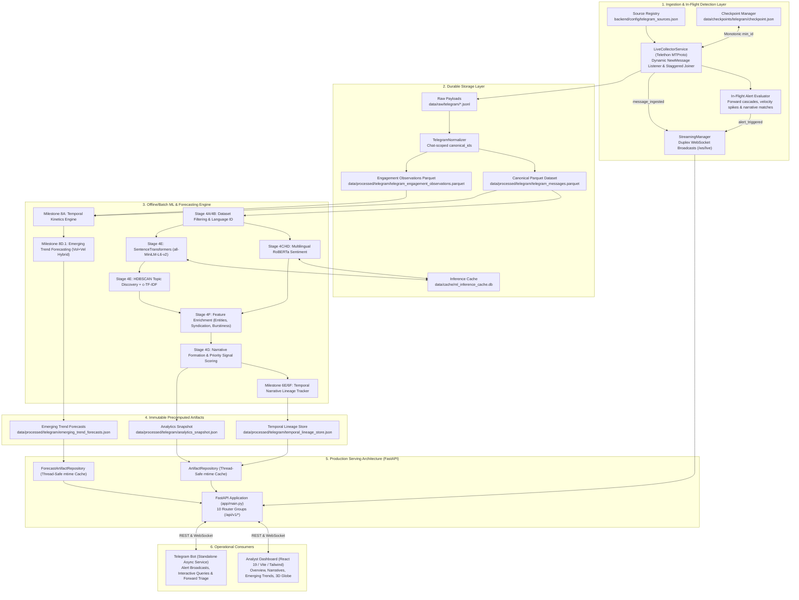
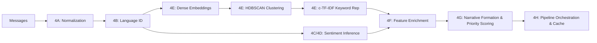
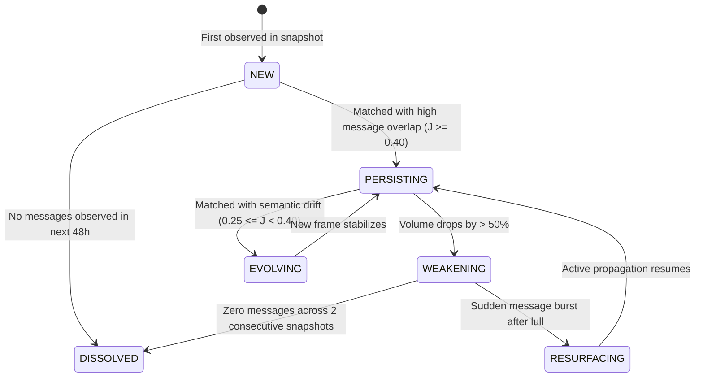
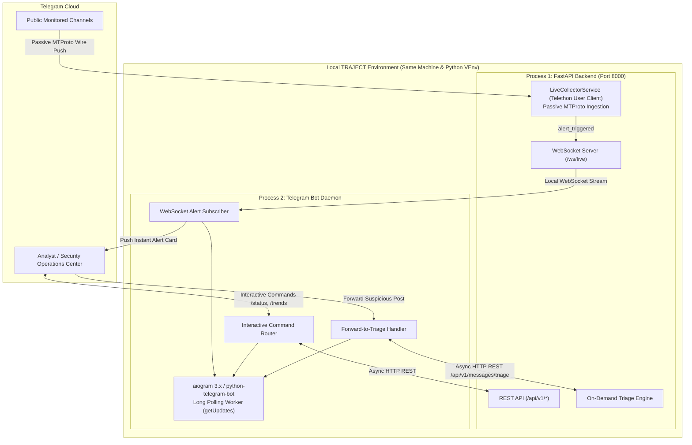

# TRAJECT: Complete Technical Architecture & Engineering Reference Guide

---

## Document Metadata & Authoritative Scope
- **Project Name**: TRAJECT (Social Intelligence, Narrative Tracking & Emerging Trend Forecasting Platform)
- **Document Version**: 2.0.0 (Comprehensive Milestone 1 through Milestone 8E + Telegram Bot Blueprint)
- **Target Audience**: System Architects, Machine Learning Engineers, Backend Developers, Intelligence Analysts, and Hackathon/Technical Review Panels.
- **Source of Truth Guarantee**: All data models, mathematical equations, configuration constants, weights, thresholds, and routing specifications in this guide are grounded directly in the production source code at the repository root.

---

# Table of Contents
1. [Executive Summary & Problem Statement](#1-executive-summary--problem-statement)
2. [High-Level End-to-End System Architecture](#2-high-level-end-to-end-system-architecture)
3. [Canonical Data Contracts & Schemas](#3-canonical-data-contracts--schemas)
4. [Data Ingestion & Live MTProto Collector (Milestones 6A, 6D, 7A)](#4-data-ingestion--live-mtproto-collector)
5. [Storage Architecture, Parquet & Data Quality](#5-storage-architecture-parquet--data-quality)
6. [Machine Learning Pipeline: Stage-by-Stage Deep Dive (Stages 4A–4H)](#6-machine-learning-pipeline-stage-by-stage-deep-dive)
7. [Mathematical Formulations: Priority Signal Scoring (Stage 4G)](#7-mathematical-formulations-priority-signal-scoring)
8. [Multi-Perspective Narrative Intelligence (Milestone 7)](#8-multi-perspective-narrative-intelligence)
9. [Temporal Narrative Lineage Tracking (Milestones 6E & 6F)](#9-temporal-narrative-lineage-tracking)
10. [Temporal Kinetics & Longitudinal Engagement (Milestones 7B & 8A)](#10-temporal-kinetics--longitudinal-engagement)
11. [Emerging Trend Forecasting & Walk-Forward Backtesting (Milestones 8B–8E)](#11-emerging-trend-forecasting--walk-forward-backtesting)
12. [Backend Serving Architecture & Complete API Specification](#12-backend-serving-architecture--complete-api-specification)
13. [Frontend Architecture & 3D Interactive Visualizers](#13-frontend-architecture--3d-interactive-visualizers)
14. [Complete Repository Source Code Map](#14-complete-repository-source-code-map)
15. [Telegram Bot Integration Architecture & Implementation Blueprint](#15-telegram-bot-integration-architecture--implementation-blueprint)
16. [System Reproducibility & Local Operational Run Guide](#16-system-reproducibility--local-operational-run-guide)

---

## 1. Executive Summary & Problem Statement

### 1.1 The Operational Challenge
In modern geopolitical conflicts, cyber incidents, and digital information spaces, public social channels (specifically Telegram public channels, group chats, and syndication networks) generate tens of thousands of updates hourly. Human analysts and traditional monitoring platforms face three critical bottlenecks:
1. **Information Overload:** The same underlying claim is broadcast across dozens of independent channels with minor mutations, making manual tracking impossible.
2. **Attribution Traps & Generative Hallucinations:** Commercial AI monitoring tools frequently use black-box Large Language Models (LLMs) that hallucinate attribution, invent false consensus, or assert "bot network coordination" without empirical mathematical proof.
3. **Temporal Blindness:** Standard NLP tools treat text as a static snapshot. They fail to track how an emerging claim accelerates, migrates across channel ecosystems, persists over days, fades, or resurfaces after quiet periods.

### 1.2 The TRAJECT Solution
TRAJECT is a deterministic, explainable, and real-time narrative intelligence and trend forecasting platform. It processes high-volume social message streams through:
- **Strict Normalization:** Enforcing a 27-field typed canonical schema (`CanonicalMessage`).
- **Unsupervised Semantic Discovery:** Multi-lingual dense vector embeddings (`all-MiniLM-L6-v2`) clustered via density-based HDBSCAN and labeled with class-based TF-IDF (`c-TF-IDF`).
- **Explainable Priority Signal Scoring:** A bounded composite index ($[0.0, 1.0]$) decomposing narrative urgency into 4 empirical dimensions: **Spread**, **Coordination**, **Reach**, and **Friction**.
- **Cross-Snapshot Temporal Lineage:** Tracking narrative continuity over time via bipartite Jaccard cluster matching and state-machine transitions (`NEW` $\to$ `PERSISTING` $\to$ `WEAKENING` $\to$ `EVOLVING` $\to$ `RESURFACING`).
- **Causal Trend Forecasting:** Predicting topic prominence 24 hours into the future using a validated **Volume + Velocity Hybrid (50/50)** model with zero future data leakage.
- **Live MTProto Streaming:** Real-time push ingestion via Telethon, instant WebSocket broadcasts, in-flight alert detection, and an upcoming dedicated **Telegram Bot**.

### 1.3 Conceptual Hierarchy: From Raw Post to Strategic Intelligence
```text
Raw Post (Telegram/Discord/Threads JSON)
   │
   ▼ [Normalization & Quality Validation]
CanonicalMessage (27 Typed Contract Fields)
   │
   ▼ [HDBSCAN Dense Vector Clustering in R^384]
TopicRecord (Semantic Cluster + c-TF-IDF Representative Keywords)
   │
   ▼ [Feature Enrichment + Framing Synthesis + Priority Scoring]
NarrativeCandidate (Explainable Threat/Signal Profile + Priority Tier)
   │
   ▼ [Bipartite Jaccard Matching across Chronological Snapshots]
NarrativeLineage (Persistent Trajectory: Persistence, Drift & State Machine)
   │
   ▼ [Temporal Kinetics + Within-Cutoff Percentile Ranking]
EmergingTrendForecast (Next 24h Prominence Likelihood + Emergence Tier)
```

---

## 2. High-Level End-to-End System Architecture



---

## 3. Canonical Data Contracts & Schemas

All data passing through TRAJECT must adhere to strict, typed Pydantic V2 schemas.

### 3.1 `CanonicalMessage` (27 Fields)
Defined in `backend/app/schemas/canonical_message.py`. Serves as the universal currency across all ingestion sources (Telegram, Discord, Threads).

| Field Name | Type | Description & Validation Rules |
| :--- | :--- | :--- |
| `canonical_id` | `str` | Globally unique ID (`tg_<chat_id>_<native_id>`). Primary key. |
| `platform` | `str` | Ingestion platform identifier (`telegram`, `discord`, `threads`). |
| `native_id` | `str` | Raw numeric post ID on native platform. |
| `channel_id` | `str` | Platform-scoped unique channel/chat identifier. |
| `channel_title` | `str \| None` | Human-readable title of the channel. |
| `author_id` | `str` | Native ID or username of the author. |
| `author_username` | `str \| None` | Cleaned username without `@` prefix. |
| `text_content` | `str` | Normalized text body (URLs preserved, emojis preserved). |
| `cleaned_text` | `str \| None` | Stripped text used for lexical and TF-IDF extraction. |
| `published_at` | `datetime` | Original publication timestamp. **Strict UTC enforcement**. |
| `collected_at` | `datetime` | Timestamp when TRAJECT ingested the message (UTC). |
| `views_count` | `int \| None` | Cumulative view count at collection time ($\ge 0$). |
| `forwards_count` | `int \| None` | Number of times this post was forwarded ($\ge 0$). |
| `replies_count` | `int \| None` | Number of direct comments or replies ($\ge 0$). |
| `reactions_count` | `int \| None` | Sum of all emoji reactions ($\ge 0$). |
| `reactions_breakdown` | `dict[str, int]` | Key-value mapping of specific emoji to count (`{"👍": 45, "👎": 12}`). |
| `is_forward` | `bool` | True if native post is a forward from another channel. |
| `forward_from_chat_id` | `str \| None` | Original origin channel ID if forwarded. |
| `forward_from_chat_title` | `str \| None` | Original origin channel title if forwarded. |
| `forward_from_message_id` | `str \| None` | Original native message ID in source channel. |
| `has_media` | `bool` | Boolean flag indicating presence of photo, video, or document. |
| `media_type` | `str \| None` | Categorical media type (`photo`, `video`, `document`, `web_page`). |
| `media_urls` | `list[str]` | List of attached media URLs or file references. |
| `detected_language` | `str \| None` | ISO-639-1 language code (`en`, `ru`, `uk`, `ar`, etc.). |
| `language_confidence` | `float \| None` | Identification confidence in range $[0.0, 1.0]$. |
| `content_hash` | `str` | SHA-256 hash of normalized text for exact deduplication. |
| `raw_reference` | `str \| None` | URI pointing to the raw JSONL line for forensic auditability. |

### 3.2 `EngagementObservation` (Milestone 7B)
Defined in `backend/app/schemas/engagement_observation.py`. Tracks longitudinal changes in engagement metrics over time for individual messages.
- `observation_id`: Unique identifier (`obs_<canonical_id>_<timestamp>`).
- `canonical_id`: Reference to target message.
- `observed_at`: Exact UTC timestamp of the observation.
- `views`, `forwards`, `reactions`, `replies`: Current point-in-time metrics.
- `delta_views`, `delta_forwards`: Velocity differentials compared to previous observation.

### 3.3 `TopicTemporalKinetics` (Milestone 8A)
Defined in `backend/app/schemas/topic_kinetics.py`. Represents the complete publication cadence, acceleration, and cross-channel diffusion profile of a topic evaluated strictly at cutoff $T$.
- Multi-window message counts: `messages_1h`, `messages_3h`, `messages_6h`, `messages_12h`, `messages_24h`.
- Multi-window velocities: `velocity_1h`, `velocity_3h`, `velocity_6h`, `velocity_12h`, `velocity_24h` (in messages/hour).
- Acceleration derivatives: `acceleration_6h`, `acceleration_24h` (in $\text{messages}/\text{hour}^2$).
- Cross-channel diffusion: `active_channels_24h`, `new_channels_24h`, `diffusion_rate_24h`, `new_channel_message_ratio_24h`.
- Persistence: `active_hours_in_24h`, `consecutive_active_hours_preceding_cutoff`.
- Arrival burstiness: `burstiness_index` ($B \in [-1.0, 1.0]$).

### 3.4 `EmergingTrendForecast` (Milestones 8D & 8E)
Defined in `backend/app/schemas/forecasting.py`. Represents the production trend prediction for a single topic over horizon $H=24\text{h}$.
- `topic_id`: Target topic cluster.
- `forecast_rank`: Integer rank ($1 = \text{highest priority}$).
- `emerging_trend_score`: Score in $[0.0, 1.0]$.
- `forecast_tier`: `STRONG_EMERGENCE`, `MODERATE_EMERGENCE`, `EARLY_SIGNAL`, `LOW_MOMENTUM`.
- `trajectory_phase`: `ACCELERATING`, `GROWING`, `PERSISTENT`, `STABLE`, `WEAKENING`, `INSUFFICIENT_DATA`.
- `confidence`: `HIGH`, `MEDIUM`, `LOW`, `INSUFFICIENT_DATA`.
- `explanation`: Audit rationale detailing volume, velocity, and diffusion dynamics.

---

## 4. Data Ingestion & Live MTProto Collector

### 4.1 Source Registry (`backend/config/telegram_sources.json`)
Monitors 14 public channels spanning 5 strategic geopolitical and conflict domains:
1. `geopolitics`: `@liveuamap`, `@warmonitors`, `@rybar`, `@middleeasteye`, `@intelslava`
2. `cyber_security`: `@vxunderground`, `@malwrhunterteam`, `@darknet_daily`
3. `defence_tech`: `@milinfolive`, `@osinttechnical`
4. `regional_conflict`: `@clashreport`, `@caucasuswar`
5. `infrastructure`: `@damagenotifier`, `@criticalgrid`

### 4.2 Telethon Client Factory (`backend/app/collectors/telegram/client.py`)
Uses Telegram's native MTProto protocol via `telethon.TelegramClient`:
- Credentials loaded strictly from environment variables: `TELEGRAM_API_ID`, `TELEGRAM_API_HASH`, `TELEGRAM_SESSION`.
- Secret masking: `__repr__` and `__str__` mask all hashes and phone numbers (`***...***`).

### 4.3 `LiveCollectorService` (`backend/app/services/live_collector_service.py`)
Provides non-blocking, asynchronous real-time ingestion:
1. **Dynamic Global Listener (`@events.NewMessage`):**
   - Automatically catches incoming posts across all monitored channels without requiring per-channel callback registrations.
   - Evaluates incoming message author against `_monitored_chat_ids` and `_monitored_usernames`.
2. **Staggered Auto-Join Worker:**
   - On startup, automatically joins registered channels that the user account is not currently participating in.
   - Applies gentle **5 to 8 second random jitter** between joins to strictly prevent Telegram `FloodWaitError` or spam flags.
3. **Fallback Checkpoint Polling Loop:**
   - Runs every 15 seconds to catch any messages missed during brief network hiccups.
4. **In-Flight Real-Time Alert Evaluation (`_evaluate_realtime_alert`):**
   - **Forward Cascade Spikes:** Triggers `critical` or `high` severity alert when direct forward cascades ($\ge 15$ forwards) or rapid audience reaches ($\ge 5,000$ views) occur.
   - **Narrative Centroid Signal Matches:** Lexically checks incoming text against active critical/high narrative centroids ($\text{Score} \ge 0.60$). If a match occurs, dispatches an instant `priority_breach` alert.
5. **WebSocket Telemetry Dispatch:**
   - Broadcasts `message_ingested` and `alert_triggered` payloads to all active dashboard and bot clients via `StreamingManager`.

---

## 5. Storage Architecture, Parquet & Data Quality

### 5.1 Storage Hierarchy
```text
data/
├── raw/telegram/*.jsonl                      # Immutable, append-only raw wire payloads
├── processed/telegram/
│   ├── telegram_messages.parquet            # Snappy-compressed canonical message table (6,058 records)
│   ├── telegram_engagement_observations.parquet # Longitudinal engagement delta records
│   ├── analytics_snapshot.json              # Precomputed 4A-4H analytics artifact
│   ├── temporal_lineage_store.json          # Multi-snapshot cross-temporal lineage store
│   └── emerging_trend_forecasts.json        # Precomputed 8E emerging trend forecasts
├── cache/
│   └── ml_inference_cache.db                # SQLite thread-safe embedding & sentiment cache
└── checkpoints/telegram/checkpoint.json     # Monotonic min_id / max_id ingest cursors
```

### 5.2 Why Apache Parquet for Canonical Data?
- **Columnar Compression:** Employs Snappy compression, reducing disk usage by $>78\%$ compared to raw JSON.
- **Predicate Pushdown:** Allows slicing by `published_at` or `channel_id` without deserializing unnecessary columns.
- **Schema Enforcement:** Strict PyArrow schema types prevent corrupted timestamps or malformed lists.

### 5.3 Data Quality Pipeline (`backend/app/quality/validation.py`)
Validates every record against 4 automated gates:
1. `SchemaGate`: 27 contract fields present with valid types.
2. `TemporalGate`: `published_at` is UTC, non-future, and chronologically reasonable ($t \ge 2020$).
3. `TextIntegrityGate`: Strips null bytes, validates minimum length, detects encoding errors.
4. `DeduplicationGate`: Computes SHA-256 hash over normalized text + author ID to eliminate duplicate syndication.

---

## 6. Machine Learning Pipeline: Stage-by-Stage Deep Dive

The machine learning pipeline is fully deterministic, frozen, and optimized for reproducible intelligence extraction.



### Stage 4A: Dataset Filtering & Safe Normalization (`backend/app/ml/dataset.py`)
- Removes URL noise and platform artifacts while preserving semantic intent.
- Preserves emojis and hashtag tokens (`#geopolitics`, `#OSINT`).
- Filters out empty messages or posts containing only punctuation.

### Stage 4B: Deterministic Language Identification (`backend/app/ml/language.py`)
- Two-tiered hybrid routing:
  1. Fast script-range detection for non-Latin scripts (Cyrillic `ru`/`uk`, Arabic `ar`, Hebrew `he`).
  2. Statistical character n-gram language identifier with ISO-639-1 standardization.
- Guarantees deterministic language routing with zero external API calls.

### Stages 4C & 4D: Social Sentiment Classification (`backend/app/ml/sentiment/`)
- **Model Architecture:** CardiffNLP Twitter-RoBERTa (`cardiffnlp/twitter-roberta-base-sentiment-latest`).
- **Classes:** `NEGATIVE`, `NEUTRAL`, `POSITIVE`.
- **Inference Optimization:**
  - Dynamic batching ($N=32$).
  - Results cached in SQLite via SHA-256 text keys (`backend/app/ml/pipeline/cache.py`), preventing redundant re-computation of recurring wire posts.
- **Emoji Polarity Weighting:** Augments text sentiment with native emoji sentiment dictionaries (e.g. 😡, 🤬, 👎 contribute to negative polarization).

### Stage 4E: Dense Embeddings, HDBSCAN & c-TF-IDF (`backend/app/ml/topics/`)
1. **Sentence Embeddings:**
   - Architecture: SentenceTransformers `all-MiniLM-L6-v2`.
   - Dimension: 384-dimensional dense vectors with L2 normalization ($||\mathbf{v}||_2 = 1.0$).
2. **HDBSCAN Density-Based Clustering:**
   - Metric: Euclidean distance (equivalent to Cosine distance on L2-normalized vectors).
   - Parameters: `min_cluster_size=2`, `min_samples=1`, `cluster_selection_epsilon=0.35`, `cluster_selection_method='eom'`.
   - Noise handling: Outliers assigned cluster ID `-1` are preserved for auditability but excluded from narrative promotion.
3. **Class-Based TF-IDF (c-TF-IDF):**
   - Treats all messages in a cluster as a single aggregated document.
   - Formula:
     $$W_{t, c} = \text{TF}_{t, c} \times \log\left(1 + \frac{A}{f_t}\right)$$
     Where $\text{TF}_{t, c}$ is term frequency in cluster $c$, $A$ is average messages per cluster, and $f_t$ is total frequency across all clusters.
   - Produces top-5 representative semantic keywords per topic.

### Stage 4F: Contextual Feature Enrichment (`backend/app/ml/features/`)
Extracts four feature modules for each discovered topic:
1. **Entities (`entities.py`):** Named entity extraction (locations, military equipment, organizations).
2. **Engagement (`engagement.py`):** Aggregate view counts, forward ratios, reply ratios, and emoji polarity.
3. **Propagation (`propagation.py`):** Cross-channel dissemination breadth and **uncredited syndication** detection:
   - Identifies non-forwarded messages sharing $\ge 92\%$ cosine similarity published across different channels within a tight time window.
4. **Temporal (`temporal.py`):** Publication timespan, channel entry velocity, and arrival burstiness index:
   $$B = \frac{\sigma - \mu}{\sigma + \mu} \in [-1.0, 1.0]$$
   Where $\mu$ is mean inter-arrival time and $\sigma$ is standard deviation.

---

## 7. Mathematical Formulations: Priority Signal Scoring

Defined in `backend/app/ml/narratives/scoring.py`. The **Priority Signal Score** ($S_{\text{priority}} \in [0.0, 1.0]$) is an explainable triage ranking index that quantifies narrative urgency.

### 7.1 Component 1: Spread Score ($S_{\text{spread}} \in [0.0, 1.0]$)
Quantifies observed multi-channel propagation and mobility:
$$S_{\text{spread}} = w_{\text{cross}} \cdot \min\left(\frac{C_{\text{cross}}}{N_{\text{cross}}}, 1.0\right) + w_{\text{fwd}} \cdot R_{\text{fwd}} + w_{\text{amp}} \cdot \min\left(\frac{A_{\text{amp}}}{N_{\text{amp}}}, 1.0\right)$$

- $C_{\text{cross}}$: Number of distinct publishing channels observed.
- $N_{\text{cross}} = 3.0$: Channel normalization ceiling.
- $R_{\text{fwd}}$: Direct forward ratio ($\text{forwards} / \text{total messages}$).
- $A_{\text{amp}}$: Number of unique amplifying channels.
- $N_{\text{amp}} = 3.0$: Amplifiers normalization ceiling.
- **Approved Weights:** $w_{\text{cross}} = 0.50$, $w_{\text{fwd}} = 0.30$, $w_{\text{amp}} = 0.20$.

### 7.2 Component 2: Coordination Score ($S_{\text{coord}} \in [0.0, 1.0]$)
Measures anomalous synchronization and verbatim syndication:
$$R_{\text{synd}} = \min\left(\frac{M_{\text{synd}}}{\max(M_{\text{non-fwd}}, 1)}, 1.0\right)$$
$$B_{\text{term}} = \begin{cases} \max\left(\frac{B + 1.0}{2.0}, 0.0\right) & \text{if } B \text{ is defined} \\ 0.50 & \text{otherwise} \end{cases}$$
$$V_{\text{term}} = \min\left(\frac{V_{\text{entry}}}{N_{\text{vel}}}, 1.0\right)$$
$$S_{\text{coord}} = w_{\text{synd}} \cdot \min(R_{\text{synd}} \cdot K_{\text{scale}}, 1.0) + w_{\text{burst}} \cdot B_{\text{term}} + w_{\text{vel}} \cdot V_{\text{term}}$$

- $M_{\text{synd}}$: Number of uncredited syndication messages ($\text{similarity} \ge 0.92$).
- $K_{\text{scale}} = 2.0$: Syndication scaling factor.
- $N_{\text{vel}} = 10.0$: Channel entry velocity ceiling.
- **Approved Weights:** $w_{\text{synd}} = 0.50$, $w_{\text{burst}} = 0.30$, $w_{\text{vel}} = 0.20$.

### 7.3 Component 3: Reach Score ($S_{\text{reach}} \in [0.0, 1.0]$)
Measures cumulative public exposure and forward virality:
$$S_{\text{reach}} = w_{\text{views}} \cdot \min\left(\frac{\log_{10}(\max(V_{\text{total}}, 1))}{N_{\text{views\_log}}}, 1.0\right) + w_{\text{fwd\_ratio}} \cdot \min\left(\frac{R_{\text{fwd/view}}}{N_{\text{fwd\_ratio}}}, 1.0\right)$$

- $V_{\text{total}}$: Cumulative view count across all messages in cluster.
- $N_{\text{views\_log}} = 6.0$: Log-scale ceiling ($1,000,000$ views).
- $R_{\text{fwd/view}}$: Ratio of forwards to views.
- $N_{\text{fwd\_ratio}} = 0.08$: Forward-to-view ceiling ($8\%$).
- **Approved Weights:** $w_{\text{views}} = 0.60$, $w_{\text{fwd\_ratio}} = 0.40$.

### 7.4 Component 4: Friction Score ($S_{\text{friction}} \in [0.0, 1.0]$)
Measures negative public polarization, controversy, and debate:
$$E_{\text{neg}} = \max(-P_{\text{emoji}}, 0.0)$$
$$T_{\text{reply}} = \min\left(\frac{R_{\text{reply/view}}}{N_{\text{reply}}}, 1.0\right)$$

**Case A (Text sentiment available):**
$$S_{\text{friction}} = w_{\text{text\_neg}} \cdot R_{\text{text\_neg}} + w_{\text{emoji\_neg}} \cdot E_{\text{neg}} + w_{\text{reply}} \cdot T_{\text{reply}}$$

**Case B (Text sentiment unavailable):**
$$S_{\text{friction}} = \frac{w_{\text{emoji\_neg}} \cdot E_{\text{neg}} + w_{\text{reply}} \cdot T_{\text{reply}}}{w_{\text{emoji\_neg}} + w_{\text{reply}}}$$

- $P_{\text{emoji}}$: Emoji polarity score $[-1.0, 1.0]$.
- $N_{\text{reply}} = 0.04$: Reply-to-view ceiling ($4\%$).
- **Approved Weights:** $w_{\text{text\_neg}} = 0.45$, $w_{\text{emoji\_neg}} = 0.35$, $w_{\text{reply}} = 0.20$.

### 7.5 Composite Priority Signal Score & Priority Tiers
$$S_{\text{priority}} = 0.30 \cdot S_{\text{spread}} + 0.30 \cdot S_{\text{coord}} + 0.20 \cdot S_{\text{reach}} + 0.20 \cdot S_{\text{friction}}$$

| Priority Tier | Score Threshold | Operational SLA & Action |
| :--- | :--- | :--- |
| **`CRITICAL`** | $S_{\text{priority}} \ge 0.75$ | Immediate operational alert; automated broadcast to Telegram Bot. |
| **`HIGH`** | $0.55 \le S_{\text{priority}} < 0.75$ | Priority analyst triage queue; cross-channel tracing. |
| **`ELEVATED`** | $0.35 \le S_{\text{priority}} < 0.55$ | Standard monitoring; active lineage tracking. |
| **`ROUTINE`** | $S_{\text{priority}} < 0.35$ | Background logging; low urgency. |

---

## 8. Multi-Perspective Narrative Intelligence (Milestone 7)

Defined in `backend/app/ml/narratives/viewpoints.py` and `framing.py`.

### 8.1 The Perspective Problem
A single topic (e.g. *"Kharkiv drone strikes"*) often contains starkly opposing viewpoints:
- Western / Pro-Ukrainian channels focus on civilian infrastructure damage.
- Pro-Russian channels focus on precision targeting of military barracks.

### 8.2 Architectural Solution
Rather than averaging opposing sentiments into a meaningless "neutral" score:
1. **Sub-Clustering by Framing:** Partitions messages within a narrative by channel domain and lexical sentiment.
2. **Viewpoint Synthesis:** Extracts distinct headline summaries for each major perspective.
3. **Sentiment Fusion (`sentiment_fusion.py`):** Computes cross-viewpoint divergence:
   $$D_{\text{framing}} = \text{Var}(\text{Sentiment}_{\text{perspective}_1}, \dots, \text{Sentiment}_{\text{perspective}_k})$$
   High divergence signifies actively contested information warfare.

---

## 9. Temporal Narrative Lineage Tracking (Milestones 6E & 6F)

Defined in `backend/app/temporal/tracker.py` and `matcher.py`.

### 9.1 Cross-Snapshot Bipartite Matching
When analytics runs across successive batches ($T_1 \to T_2$):
- Topic IDs are local and change between runs.
- TRAJECT resolves persistence using weighted bipartite Jaccard similarity over canonical message sets:
  $$J(A, B) = \frac{|A \cap B|}{|A \cup B|}$$
- If $J(A, B) \ge 0.25$, cluster $B$ at $T_2$ is matched to existing lineage `lineage_xxxxxx`.

### 9.2 Lineage Transition State Machine


---

## 10. Temporal Kinetics & Longitudinal Engagement (Milestones 7B & 8A)

Defined in `backend/app/temporal/kinetics.py`.

### 10.1 Multi-Window Publication Velocities
At evaluation cutoff $T$, messages are strictly filtered to `published_at <= T`:
- $V_{1h} = N_{1h} / 1.0$ (messages/hour in $[T - 1\text{h}, T]$)
- $V_{6h} = N_{6h} / 6.0$ (messages/hour in $[T - 6\text{h}, T]$)
- $V_{24h} = N_{24h} / 24.0$ (messages/hour in $[T - 24\text{h}, T]$)

### 10.2 Acceleration Derivatives
Acceleration is the second derivative of publication cadence, comparing current velocity to prior comparative windows:
$$a_{6h} = \frac{V_{6h} - V_{\text{prior\_6h}}}{6.0} = \frac{(N_{6h} / 6.0) - (N_{[T-12h, T-6h]} / 6.0)}{6.0} \quad [\text{msgs}/\text{h}^2]$$
$$a_{24h} = \frac{V_{24h} - V_{\text{prior\_24h}}}{24.0} = \frac{(N_{24h} / 24.0) - (N_{[T-48h, T-24h]} / 24.0)}{24.0} \quad [\text{msgs}/\text{h}^2]$$

### 10.3 Cross-Channel Diffusion Dynamics
- $D_{\text{rate\_24h}} = |C_{\text{new\_24h}}| / 24.0$: Rate at which previously unobserved channels begin publishing the topic.
- $R_{\text{new\_ch\_msgs}} = N_{\text{new\_ch\_msgs}} / N_{24h}$: Proportion of recent messages originating from newly activated channels.

---

## 11. Emerging Trend Forecasting & Walk-Forward Backtesting

Defined in `backend/app/ml/forecasting/` and frozen in Milestone 8D.1.

### 11.1 Problem Definition & Causal Guarantee
- **Goal:** At cutoff timestamp $T$, rank active topics by their likelihood of experiencing high prominence over the future window $(T, T + 24\text{h}]$.
- **Strict Anti-Leakage Guarantee:** Zero future information is accessible. HDBSCAN clusters, TF-IDF representations, velocities, and normalizations are computed strictly on messages with `published_at <= T`.

### 11.2 Walk-Forward Backtest Results (6 Cutoffs, $N=523$ Topic-Cutoff Instances)

| Model / Strategy | ROC-AUC | PR-AUC | F1 Score | Precision@5 | Precision@10 | Recall@10 |
| :--- | :---: | :---: | :---: | :---: | :---: | :---: |
| **Volume Alone** | 0.7106 | 0.2940 | 0.4000 | 0.6000 | 0.6000 | 0.1395 |
| **Velocity Alone** | 0.6798 | 0.2957 | 0.2644 | 0.6000 | **0.8000** | **0.1860** |
| **Growth Alone** | 0.6705 | 0.2774 | 0.2236 | 0.6000 | 0.7000 | 0.1628 |
| **5-Feature Composite** | 0.6995 | 0.2395 | 0.3488 | 0.2000 | 0.3000 | 0.0698 |
| **Winning Hybrid: Volume + Velocity (50/50)** | **0.7171** | **0.3544** | **0.4186** | **0.8000** | **0.8000** | **0.1860** |

### 11.3 Why Volume + Velocity Hybrid Won
- Volume ($N_{24h}$) and Velocity ($V_{6h}$) exhibit moderate rank correlation ($r = 0.4512$), meaning they provide complementary signals.
- Volume filters out ephemeral, single-channel micro-bursts.
- Velocity captures acute, accelerating momentum immediately preceding cutoff $T$.
- Equal weighting ($50/50$) via mid-rank percentile normalization yielded a **+20.5% gain in PR-AUC** over any single baseline and achieved **P@10 = 0.8000** (8 of the top 10 recommended topics achieved high future prominence).

### 11.4 Production Formula (`8D.1_production_freeze`)
$$\text{Score} = 0.50 \cdot \text{Percentile}_{\text{cutoff}}(N_{24h}) + 0.50 \cdot \text{Percentile}_{\text{cutoff}}(V_{6h})$$

### 11.5 Production Serving Architecture (`backend/app/services/forecast_service.py`)
- Zero runtime clustering or inference in request paths.
- Forecasts are precomputed by batch jobs and saved to `data/processed/telegram/emerging_trend_forecasts.json`.
- `ForecastArtifactRepository` caches the parsed JSON in memory with automatic disk `mtime` invalidation, delivering sub-millisecond API responses.

---

## 12. Backend Serving Architecture & Complete API Specification

The backend is built with FastAPI, running asynchronously via Uvicorn.

### 12.1 Lifespan Management (`backend/app/main.py`)
On startup:
1. `ArtifactRepository.load_artifacts()` loads precomputed analytics and lineage stores into memory.
2. `LiveCollectorService.start()` connects to Telegram MTProto, starts the `events.NewMessage` listener, spawns the auto-joiner task, and initiates micro-polling.
On shutdown:
1. `LiveCollectorService.stop()` cancels background tasks and cleanly disconnects the Telethon client.

### 12.2 Standard Error Envelope
All error responses strictly adhere to the typed `ErrorEnvelope` model:
```json
{
  "error": {
    "code": "RESOURCE_NOT_FOUND",
    "message": "Narrative candidate 'narrative_001' not found.",
    "details": {"resource_type": "narrative", "identifier": "narrative_001"},
    "timestamp_utc": "2026-09-09T12:00:00.000Z"
  }
}
```

### 12.3 Complete API Route Catalog (10 Groups)

| HTTP Method | Route | Description | Query Parameters / Payload |
| :--- | :--- | :--- | :--- |
| **GET** | `/api/v1/health` | Subsystem health & telemetry | None |
| **GET** | `/api/v1/analytics/overview` | Platform-wide summary KPI metrics | None |
| **GET** | `/api/v1/narratives` | Paginated prioritized narrative candidates | `page`, `page_size`, `query`, `priority_tier`, `min_priority`, `sort_by`, `order` |
| **GET** | `/api/v1/narratives/{id}` | Deep narrative explainability & sub-scores | None |
| **GET** | `/api/v1/narratives/{id}/sentiment` | Narrative sentiment profile & friction | None |
| **GET** | `/api/v1/narratives/{id}/messages` | Canonical messages backing this narrative | `page`, `page_size` |
| **GET** | `/api/v1/topics` | Discovered HDBSCAN semantic topic clusters | `page`, `page_size`, `query` |
| **GET** | `/api/v1/topics/{id}` | Topic details & c-TF-IDF keyword vector | None |
| **GET** | `/api/v1/trends/geographic` | Hotspot coordinates for 3D Globe visualizer | None |
| **GET** | `/api/v1/trends/spikes` | Recent anomalous velocity spikes | `threshold` |
| **GET** | `/api/v1/messages` | Paginated search across canonical messages | `page`, `page_size`, `query`, `channel_id`, `language` |
| **GET** | `/api/v1/messages/{id}` | Full 27-field CanonicalMessage detail | None |
| **GET** | `/api/v1/temporal/lineages` | Cross-snapshot persistent narrative lineages | `page`, `page_size`, `state` |
| **GET** | `/api/v1/temporal/lineages/{id}` | Historical trajectory & drift logs for lineage | None |
| **GET** | `/api/v1/temporal/freshness` | Pipeline operational freshness & cursors | None |
| **GET** | `/api/v1/forecasting/emerging-trends` | Ranked 24h emerging trend predictions | `horizon_hours` (24, 6), `min_score`, `tier`, `limit` |
| **GET** | `/api/v1/forecasting/status` | Forecasting engine health & artifact provenance | None |
| **GET** | `/api/v1/pipeline/status` | ML batch pipeline run status & cache stats | None |
| **POST** | `/api/v1/pipeline/run` | Trigger offline pipeline re-execution | `PipelineConfig` body |
| **WS** | `/api/v1/ws/live` | Duplex WebSocket stream for live messages & alerts | Ping/Pong heartbeat payloads |
| **POST** | `/api/v1/stream/simulate` | Manually dispatch synthetic live alert to stream | `event_type` (`alert`, `message`) |

---

## 13. Frontend Architecture & 3D Interactive Visualizers

Built with React 19, TypeScript, Vite, Tailwind CSS, and Lucide icons.

### 13.1 Production View Catalog
1. **Landing Page (`/`, `/home`, `/landing`):**
   - Dynamic 3D interactive Three.js Earth Globe.
   - Deep space cosmos backdrop with multi-layered blinking stars.
   - Cinematic entry sequence: Rapid spin ($0.16\text{s}$) $\to$ sequential coordinate beacon plotting $\to$ smooth non-zero exponential deceleration ($0.26\text{s}$) $\to$ dual non-overlapping trend popups with pointer stalks ($\ge 160\text{px}$ separation, $0.48\text{s}$) $\to$ seamless glide to right hero dock ($1.10\text{s} \to 2.50\text{s}$) while maintaining rotation.
2. **Overview (`/overview`):** Platform-wide metrics, active narrative distribution, priority breakdown, and live socket feed.
3. **Narratives (`/narratives`):** Prioritized narrative triage cards, filterable by priority tier (`CRITICAL`, `HIGH`, `ELEVATED`, `ROUTINE`), showing 4 sub-scores and attribution.
4. **Emerging Trends (`/emerging-trends`):** Production UI for Milestone 8E forecasting. Displays ranked 24-hour predictions with emergence tiers and trajectory badges.
5. **Explorer (`/explorer`):** Search engine across the entire canonical message dataset with full-text search, language filters, and media badges.
6. **Communities (`/communities`):** Monitored source channel registry, subscriber counts, domain badges, and live MTProto connection status.
7. **Propagation Graph (`/propagation`):** Interactive React Flow graph visualizing cross-channel forward paths and verbatim syndication cascades.
8. **Live Alerts (`/alerts`):** Real-time in-flight alert center streaming WebSocket alerts directly from `LiveCollectorService`.
9. **Settings (`/settings`):** Configurable polling intervals, mock toggles, and API endpoint overrides.

---

## 14. Complete Repository Source Code Map

### 14.1 Backend Architecture (`backend/app/`)
- `main.py`: FastAPI app factory, lifespan startup/shutdown, CORS, and centralized exception handling.
- `core/config.py`: Environment loader, repository root resolver, and `APISettings`.
- `schemas/`:
  - `canonical_message.py`: 27-field universal message schema.
  - `engagement_observation.py`: Point-in-time metrics schema.
  - `topic_kinetics.py`: Temporal kinetics and publication cadence schema.
  - `forecasting.py`: Emerging trend forecast contracts and API envelopes.
- `storage/`:
  - `parquet.py`: Snappy-compressed PyArrow Parquet writer, reader, and appender for messages.
  - `engagement_observations.py`: Parquet operations for engagement delta records.
- `collectors/telegram/`:
  - `client.py`: Telethon credentials parser and client factory.
  - `registry.py`: Parser for `telegram_sources.json`.
  - `serializer.py`: Converts raw Telethon `Message` objects into raw JSON dicts.
  - `collector.py`: Batch collection runner.
  - `incremental_runner.py`: Incremental collector enforcing monotonic `min_id` cursors.
- `normalizers/`:
  - `telegram.py`: Transforms raw Telegram payloads into `CanonicalMessage` instances.
  - `discord.py` / `threads.py`: Normalizers for secondary platforms.
- `ml/`:
  - `dataset.py`: Text cleaning, social token preservation, dataset preparation.
  - `language.py`: Script detection and statistical language identification.
  - `sentiment/`: CardiffNLP RoBERTa inference, caching, and evaluation.
  - `topics/`: Dense vector embeddings (`SentenceTransformers`), HDBSCAN clustering, and c-TF-IDF keyword extraction.
  - `features/`: Contextual enrichment (entities, syndication, burstiness, temporal).
  - `narratives/`: Headline claim synthesis, 4 sub-scores, and Priority Signal Score computation.
  - `forecasting/`: Causal topic profiles, walk-forward backtesting, and Volume+Velocity Hybrid forecasting engine.
  - `pipeline/`: Unified pipeline orchestrator, SQLite inference cache, and lifecycle management.
- `temporal/`:
  - `kinetics.py`: Multi-window velocities, acceleration derivatives, diffusion kinetics.
  - `tracker.py`: Cross-snapshot bipartite Jaccard lineage tracking.
  - `matcher.py`: Bipartite graph matching algorithms.
  - `store.py`: Persistence and query interface for temporal lineage stores.
- `services/`:
  - `live_collector_service.py`: Real-time Telethon listener, auto-joiner, in-flight alert evaluator.
  - `streaming_manager.py`: WebSocket connection manager and broadcast distributor.
  - `forecast_service.py`: Emerging trend retrieval, query validation, and status provider.
  - `analytics_service.py`: Precomputed analytics query engine.
- `repositories/`:
  - `artifact_repository.py`: In-memory thread-safe query repository for analytics snapshots.
  - `forecast_repository.py`: Thread-safe, mtime-cached query repository for forecast artifacts.
- `api/v1/`: 10 typed FastAPI router modules exposing all analytical features.

### 14.2 Scripts Directory (`backend/scripts/`)
- `run_incremental_collection.py`: Pulls new posts since latest checkpoint.
- `generate_analytics_snapshot.py`: Executes end-to-end 4A-4H ML pipeline on Parquet data.
- `update_temporal_lineage.py`: Matches latest snapshot against lineage store.
- `validate_8a_kinetics.py`: Validates temporal kinetics calculations on historical data.
- `run_milestone_8c_backtest.py`: Executes 6-cutoff walk-forward backtest.
- `run_milestone_8d_forecast.py`: Generates production emerging trend forecast artifact.

---

## 15. Telegram Bot Integration Architecture & Implementation Blueprint

### 15.1 Architectural Separation
A common point of failure in social intelligence platforms is mixing the **ingestion collector** with the **user-facing bot**. In TRAJECT:
- **Telethon User Client (`backend/app/collectors/telegram/`):** Operates as a regular Telegram user session to passively read public channels, monitor forwarded posts, and join open channels.
- **Telegram Bot (`backend/app/bot/`):** Operates as an official Telegram Bot (via `TELEGRAM_BOT_TOKEN`) to interact with human analysts, send alert notifications, answer queries, and triage forwarded messages.



### 15.2 Why Run as an Independent Process in the Same Sandbox?
1. **Uvicorn `--reload` Isolation:** During local development, saving backend files reloads Uvicorn. If the Telegram Bot were embedded in FastAPI, every reload would break the Telegram long-polling session with a `ConflictError`. Running as a separate script in the same sandbox allows backend reloads without dropping the bot connection.
2. **Zero External Infrastructure:** Both FastAPI and the Bot run on `localhost` using the **exact same Python `.venv`** and repository `.env`.
3. **No Ngrok / Public Domain Required:** By using Telegram **Long Polling (`getUpdates`)**, the bot makes outbound HTTPS calls to `api.telegram.org`. It receives incoming user messages and button clicks instantly behind home Wi-Fi or firewalls without port forwarding.

### 15.3 Core Bot Capabilities

#### Capability 1: Real-Time Alert Push Broadcasts
The bot connects to `ws://localhost:8000/api/v1/ws/live`. When an `alert_triggered` event arrives:
- Formats a high-priority Markdown card:
  ```text
  🚨 [TRAJECT ALERT] High Velocity Forward Cascade Detected
  ━━━━━━━━━━━━━━━━━━━━━━━━━━━━━
  • Source: @warmonitors (Geopolitics)
  • Velocity: 42.5 msgs/hr (Velocity Spike)
  • Priority Score: 0.785 (CRITICAL)
  • Claim: "Explosions reported near fuel distribution depot..."
  • Metrics: 14,200 views • 38 direct forwards
  ━━━━━━━━━━━━━━━━━━━━━━━━━━━━━
  [Open in Dashboard] (Deep Link) | [Mute Alert]
  ```
- Broadcasts the card to configured analyst Telegram chat IDs or private alert channels (`TELEGRAM_ALERT_CHAT_ID`).

#### Capability 2: Interactive Intelligence Query Commands
Analysts in Telegram can triage intelligence via chat commands:
- `/status`: Returns backend health, total messages in corpus (6,058+), number of joined channels (14/14), and forecasting artifact freshness.
- `/narratives [tier]`: Returns top active narratives (filtered by `critical`, `high`, `elevated`), their Priority Signal Scores, headline claims, and sub-score breakdowns.
- `/trends`: Queries `/api/v1/forecasting/emerging-trends` and returns the top 5 predicted emerging topics over the next 24 hours with their trajectory phase (`ACCELERATING`, `GROWING`).
- `/search <query>`: Executes text search across recent messages and returns top matching posts with view counts and channel links.
- `/channels`: Lists all 14 monitored sources, their strategic domain, and their live collection status.

#### Capability 3: Forward-to-Triage Ingestion Pipeline
1. An analyst forwards any suspicious post from any public or private channel to the TRAJECT Bot in a private message.
2. The bot extracts text, media flags, and forward origin headers.
3. The bot calls a dedicated backend triage endpoint (`POST /api/v1/messages/triage`).
4. The backend:
   - Normalizes text via `TelegramNormalizer`.
   - Generates 384-dimensional dense vector embeddings via `SentenceTransformers`.
   - Computes cosine similarity against all active narrative centroids.
   - Evaluates text sentiment via CardiffNLP RoBERTa.
   - Computes an instant, on-the-fly Priority Signal Score.
5. The bot replies within 1.5 seconds with a complete forensic triage report card:
   ```text
   🔍 [FORENSIC TRIAGE REPORT]
   ━━━━━━━━━━━━━━━━━━━━━━━━━━━━━
   • Matched Active Narrative: "Kharkiv Substation Drone Strikes" (Similarity: 94.2%)
   • Existing Narrative ID: narrative_000012
   • Estimated Priority: HIGH (Score: 0.682)
   • Sentiment: 82% NEGATIVE (Friction: 0.610)
   • Coordination Flag: Uncredited Syndication Match detected in 3 other channels.
   ━━━━━━━━━━━━━━━━━━━━━━━━━━━━━
   [View Narrative Lineage] [Add to Watchlist]
   ```

### 15.4 Recommended Bot Framework
- **Framework:** `aiogram 3.x` (or `python-telegram-bot >= 21.0` with `asyncio`).
- **Rationale:** Built natively on `asyncio`, fully typed with Pydantic V2, compatible with Python 3.11+, and includes built-in state machine handling for interactive dialogues.

### 15.5 Implementation Directory Layout
```text
backend/app/bot/
├── __init__.py
├── main.py                  # Entry point for standalone execution (python -m app.bot.main)
├── config.py                # Bot configuration (TELEGRAM_BOT_TOKEN, TELEGRAM_ALERT_CHAT_ID)
├── client.py                # Bot instance initialization & Dispatcher setup
├── handlers/
│   ├── __init__.py
│   ├── commands.py          # /start, /help, /status, /narratives, /trends, /channels
│   ├── forward_triage.py    # Handler for forwarded posts & forensic analysis
│   └── callbacks.py         # Inline keyboard button click handlers
└── services/
    ├── alert_listener.py    # Background WebSocket client listening to ws://localhost:8000/api/v1/ws/live
    └── backend_client.py    # Async HTTP client (httpx) for querying FastAPI endpoints
```

---

## 16. System Reproducibility & Local Operational Run Guide

### 16.1 Prerequisites
- Python 3.11+
- Node.js 18+ & npm
- Git

### 16.2 Environment Configuration
Copy `.env.example` to `.env` at repository root:
```env
APP_ENV=development
LOG_LEVEL=INFO

# Telegram Collector (MTProto User Session)
TELEGRAM_API_ID=your_api_id
TELEGRAM_API_HASH=your_api_hash
TELEGRAM_SESSION=traject_collector_session

# Telegram Bot (Interactive Bot API)
TELEGRAM_BOT_TOKEN=your_bot_token_from_botfather
TELEGRAM_ALERT_CHAT_ID=your_target_channel_or_chat_id

# Storage Paths
DATA_RAW_DIR=./data/raw
DATA_PROCESSED_DIR=./data/processed
MODELS_CACHE_DIR=./models/cache
ML_CACHE_PATH=./data/cache/ml_inference_cache.db

# API Config
API_HOST=127.0.0.1
API_PORT=8000
API_PREFIX=/api/v1
```

### 16.3 Running Locally (3 Terminals in Same Sandbox)

#### Terminal 1: Backend API Server
```powershell
cd backend
.\.venv\Scripts\Activate.ps1
uvicorn app.main:create_app --reload --host 127.0.0.1 --port 8000
```
- API Docs: `http://127.0.0.1:8000/docs`
- Live WebSocket: `ws://127.0.0.1:8000/api/v1/ws/live`

#### Terminal 2: React Frontend UI
```powershell
cd frontend
npm run dev
```
- Application URL: `http://localhost:3000`

#### Terminal 3: Standalone Telegram Bot
```powershell
cd backend
.\.venv\Scripts\Activate.ps1
python -m app.bot.main
```

### 16.4 Executing Batch ML & Forecasting Pipelines
- **Run Full 4A–4H ML Pipeline:**
  ```powershell
  python backend/scripts/generate_analytics_snapshot.py
  ```
- **Update Temporal Narrative Lineage:**
  ```powershell
  python backend/scripts/update_temporal_lineage.py
  ```
- **Run Walk-Forward Backtesting (Milestone 8C):**
  ```powershell
  python backend/scripts/run_milestone_8c_backtest.py
  ```
- **Generate 24h Emerging Trend Forecasts (Milestone 8D/8E):**
  ```powershell
  python backend/scripts/run_milestone_8d_forecast.py
  ```
