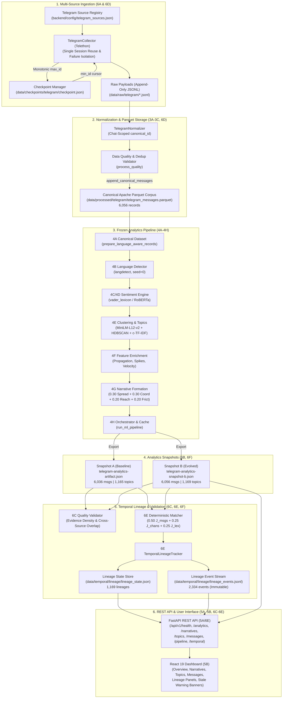

# TRAJECT — Developer Handoff: Milestone 6A → Current State

---

## 1. Executive Summary

This developer handoff document provides an exhaustive, code-verified technical reconstruction of all work implemented in the **TRAJECT** repository (`D:\Projects\Traject`) from **Milestone 6A** through the current state (**Milestone 6F Accepted & Frozen**).

TRAJECT is a social media analytics and narrative intelligence platform built for **Smart India Hackathon (SIH) 2026 — Problem Statement 26152 (NTRO)**. Its core mission is the continuous, deterministic discovery, framing, priority scoring, and temporal evolution tracking of narrative clusters across multi-platform feeds.

Up through Milestone 5B, TRAJECT operated as a single-channel analytical pipeline and React dashboard processing static/synthetic messages through an eight-stage frozen machine learning pipeline (Milestones 4A–4H), exposed via a FastAPI REST service (Milestone 5A) and rendered in a React 19 / Vite / Tailwind UI (Milestone 5B).

Starting with **Milestone 6A**, the platform was transitioned into an end-to-end, multi-source ingestion and temporal evolution system:
- **6A**: Configuration-driven multi-source Telegram collection engine reusing a single MTProto session with channel failure isolation.
- **6B**: Large-scale real Telegram corpus builder ingesting **6,036 canonical records** across 13 live channels and 5 domains into Apache Parquet, driving cold-start 4A–4H analytics (**Snapshot A**).
- **6C**: Deterministic narrative quality validation engine classifying observational evidence density (`strong_evidence`, `moderate_evidence`, `limited_evidence`, `insufficient_evidence`) and cross-source/cross-domain co-occurrence without touching ML weights or the 4G scoring contract.
- **6D**: Atomic, append-safe incremental ingestion engine with monotonic per-channel Telegram message ID checkpoints and backward-compatible pipeline freshness telemetry.
- **6E**: Temporal narrative lineage tracking infrastructure implementing deterministic cross-snapshot narrative matching ($0.50 \cdot J_{\text{messages}} + 0.25 \cdot J_{\text{channels}} + 0.25 \cdot J_{\text{lexical}}$), immutable snapshot tracking, and append-only event streams.
- **6F**: Real temporal narrative evolution validation executing the 6E lineage engine across **two genuinely different real Telegram analytics snapshots** (Snapshot A: 6,036 messages vs. Snapshot B: 6,056 messages), demonstrating 1,162 persisting narratives, 3 weakening narratives, 4 newly formed clusters, and 2,334 deterministic audit events with 100% idempotency.

---

## 2. Repository State

### 2.1 Git Status & Branch State
- **Active Working Directory:** `D:\Projects\Traject`
- **Current Head Commit:** `0985972 feat(6A): implement configuration-driven multi-channel Telegram collection`
- **Working Tree:** Uncommitted changes and new modular additions for Milestones 6B, 6C, 6D, 6E, and 6F are fully staged/implemented and passing offline verification.
- **Upstream Git Branches:** `main`, `new-data`, PR #1 (backend structure/5A), PR #2 (Discord/Threads ingestion).

### 2.2 Python & Frontend Runtime Environments
- **Python Runtime:** Python 3.13.14 (`backend/.venv/Scripts/python.exe`)
- **Package Manager:** `pip` / `setuptools` with `pyproject.toml`
- **Node Runtime:** Node.js / `npm` (frontend with React 19, TypeScript 5.7, Vite 6.1, TailwindCSS 4.0)
- **Running Daemons:**
  - FastAPI server (`uvicorn app.main:app --reload --host 127.0.0.1 --port 8000`)
  - Vite dev server (`npm run dev` in `D:\Projects\Traject\frontend`)

### 2.3 Verified Automated Test Health
- **Full Backend Pytest Suite:** **278 passed, 0 failed, 2 warnings** in 93.98s (`pytest backend/tests -q`)
- **6A–6F Test Suite:** **61 dedicated tests collected and passed** across 6 test modules:
  - `backend/tests/test_telegram_multi_collector.py`: 18 tests
  - `backend/tests/test_telegram_corpus_builder.py`: 6 tests
  - `backend/tests/test_narrative_quality_validation.py`: 7 tests
  - `backend/tests/test_telegram_incremental.py`: 15 tests
  - `backend/tests/test_temporal_lineage.py`: 9 tests
  - `backend/tests/test_6f_temporal_evolution.py`: 6 tests
- **Frontend Unit/Telemetry Suite:** **14 passed, 0 failed** (`npm test -- --run`)
- **Frontend Production Build:** **Clean build** in 3.13s (`npm run build` -> `tsc && vite build`)

---

## 3. Milestone 6A — Multi-Channel Telegram Collection

### 3.1 Objective & Rationale
Prior to Milestone 6A, Telegram collection was limited to a single hardcoded channel (`@GenshinUpdate_STR` for test/auth baseline). Milestone 6A transitioned TRAJECT into a multi-channel collection system capable of ingesting messages across multiple public Telegram channels while strictly preserving schema contracts and isolating per-channel failures.

### 3.2 Files Created
| File Path | Purpose | Key Components |
|---|---|---|
| `backend/config/telegram_sources.json` | Version-controlled source registry | 13 candidate channels, domain mappings, source types |
| `backend/config/telegram_sources.schema.json` | JSON Schema definition | Validates source configuration structure |
| `backend/app/collectors/telegram/registry.py` | Pydantic / dataclass source models and loader | `SourceType(StrEnum)`, `TelegramSourceEntry`, `TelegramSourceRegistry`, `load_telegram_source_registry()` |
| `backend/tests/test_telegram_multi_collector.py` | Automated test suite (18 tests) | Tests registry loading, parsing, sequential execution, failure isolation, client reuse |

### 3.3 Files Modified
| File Path | Modification Summary |
|---|---|
| `backend/app/collectors/telegram/collector.py` | Added `parse_telegram_sources()`, `MultiCollectionResult`, `collect_sources()`, cached client session reuse, and async context management (`__aenter__`/`__aexit__`). |
| `backend/app/collectors/telegram/__init__.py` | Exported registry functions and multi-collection dataclasses. |
| `.env.example` | Added `TELEGRAM_SOURCES` and `TELEGRAM_COLLECTION_LIMIT` documentation. |

### 3.4 Core Implementation Details
1. **Source Parsing (`parse_telegram_sources`):**
   Normalizes strings, lists, or environment variables. Strips whitespace, strips `t.me/` URLs to `@channel` syntax, supports numeric channel IDs (`-100...`), and deduplicates case-insensitively while strictly preserving declaration order.
2. **Sequential Multi-Source Collection (`TelegramCollector.collect_sources`):**
   Channels are scraped sequentially rather than concurrently. This design decision protects against MTProto `FloodWaitError` rate limits.
3. **Telethon Client Reuse:**
   The collector caches `self._cached_client` (using session `traject_collector_session.session`). The single authenticated MTProto connection is reused across all configured sources, avoiding repetitive handshake overhead.
4. **Failure Isolation:**
   When an individual channel raises an error (`ChannelPrivateError`, `UsernameInvalidError`, `UsernameNotOccupiedError`, or RPC fault), the exception is logged and recorded in `MultiCollectionResult.failed_channel_errors[channel]`. The collector does not abort, proceeding immediately to the next configured channel.
5. **Chat-Scoped Canonical Message IDs:**
   Telegram message IDs are monotonic *per chat*, not globally unique across Telegram. The normalizer generates `canonical_id` as:
   $$\text{canonical\_id} = \text{"telegram:"} + \text{chat\_entity\_id} + \text{":"} + \text{native\_message\_id}$$
   This prevents collision when two channels have identical native message IDs.

### 3.5 Acceptance Status
**ACCEPTED & FROZEN** (documented in `docs/MILESTONE_6A_MULTI_CHANNEL_TELEGRAM_AUDIT.md`).

---

## 4. Milestone 6B — Real Telegram Corpus & Analytics Baseline

### 4.1 Objective & Rationale
Milestone 6B moved TRAJECT from toy sample data to a production-scale historical Telegram corpus. It executed multi-source collection across 13 live channels, validated data quality, eliminated duplicates, stored canonical records in Apache Parquet, generated a cryptographic provenance manifest, and executed the frozen 4A–4H ML analytics pipeline.

### 4.2 Files Created
| File Path | Purpose | Key Components |
|---|---|---|
| `backend/config/telegram_collection.json` | Collection execution bounds | `per_source_limit: 500`, `max_sources: 13`, `dataset_name: "telegram_messages"` |
| `backend/config/telegram_collection.schema.json` | JSON Schema definition | Validates collection parameters |
| `backend/app/collectors/telegram/corpus_builder.py` | End-to-end corpus orchestrator | `TelegramCorpusBuilder`, `CorpusManifest`, `SourceDistributionRow`, `build_and_process_corpus()` |
| `backend/tests/test_telegram_corpus_builder.py` | Unit & mock pipeline tests (6 tests) | Config parsing, distribution accounting, manifest generation, Parquet round-trip |
| `data/manifests/telegram/manifest_telegram_20260906_193932.json` | Baseline provenance manifest | Records complete audit metrics, source counts, and dataset paths |

### 4.3 Baseline Corpus Accounting
- **Target Channels (13 channels, 4 domains):**
  - `geopolitics`: `@warmonitors`, `@GeoPWatch`
  - `conflict`: `@liveuamap`, `@OSINTdefender`
  - `general_news`: `@BNONews`, `@ReutersWorldChannel`, `@BBCWorld`
  - `cybersecurity`: `@thehackernews`, `@ctinow`, `@cveNotify`, `@cybdetective`
  - `india_defence`: `@Ministry_Of_Defence_Gvt_India`, `@majormadhankumarmmk`
- **Raw Messages Ingested:** 6,045
- **Normalized Canonical Messages:** 6,045
- **Duplicates Discarded:** 9
- **Clean Canonical Parquet Records:** **6,036**
- **Parquet Storage Path:** `data/processed/telegram/telegram_messages.parquet`

### 4.4 ML Analytics Execution (Snapshot A)
The clean 6,036-message corpus was executed through `run_ml_pipeline()`:
- **Topics Discovered (4E):** 1,165 HDBSCAN clusters
- **Narratives Promoted (4G):** 1,165 narrative candidates
- **Cold Run Duration:** 1,512.02 seconds (~25.2 minutes)
- **Artifact Path:** `data/processed/telegram/telegram-analytics-artifact.json`
- **SHA-256 Checksum:** `cbf922185c6ede003c5b6a046b8952a9282d0e1a3e5b36592748f5bd43bc7c8d`

### 4.5 Acceptance Status
**ACCEPTED & FROZEN** (documented in `docs/MILESTONE_6B_REAL_TELEGRAM_CORPUS_AUDIT.md`).

---

## 5. Milestone 6C — Narrative Quality Validation

### 5.1 Objective & Rationale
Narrative formation in 4G groups messages into candidates and calculates a Priority Signal Score. However, analysts need to understand *observational evidence robustness* (e.g., how many sources corroborated the narrative and whether it crossed strategic domains) without conflating data coverage with threat/coordination scores. Milestone 6C introduced deterministic quality classification and cross-source co-occurrence analytics.

### 5.2 Files Created
| File Path | Purpose | Key Components |
|---|---|---|
| `backend/app/analytics/narrative_validation.py` | Deterministic validation engine | `NarrativeQualityClassification`, `NarrativeQualityMetrics`, `CrossSourceOverlapReport`, `CorpusQualityValidator` |
| `backend/app/analytics/validate_narratives.py` | Standalone CLI validation script | Evaluates analytics artifacts, saves JSON audit report |
| `backend/tests/test_narrative_quality_validation.py` | Automated test suite (7 tests) | Classification logic, overlap matrices, API schema backwards compatibility |
| `data/reports/narrative_validation_report.json` | Generated audit artifact | Complete cross-source evaluation of the 1,165 baseline narratives |

### 5.3 Files Modified
| File Path | Modification Summary |
|---|---|
| `backend/app/schemas/api/narratives.py` | Added additive optional fields: `distinct_sources_count`, `distinct_domains_count`, `is_cross_source`, `is_cross_domain`, `domains_represented`, `quality_classification`, and `validation_notes`. |
| `backend/app/repositories/artifact_repository.py` | Enriched loaded candidates with registry-backed domain and quality classification. |
| `frontend/src/types/api.ts` | Added TypeScript types matching 6C fields. |
| `frontend/src/components/narratives/NarrativeRow.tsx` | Rendered badges for `Cross-Source` and `Cross-Domain`. |

### 5.4 Deterministic Evidence Tiers
The engine classifies narrative evidence density deterministically:
- `strong_evidence`: $\ge 5$ messages spanning $\ge 2$ distinct sources.
- `moderate_evidence`: $\ge 3$ messages OR ($\ge 2$ messages spanning $\ge 2$ sources).
- `limited_evidence`: Exactly 2 messages from a single source.
- `insufficient_evidence`: $< 2$ messages or zero meaningful text.

> [!IMPORTANT]
> **Semantic Separation:** Cross-source co-occurrence is an **observational verification metric**, NOT a claim of coordinated inauthentic behavior (CIB) or bot activity. Two news channels reporting the same breaking news event represent high evidence density, not an information operation.

### 5.5 Baseline Corpus Audit Results
Evaluating the 1,165 baseline narrative candidates revealed:
- `strong_evidence`: 127 narratives (10.9%)
- `moderate_evidence`: 763 narratives (65.5%)
- `limited_evidence`: 275 narratives (23.6%)
- `insufficient_evidence`: 0 narratives (0.0%)
- **Multi-Source Narratives ($\ge 2$ channels):** 168 candidates (14.4%)
- **Multi-Domain Narratives ($\ge 2$ domains):** 105 candidates (9.0%)

### 5.6 Acceptance Status
**ACCEPTED & FROZEN** (documented in `docs/MILESTONE_6C_NARRATIVE_QUALITY_AUDIT.md`).

---

## 6. Milestone 6D — Incremental Telegram Collection

### 6.1 Objective & Rationale
Milestone 6D solved the operational problem of recurring data ingestion. Rather than re-scraping historical channels from scratch, 6D established an incremental collection runner that queries channels starting strictly after the latest ingested message, safely appends records to Parquet, updates per-source cursors, and signals analytics freshness.

### 6.2 Files Created
| File Path | Purpose | Key Components |
|---|---|---|
| `backend/app/collectors/telegram/checkpoint.py` | Per-source state cursor manager | `SourceCheckpoint`, `TelegramCheckpointState`, `TelegramCheckpointManager` |
| `backend/app/collectors/telegram/incremental_runner.py` | Orchestrates bounded incremental pulls | `IncrementalCollectionResult`, `IncrementalCollectionRunner` |
| `backend/scripts/run_incremental_collection.py` | Production CLI script | Command-line driver for incremental collection runs |
| `backend/tests/test_telegram_incremental.py` | Comprehensive test suite (15 tests) | Cursor monotonicity, atomic writes, corruption recovery, Parquet append deduplication |

### 6.3 Files Modified
| File Path | Modification Summary |
|---|---|
| `backend/app/collectors/telegram/collector.py` | Added `min_id` parameter to `collect_channel` and `source_min_ids` mapping to `collect_sources`. Passed `min_id` directly to Telethon's `client.iter_messages(entity, min_id=min_id)`. |
| `backend/app/storage/parquet.py` | Implemented `append_canonical_messages(parquet_path, new_messages)` with strict deduplication against existing `canonical_id`s, metadata merging, and atomic temporary file rename. |
| `backend/app/schemas/api/pipeline.py` | Added operational telemetry fields: `collection_mode`, `last_collection_run`, `last_successful_collection`, `last_new_record_count`, `cumulative_record_count`, `corpus_snapshot_id`, `analytics_generated_at`, `analytics_current`, `stale_analytics_reason`, `active_lineages_count`, `last_temporal_update`. |
| `backend/app/repositories/artifact_repository.py` | Ingested latest incremental manifest metadata into `get_pipeline_status()`. |
| `frontend/src/pages/Overview/OverviewPage.tsx` | Rendered live operational banner displaying cumulative corpus count, last sync delta (`+N new`), and an amber warning badge when `analytics_current === false`. |

### 6.4 Checkpoint & Append Architecture
1. **Monotonic Message ID Advancement:**
   Telegram assigns ascending integer IDs to messages within a channel. Telethon's `min_id` filters messages strictly greater than the cursor. When a run completes, the channel's `last_message_id` is updated if and only if `max_message_id > previous_last_message_id`.
2. **Atomic Checkpoint Writes:**
   Checkpoints are saved to `data/checkpoints/telegram/checkpoint.json`. Writes are serialized to a temporary file (`checkpoint.json.tmp`) and atomically replaced via `os.replace()`.
3. **Corruption Protection:**
   If `checkpoint.json` is damaged or unparseable, the manager creates a timestamped backup (`checkpoint.corrupt_<timestamp>.bak`) and resets to clean state without crashing.
4. **Append-Safe Parquet:**
   `append_canonical_messages()` reads existing records, extracts `existing_ids = {m.canonical_id for m in existing_messages}`, discards duplicates from incoming records, writes combined records to a temporary Parquet file, and atomically replaces the live file.

### 6.5 Acceptance Status
**ACCEPTED & FROZEN** (documented in `docs/MILESTONE_6D_INCREMENTAL_COLLECTION_AUDIT.md`).

---

## 7. Milestone 6E — Temporal Narrative Lineage & Monitoring

### 7.1 Objective & Rationale
Milestone 6E introduced the capability to track narrative evolution across consecutive analytical snapshots. In social media monitoring, narrative clusters change over time: some persist, some lose volume, some disappear, and new ones emerge. Milestone 6E built a deterministic cross-snapshot narrative matcher, an append-only event stream, and operational monitoring endpoints.

### 7.2 Files Created
| File Path | Purpose | Key Components |
|---|---|---|
| `backend/app/temporal/models.py` | Temporal domain models and schemas | `LineageState`, `LineageEventType`, `LineageEvent`, `NarrativeLineage`, `TemporalSnapshotMetadata`, `TemporalComparisonReport` |
| `backend/app/temporal/matcher.py` | Deterministic matching engine | `NarrativeMatchingProfile`, `DeterministicNarrativeMatcher`, `MatchResult` |
| `backend/app/temporal/store.py` | Persistent lineage state & event store | `TemporalLineageStore` |
| `backend/app/temporal/tracker.py` | Snapshot comparison driver | `TemporalLineageTracker` |
| `backend/app/api/v1/temporal.py` | FastAPI REST router (`/api/v1/temporal`) | 5 operational & lineage endpoints |
| `backend/app/schemas/api/temporal.py` | Pydantic response models | `TemporalStatusResponse`, `LineageListResponse`, `NarrativeLineageDetailResponse` |
| `backend/scripts/generate_analytics_snapshot.py` | CLI snapshot generator | Runs 4A–4H ML pipeline over Parquet corpus, outputs immutable timestamped JSON artifact |
| `backend/scripts/update_temporal_lineage.py` | CLI lineage updater | Evaluates Snapshot $t-1$ to Snapshot $t$, appends events, updates state |
| `backend/tests/test_temporal_lineage.py` | Automated test suite (9 tests) | Initial snapshot registration, persisting, weakening, disappearing, reappearing, ambiguity abstention, idempotency |

### 7.3 Files Modified
| File Path | Modification Summary |
|---|---|
| `backend/app/api/v1/__init__.py` | Included `temporal_router` into `v1_router`. |
| `frontend/src/types/api.ts` | Added TypeScript types for `NarrativeLineage`, `LineageEvent`, `TemporalStatusResponse`, etc. |
| `frontend/src/services/telemetryApi.ts` | Added client API methods: `getTemporalStatus()`, `getTemporalSnapshots()`, `getLineages()`, `getLineageDetail()`, `getLineageByNarrative()`. |
| `frontend/src/pages/Narratives/NarrativeDetailPage.tsx` | Integrated lineage history panel and transition timeline into narrative details. |

### 7.4 Deterministic Matching Formula
To match narrative candidate $N_A$ from Snapshot A to candidate $N_B$ from Snapshot B:
$$\text{lineage\_match\_score} = 0.50 \cdot J_{\text{messages}} + 0.25 \cdot J_{\text{channels}} + 0.25 \cdot J_{\text{lexical}}$$

Where:
- $J_{\text{messages}} = \frac{|\text{message\_ids}_A \cap \text{message\_ids}_B|}{|\text{message\_ids}_A \cup \text{message\_ids}_B|}$
- $J_{\text{channels}} = \frac{|\text{channels}_A \cap \text{channels}_B|}{|\text{channels}_A \cup \text{channels}_B|}$ (combines broadcasting and origin channels)
- $J_{\text{lexical}} = \frac{|\text{tokens}_A \cap \text{tokens}_B|}{|\text{tokens}_A \cup \text{tokens}_B|}$ (tokens from named entities and headline claims)

#### Matching Rules & Thresholds:
1. **Acceptance Threshold:** `lineage_match_score >= 0.40` (or `J_messages >= 0.15`).
2. **Grounding Safety Condition:** Must share $\ge 1$ canonical message OR ($\ge 1$ shared entity AND $J_{\text{lexical}} \ge 0.20$). Candidates cannot match purely on channel overlap.
3. **Ambiguity Margin:** If candidate $N_A$ matches multiple candidates in Snapshot B, the top score must exceed the second-best score by $\ge 0.10$. If $|S_{\text{top1}} - S_{\text{top2}}| < 0.10$, the matcher **abstains** due to ambiguity.
4. **Candidate Conflict Abstention:** If two prior lineages claim the same current narrative candidate, only the strictly higher-scoring match is accepted; the lower match is rejected.

### 7.5 Operational Lifecycle States
- `NEW`: A narrative cluster appearing for the first time in the current snapshot without an eligible antecedent.
- `PERSISTING`: A narrative continuing from the previous snapshot with acceptable match score ($\ge 0.40$) and stable volume/sources.
- `WEAKENING`: A continuing narrative whose message count decreased by $>30\%$ ($< 0.70\times$ volume) OR whose source diversity contracted without message growth.
- `DISAPPEARED`: A narrative present in Snapshot $t-1$ that found no eligible match in Snapshot $t$.
- `REAPPEARED`: A narrative that was previously `DISAPPEARED` and re-emerged in a subsequent snapshot.

### 7.6 State & Event Persistence
- **Lineage State:** `data/temporal/lineage/lineage_state.json`
  Stores the latest snapshot evaluation for each lineage (`lineage_000001` ... `lineage_001169`). Writes are atomic via temporary file swap.
- **Lineage Event Log:** `data/temporal/lineage/lineage_events.jsonl`
  Append-only audit log. Every transition generates a deterministic `event_id`:
  $$\text{event\_id} = \text{"ev\_"} + \text{snapshot\_id} + \text{"\_"} + \text{lineage\_id} + \text{"\_"} + \text{event\_type}$$
  Duplicate events are rejected at ingestion; repeated runs produce zero duplicate lines.

### 7.7 Acceptance Status
**ACCEPTED & FROZEN** (documented in `docs/MILESTONE_6E_TEMPORAL_LINEAGE_OPERATIONAL_AUDIT.md`).

---

## 8. Milestone 6E Contract Verification & Corrections Pass

Before proceeding to 6F, a strict contract audit pass was executed to reconcile documentation discrepancies against source code:
1. **Priority Signal Score Contract (4G):**
   A discrepancy was identified where an audit document stated `0.35 * Spread + 0.25 * Coordination + 0.20 * Reach + 0.20 * Friction`. Source code in `backend/app/ml/narratives/scoring.py` (lines 39–44) was inspected and verified to be strictly:
   $$\text{Priority Signal Score} = 0.30 \cdot \text{Spread} + 0.30 \cdot \text{Coordination} + 0.20 \cdot \text{Reach} + 0.20 \cdot \text{Friction}$$
   The documentation was corrected to match the code.
2. **Language Detection Implementation (4B):**
   Verified against `backend/app/ml/language.py`. The system uses `langdetect` with `DetectorFactory.seed = 0` (version `"langdetect:1.0.9"`). FastText is **NOT** used in the repository; documentation claiming FastText was corrected.
3. **Real vs. Synthetic Scope at 6E:**
   Milestone 6E initialized lineage tracking on real Snapshot A (1,165 lineages, 1,165 creation events), but its multi-snapshot transition tests (`PERSISTING`, `WEAKENING`, `DISAPPEARED`, `REAPPEARED`) used synthetic fixture snapshots. Genuine multi-snapshot evolution was deferred to Milestone 6F.

---

## 9. Milestone 6F — Real Temporal Narrative Evolution Validation

### 9.1 Objective & Real Data Execution
Milestone 6F validated the temporal lineage engine across **two genuinely different real Telegram analytics snapshots** generated from live Telegram channel data.

### 9.2 Data Provenance & Corpus Reconciliation
Inspection of collection manifests and `telegram_messages.parquet` proves the exact arithmetic of the delta between Snapshot A and Snapshot B:

| Stage / Component | Manifest Path | Raw Messages | Normalized | Duplicates Discarded | Genuinely New Canonical Records | Cumulative Parquet Corpus |
|---|---|:---:|:---:|:---:|:---:|:---:|
| **Snapshot A Baseline** | `data/manifests/telegram/manifest_telegram_20260906_193932.json` | 6,045 | 6,045 | 9 | 6,036 | **6,036** |
| **Milestone 6D Run** | `data/manifests/telegram/incremental/manifest_incremental_20260906_202304.json` | 10 | 10 | 0 | **+6** | **6,042** |
| **Milestone 6F Run** | `data/manifests/telegram/incremental/manifest_incremental_20260906_212156.json` | 180 | 180 | 0 | **+14** | **6,056** |

$$\begin{aligned}
A_{\text{count}} &= 6,036 \\
\text{raw\_ingested\_count (6D + 6F)} &= 10 + 180 = 190 \\
\text{normalized\_count (6D + 6F)} &= 10 + 180 = 190 \\
\text{duplicate\_count} &= 0 \\
\text{genuinely\_new\_canonical\_count} &= 6 + 14 = \mathbf{20} \\
B_{\text{count}} &= \mathbf{6,056}
\end{aligned}$$

$$\mathbf{A_{\text{count}} + \text{genuinely\_new\_canonical\_count} = 6,036 + 20 = 6,056 = B_{\text{count}}}$$

### 9.3 Cryptographic Integrity of Snapshots
Both snapshots are immutable JSON artifacts on disk:
- **Snapshot A:** `data/processed/telegram/telegram-analytics-artifact.json`
  - Canonical Messages: 6,036
  - Candidates: 1,165
  - SHA-256: `cbf922185c6ede003c5b6a046b8952a9282d0e1a3e5b36592748f5bd43bc7c8d`
- **Snapshot B:** `data/processed/telegram/telegram-analytics-snapshot-b.json`
  - Canonical Messages: 6,056
  - Candidates: 1,169
  - SHA-256: `7839b4d58f042711864961af450c683ae88256ed71abba06eb4a66619788d4a4`

Both checksums were verified before and after lineage operations; neither snapshot was mutated.

### 9.4 Real Lineage Evolution Results ($A \rightarrow B$)
Running `backend/scripts/update_temporal_lineage.py` produced:
- **Continuing Lineages (`PERSISTING`):** **1,162** (99.40%)
- **Weakening Lineages (`WEAKENING`):** **3** (0.26%)
- **Newly Emerged Lineages (`NEW`):** **4** (0.34%)
- **Disappeared Lineages (`DISAPPEARED`):** **0** (0.00%)
- **Reappeared Lineages (`REAPPEARED`):** **0** (0.00%)
- **Total Tracked Lineages:** **1,169** (100.0%)

### 9.5 Verified Concrete Lineage Examples
All values verified directly from `lineage_state.json` and `lineage_events.jsonl`:
1. **`lineage_000001` (`PERSISTING`):**
   - Snapshot A: `narrative_583` (Topic `topic_175`) $\rightarrow$ Snapshot B: `narrative_587` (Topic `topic_176`)
   - Canonical Message IDs: `['telegram:1888348357:21058', 'telegram:1888348357:21054']` (identical in A and B)
   - Message Count: $587 \rightarrow 588$ | Distinct Author Accounts: $13 \rightarrow 14$
   - Jaccard Metrics: $J_{\text{messages}}=1.000$, $J_{\text{channels}}=1.000$, $J_{\text{lexical}}=1.000$ $\rightarrow$ Score: **1.000**
   - Event ID: `ev_analytics_snapshot_b_lineage_000001_continued`
   - *Explanation for 13 $\rightarrow$ 14 sources:* In TRAJECT, `distinct_sources_count` measures unique `author_id` values among matched messages. Incremental collection added `@ClashReport` (`author_id: 1186921499`). One of its messages matched this narrative's keywords, expanding distinct author accounts from 13 to 14.
2. **`lineage_000054` (`WEAKENING`):**
   - Snapshot A: `narrative_346` $\rightarrow$ Snapshot B: `narrative_351`
   - Message Count: $202 \rightarrow 95$ (**53.0% volume drop**, triggering the $>30\%$ reduction threshold)
   - Jaccard Metrics: $J_{\text{messages}}=1.000$, $J_{\text{channels}}=0.000$, $J_{\text{lexical}}=0.7143$ $\rightarrow$ Score: **0.6786**
   - Event ID: `ev_analytics_snapshot_b_lineage_000054_weakened`
3. **`lineage_000509` (`WEAKENING`):**
   - Snapshot A: `narrative_069` $\rightarrow$ Snapshot B: `narrative_070`
   - Message Count: $170 \rightarrow 146$ | Distinct Authors: $7 \rightarrow 6$ (source diversity contraction)
   - Score: **0.7321** | Event ID: `ev_analytics_snapshot_b_lineage_000509_weakened`
4. **`lineage_001087` (`WEAKENING`):**
   - Snapshot A: `narrative_399` $\rightarrow$ Snapshot B: `narrative_203`
   - Message Count: $682 \rightarrow 663$ | Distinct Authors: $13 \rightarrow 12$
   - Score: **0.5750** | Event ID: `ev_analytics_snapshot_b_lineage_001087_weakened`
5. **`lineage_001166` (`NEW`):**
   - Snapshot A: `None` $\rightarrow$ Snapshot B: `narrative_577` (Topic `topic_162`)
   - Message Count: 11 | Distinct Authors: 6
   - Sample IDs: `['telegram:1186921499:95373', 'telegram:1186921499:95372']` (from newly added channel `@ClashReport`)
   - Event ID: `ev_analytics_snapshot_b_lineage_001166_created`

### 9.6 Event Count Reconciliation & Idempotency Proof
- **Total Events in `data/temporal/lineage/lineage_events.jsonl`:** Exactly **2,334 lines**
  - 1,165 initial creation events in Snapshot A
  - 1,162 continuing transitions in Snapshot B
  - 3 weakening transitions in Snapshot B
  - 4 new creation events in Snapshot B
  - Arithmetic: $1,165 + 1,162 + 3 + 4 = \mathbf{2,334}$
- **Idempotency Proof:** Repeating the update command evaluated all 1,169 candidates, detected existing event IDs, and wrote **0 duplicate events**, leaving the file line count strictly invariant at 2,334 lines.

### 9.7 Acceptance Status
**ACCEPTED & FROZEN** (documented in `docs/MILESTONE_6F_REAL_TEMPORAL_EVOLUTION_AUDIT.md`).

---

## 10. End-to-End Architecture



---

## 11. Data Flow

1. **Scheduled/Manual Trigger:**
   `run_incremental_collection.py` initializes `TelegramCheckpointManager`, reads per-source `min_id` cursors, and requests up to $N$ new messages per enabled channel via `TelegramCollector.collect_sources()`.
2. **Telethon Ingestion:**
   A single authenticated client iterates over channels sequentially. Raw message dictionaries are immediately serialized and written to immutable raw JSONL files (`data/raw/telegram/<channel>_<timestamp>.jsonl`).
3. **Normalization & Quality Filtering:**
   `TelegramNormalizer` converts raw dictionaries into `CanonicalMessage` objects with chat-scoped IDs. `process_quality()` audits required fields, timestamps, and discard duplicates.
4. **Atomic Parquet Append:**
   `append_canonical_messages()` deduplicates against existing records in `telegram_messages.parquet` and atomically updates the dataset. Cursors advance monotonically in `checkpoint.json`.
5. **Freshness Flagging:**
   The repository status detects that the Parquet corpus ($6,056$ records) has outpaced the active analytics artifact ($6,036$ records). `pipeline_status.analytics_current` flips to `False`, displaying an amber warning badge on the dashboard.
6. **Analytics Execution:**
   `generate_analytics_snapshot.py` runs the frozen 4A–4H pipeline, discovering 1,169 topics, forming 1,169 narrative candidates, and emitting an immutable JSON snapshot.
7. **Lineage Evolution:**
   `update_temporal_lineage.py` compares Snapshot A to Snapshot B using `DeterministicNarrativeMatcher`. It transitions 1,162 narratives as `PERSISTING`, 3 as `WEAKENING`, and creates 4 `NEW` lineages, atomically appending 1,169 events to `lineage_events.jsonl`.
8. **REST Consumption:**
   FastAPI exposes `/api/v1/temporal/*` and `/api/v1/pipeline/*`. The React frontend consumes these endpoints, rendering real-time lineage state, matching evidence, and operational health.

---

## 12. Data Artifacts Inventory

| File Path | Format | Producer | Consumer | Lifecycle / Mutability | Purpose |
|---|---|---|---|---|---|
| `backend/config/telegram_sources.json` | JSON | Manual / Git | `registry.py`, `collector.py` | Version-controlled | Configures monitored Telegram channels, domains, and source types. |
| `backend/config/telegram_collection.json` | JSON | Manual / Git | `corpus_builder.py` | Version-controlled | Configures collection batch limits and default dataset names. |
| `data/raw/telegram/*.jsonl` | JSONL | `collector.py` | Replay / Normalizers | Append-only / Immutable | Raw Telethon API payloads preserved for forensic reproducibility. |
| `data/processed/telegram/telegram_messages.parquet` | Apache Parquet | `parquet.py` | ML Pipeline (4A) | Append-safe / Atomic | Primary canonical dataset (6,056 records, 27 fields). |
| `data/checkpoints/telegram/checkpoint.json` | JSON | `checkpoint.py` | `incremental_runner.py` | Mutable / Atomic | Stores per-source `last_message_id` cursors and collection timestamps. |
| `data/manifests/telegram/*.json` | JSON | `corpus_builder.py` | Auditing / API | Immutable | Snapshot manifest recording source counts, duplicates, and dataset paths. |
| `data/manifests/telegram/incremental/*.json` | JSON | `incremental_runner.py` | `artifact_repository.py` | Immutable | Records incremental collection runs, delta counts, and error summaries. |
| `data/processed/telegram/telegram-analytics-artifact.json` | JSON | `orchestrator.py` | FastAPI / Lineage (A) | **Immutable** | Snapshot A analytics (6,036 messages, 1,165 candidates). |
| `data/processed/telegram/telegram-analytics-snapshot-b.json` | JSON | `generate_analytics_snapshot.py` | FastAPI / Lineage (B) | **Immutable** | Snapshot B analytics (6,056 messages, 1,169 candidates). |
| `data/reports/narrative_validation_report.json` | JSON | `validate_narratives.py` | Analysts / Audits | Generated / Immutable | 6C cross-source and cross-domain overlap report across baseline candidates. |
| `data/temporal/lineage/lineage_state.json` | JSON | `store.py` / `tracker.py` | Temporal Router / UI | Mutable / Atomic | Active state of all 1,169 tracked narrative lineages. |
| `data/temporal/lineage/lineage_events.jsonl` | JSONL | `store.py` / `tracker.py` | Temporal Router / UI | **Append-only / Immutable** | Audit log of all 2,334 lifecycle transition events. |

> [!CAUTION]
> **Files that must NOT be committed to git:**
> - `data/raw/telegram/*.jsonl` (large raw payloads)
> - `data/processed/telegram/*.parquet` (binary datasets)
> - `*.session` and `*.session-journal` (Telethon MTProto credentials)
> - `.env` (API keys and credentials)

---

## 13. API Inventory

All endpoints prefixed with `/api/v1` and exposed via FastAPI:

| Method | Route | Milestone | Purpose | Key Inputs | Key Outputs | Source Backend Component |
|---|---|:---:|---|---|---|---|
| `GET` | `/health` | 5A | System operational health | None | `status`, `artifacts_loaded`, `active_records_count` | `app/api/v1/health.py` |
| `GET` | `/analytics` | 5A | High-level dataset summary & sentiment | None | `summary_counts`, `priority_distribution`, `sentiment_overview` | `app/api/v1/analytics.py` |
| `GET` | `/narratives` | 5A, 6C | Paginated narrative candidates | `page`, `page_size`, `priority_tier`, `sort_by` | `data: list[NarrativeSummaryResponse]`, `meta` | `app/api/v1/narratives.py` |
| `GET` | `/narratives/{id}` | 5A, 6C | Detailed candidate profile | `narrative_id` | 4G scores, coordination signals, 6C quality evidence | `app/api/v1/narratives.py` |
| `GET` | `/topics` | 5A | Paginated topic clusters | `page`, `page_size` | `data: list[TopicSummaryResponse]` | `app/api/v1/topics.py` |
| `GET` | `/topics/{id}` | 5A | Topic cluster members & keywords | `topic_id` | Topic terms, message IDs, exemplar messages | `app/api/v1/topics.py` |
| `GET` | `/messages` | 5A | Paginated canonical messages | `page`, `page_size`, `platform`, `language` | `data: list[CanonicalMessage]` | `app/api/v1/messages.py` |
| `GET` | `/messages/{id}` | 5A | Full 27-field canonical message | `message_id` (URL-encoded) | Full message metadata, reactions, media | `app/api/v1/messages.py` |
| `GET` | `/pipeline/status` | 5A, 6D, 6E | Ingestion status & analytics freshness | None | `cumulative_record_count`, `analytics_current`, `stale_analytics_reason` | `app/api/v1/pipeline.py` |
| `GET` | `/pipeline/metrics` | 5A | Granular execution latencies & memory | None | Stage latencies, throughput, cache hit rate | `app/api/v1/pipeline.py` |
| `GET` | `/temporal/status` | 6E | Unified collection & lineage health | None | `total_lineages_tracked`, `active_lineages_count`, `lineages_by_state` | `app/api/v1/temporal.py` |
| `GET` | `/temporal/snapshots` | 6E | Discovered immutable analytics snapshots | None | List of snapshot IDs, generated dates, corpus sizes | `app/api/v1/temporal.py` |
| `GET` | `/temporal/narratives` | 6E | Paginated narrative lineages | `state`, `page`, `page_size` | `data: list[NarrativeLineageSummary]`, `meta` | `app/api/v1/temporal.py` |
| `GET` | `/temporal/narratives/{id}` | 6E | Lineage details & transition timeline | `lineage_id` | Lineage record + chronological `events` array | `app/api/v1/temporal.py` |
| `GET` | `/temporal/narratives/by-narrative/{id}` | 6E | Resolve lineage via snapshot narrative ID | `narrative_id` | Lineage record + chronological `events` array | `app/api/v1/temporal.py` |

---

## 14. Frontend Inventory

The frontend is a modern React 19 single-page application located in `frontend/`.

| File Path | UI Component / Page | Milestone | Data Consumed | User-Facing Capability |
|---|---|:---:|---|---|
| `frontend/src/types/api.ts` | TypeScript Models | 5B, 6C–6E | FastAPI Schemas | Strict type contracts matching backend Pydantic models. |
| `frontend/src/services/telemetryApi.ts` | API Client | 5B, 6C–6E | Axios / Fetch Client | Strongly-typed service layer wrapping all REST endpoints. |
| `frontend/src/pages/Overview/OverviewPage.tsx` | Intelligence Overview Page | 5B, 6D, 6E | `/api/v1/analytics`, `/pipeline/status`, `/temporal/status` | Operational banner showing cumulative corpus count, sync deltas, amber "Analytics Stale" warning badge, and top priority narratives. |
| `frontend/src/components/narratives/NarrativeRow.tsx` | Narrative List Item | 5B, 6C | `/api/v1/narratives` | Displays 4G scores, evidence coverage badges, `Cross-Source` badges with channel counts, and `Cross-Domain` badges. |
| `frontend/src/pages/Narratives/NarrativeDetailPage.tsx` | Narrative Detail Page | 5B, 6C, 6E | `/api/v1/narratives/{id}`, `/api/v1/temporal/narratives/by-narrative/{id}` | Complete candidate telemetry, sub-score radar/breakdowns, 6C quality classification notes, and full 6E temporal lineage transition history timeline. |
| `frontend/src/components/pipeline/PipelineMetricsModal.tsx` | Metrics Modal | 5B | `/api/v1/pipeline/metrics` | Displays stage latencies (embedding, clustering, scoring), memory usage, and cache efficiency. |

---

## 15. Test Inventory

61 dedicated automated tests were added from Milestone 6A through 6F:

| Test File | Milestone | Tests | Real vs. Synthetic | Key Assertions & What It Proves |
|---|:---:|:---:|:---:|---|
| `backend/tests/test_telegram_multi_collector.py` | 6A | 18 | Mock / Fixture | Validates registry parsing, source validation, sequential collection, single Telethon client reuse across channels, per-channel failure isolation, and chat-scoped canonical IDs. |
| `backend/tests/test_telegram_corpus_builder.py` | 6B | 6 | Mock / Fixture | Proves corpus configuration loading, bounded source limits, source distribution accounting, secret exclusion from manifests, and Parquet storage round-trips. |
| `backend/tests/test_narrative_quality_validation.py` | 6C | 7 | Real Baseline + Fixture | Tests evidence quality tier rules (`strong`, `moderate`, `limited`, `insufficient`), overlap matrix calculations, backward-compatible API schemas, and filtering noisy candidates. |
| `backend/tests/test_telegram_incremental.py` | 6D | 15 | Mock / Fixture | Validates checkpoint initialization, monotonic cursor advancement, per-source cursor isolation, corruption recovery, Parquet append deduplication, and atomic writes. |
| `backend/tests/test_temporal_lineage.py` | 6E | 9 | Synthetic Snapshots | Verifies initial snapshot lineage creation, persisting transitions, weakening detection, disappeared/reappeared lifecycle, ambiguity abstention, and idempotency. |
| `backend/tests/test_6f_temporal_evolution.py` | 6F | 6 | **100% Real Snapshots (A & B)** | Verifies physical existence of Snapshot A and B, deterministic cross-snapshot matching, exact event counts ($2,334$), evidence traceability, byte-level snapshot immutability, and candidate conflict abstention. |

**Latest Regression Status:** All 278 backend tests passed in 93.98s. All 14 frontend tests passed.

---

## 16. Frozen Contracts That Must Not Be Broken

Any future developer modifying this repository must respect these **strictly frozen boundaries**:

1. **Analytical Pipeline (Milestones 4A–4H):**
   - Do NOT alter language detection rules (`langdetect`, seed=0).
   - Do NOT alter SentenceTransformers multilingual embedding model (`paraphrase-multilingual-MiniLM-L12-v2`).
   - Do NOT alter HDBSCAN clustering parameters (`min_cluster_size=2`, `min_samples=1`, metric=`euclidean`).
   - Do NOT alter c-TF-IDF keyword extraction or Named Entity Recognition logic.
2. **Priority Signal Score Formula (Milestone 4G):**
   $$\text{Priority Signal Score} = 0.30 \cdot \text{Spread} + 0.30 \cdot \text{Coordination} + 0.20 \cdot \text{Reach} + 0.20 \cdot \text{Friction}$$
   Weights and sub-score normalizations are frozen and must not be modified.
3. **Backend API Contracts (Milestone 5A):**
   - Existing endpoints and response envelopes must maintain backwards compatibility.
   - All schema additions must be optional with safe defaults.
4. **Canonical Message Contract (Milestone 1 / 3A):**
   - The 27-field `CanonicalMessage` schema is platform-neutral and frozen.
   - Telegram message IDs must remain chat-scoped (`telegram:<chat_id>:<message_id>`).
5. **Incremental Checkpointing Semantics (Milestone 6D):**
   - Checkpoints must advance monotonically using native message IDs (`min_id`).
   - Parquet writes must be append-safe, deduplicating on `canonical_id`.
6. **Temporal Lineage Matching Formula (Milestone 6E):**
   $$\text{lineage\_match\_score} = 0.50 \cdot J_{\text{messages}} + 0.25 \cdot J_{\text{channels}} + 0.25 \cdot J_{\text{lexical}}$$
   Thresholds (0.40 score, 0.10 ambiguity margin, 0.70 weakening volume ratio) are frozen.
7. **Snapshot Immutability:**
   Analytics artifacts and snapshots are write-once, immutable records. Lineage processing must NEVER mutate snapshot artifacts.

---

## 17. Real Data vs. Synthetic / Mock Data

| Component / Feature | Classification | Observational Grounding |
|---|---|---|
| Telegram Messages (`telegram_messages.parquet`) | **REAL PRODUCTION DATA** | 6,056 genuine public Telegram messages scraped via MTProto from 14 public channels. |
| Telegram Baseline Manifest | **REAL PRODUCTION DATA** | Cryptographic audit of the 6,036-message baseline collection run. |
| Analytics Snapshot A (`telegram-analytics-artifact.json`) | **REAL PRODUCTION DATA** | Real 4A–4H ML inference results over the baseline 6,036 messages (1,165 topics/candidates). |
| Analytics Snapshot B (`telegram-analytics-snapshot-b.json`) | **REAL PRODUCTION DATA** | Real 4A–4H ML inference results over the evolved 6,056 messages (1,169 topics/candidates). |
| Lineage State (`lineage_state.json`) | **REAL PRODUCTION DATA** | 1,169 real narrative lineages evaluated across Snapshot A and Snapshot B. |
| Lineage Event Log (`lineage_events.jsonl`) | **REAL PRODUCTION DATA** | 2,334 immutable audit events derived from real Snapshot A $\rightarrow$ Snapshot B transitions. |
| Discord & Threads Datasets | **SYNTHETIC / FIXTURE** | Sample fixture JSON files used to prove cross-platform replay and normalization contracts. |
| Unit Test Suites (6A, 6B, 6D, 6E) | **MOCK / SYNTHETIC** | Isolated mock objects and synthesized fixtures to verify edge cases (FloodWait, corrupted files, missing keys). |
| Milestone 6F Test Suite (`test_6f_...py`) | **REAL PRODUCTION DATA** | Tests run directly against physical Snapshot A and Snapshot B artifacts on disk. |

---

## 18. Security, Safety & Data Integrity

1. **Credential Isolation:**
   - Telegram `api_id`, `api_hash`, and phone numbers are loaded strictly from repository-root `.env`.
   - Manifests, snapshots, and checkpoint JSON files scrub all credentials.
   - Telethon session binaries (`traject_collector_session.session`) are excluded via `.gitignore`.
2. **Atomic Persistence Guarantees:**
   - Checkpoints (`checkpoint.json`), Parquet datasets (`telegram_messages.parquet`), and lineage state (`lineage_state.json`) write to temporary sibling files before executing atomic OS renames (`os.replace()`), preventing half-written file corruption upon process termination.
3. **Audit Event Idempotency:**
   - Every transition event in `lineage_events.jsonl` contains a deterministic `event_id`.
   - Repeated executions will not duplicate events or inflate transition counts.
4. **No Fabricated Analytics or CIB Accusations:**
   - The platform strictly separates **observational signal detection** from **attribution**.
   - Phrases like "Coordinated Inauthentic Behavior" (CIB) or "bot network" are deliberately avoided unless backed by external investigative attribution. The system uses neutral terminology: `potential_syndication_spike`, `cross_source_corroborated`, `evidence_density`.

---

## 19. Known Limitations

1. **Single Platform in Real Corpus:**
   While Discord and Meta Threads normalizers and replay harnesses exist in the codebase, the multi-source crawler and live incremental runners are currently implemented only for **Telegram**.
2. **Lineage Topology (1-to-1 Matching):**
   The 6E lineage matcher tracks 1-to-1 narrative continuity. Complex topological operations such as narrative *splits* (one narrative dividing into two distinct topics) or *merges* (two separate narratives converging into one) are not yet modeled as first-class graph operations.
3. **Batch Rather Than Streaming:**
   Ingestion and lineage processing run as scheduled/on-demand batch CLI operations. There is currently no streaming bus (e.g. Apache Kafka, Redis Streams) or real-time websocket push to the frontend.
4. **Subscriber Count Availability:**
   Telegram channel scraping via standard MTProto user accounts occasionally encounters rate limits or permission restrictions when querying total channel subscriber counts, resulting in `subscriber_count: null` for certain messages (handled gracefully by reach scoring fallbacks).
5. **Model Cold Start:**
   Generating an analytics snapshot over 6,000+ messages requires ~25 minutes on cold cache (or ~12 minutes with precomputed embeddings), requiring scheduled batch execution rather than synchronous on-the-fly calculation during HTTP requests.

---

## 20. Milestone Completion Status

| Milestone | Title | Status | Real Data? | Tests | Important Deliverables | Remaining Work |
|:---:|---|:---:|:---:|:---:|---|---|
| **6A** | Multi-Channel Telegram Collection | **COMPLETE & FROZEN** | Yes (Live MTProto) | 18 passed | Source registry, Telethon reuse, failure isolation, CLI | None |
| **6B** | Real Telegram Corpus & Baseline | **COMPLETE & FROZEN** | Yes (6,036 msgs) | 6 passed | 6,036 Parquet corpus, Snapshot A artifact, manifest | None |
| **6C** | Narrative Quality Validation | **COMPLETE & FROZEN** | Yes (Baseline) | 7 passed | Quality tiers, cross-source metrics, validation report | None |
| **6D** | Incremental Telegram Collection | **COMPLETE & FROZEN** | Yes (+20 msgs) | 15 passed | Checkpoint manager, append-safe Parquet, freshness flags | None |
| **6E** | Temporal Narrative Lineage & Monitoring | **COMPLETE & FROZEN** | Real state / Synthetic test | 9 passed | Lineage matcher, event stream, temporal API, frontend | None |
| **6F** | Real Temporal Evolution Validation | **COMPLETE & FROZEN** | **Yes (Snapshots A & B)** | 6 passed | Snapshot B (6,056 msgs), 2,334 events, 6F audit doc | None |

---

## 21. What Remains to Finish the Project?

In accordance with the directive: *"Finish the whole project part first, then move to perfection/optimization"*, the remaining tasks are separated into core project-completion requirements versus post-completion optimizations.

### 21.1 Required for Project Completion
1. **Multi-Platform Ingestion Expansion (Milestone 7A):**
   Implement live multi-source collectors for **Discord** and **Meta Threads** (or mock live polling using existing 2B normalizers) to prove multi-platform narrative propagation into the shared Parquet corpus.
2. **Temporal Lineage Graph Visualizer (Milestone 7B):**
   Add a dedicated Sankey or DAG visualization page in the React dashboard to render multi-snapshot narrative trajectories (`NEW` $\rightarrow$ `PERSISTING` $\rightarrow$ `WEAKENING`).
3. **Automated End-to-End Orchestrator Daemon (Milestone 7C):**
   Provide a lightweight scheduler or single orchestrator command (`python -m app.orchestration.daemon`) that runs:
   $$\text{Ingest (6D)} \longrightarrow \text{Parquet Append} \longrightarrow \text{ML Pipeline (4H)} \longrightarrow \text{Temporal Update (6E)}$$
   on a recurring loop with configurable sleep intervals.
4. **System Packaging & Docker Deployment (Milestone 7D):**
   `Dockerfile` and `docker-compose.yml` defining backend, frontend, volume mounts for `data/`, and reverse proxy.

### 21.2 Post-Completion / Perfection (Deferred)
- Narrative split-and-merge topological graph modeling.
- Vector database migration (e.g. Qdrant / Milvus) replacing in-memory NumPy similarity.
- Distributed task queuing (Celery / Redis / Kafka).
- LLM-based narrative counter-framing recommendations.

---

## 22. Recommended Next Sequence

| Step | Milestone | Goal | Dependencies | Files to Create / Modify |
|:---:|:---:|---|---|---|
| **1** | **7A** | Live / Replay Multi-Platform Ingestion | 6D Parquet, 2B Normalizers | `backend/app/collectors/discord/`, `backend/app/collectors/threads/` |
| **2** | **7B** | Frontend Temporal Lineage DAG / Sankey | 6E REST Endpoints | `frontend/src/pages/Temporal/`, `frontend/src/components/temporal/` |
| **3** | **7C** | Unified Ingestion & Analytics Pipeline Runner | 6D Runner, 6E Tracker | `backend/app/orchestration/runner.py`, `backend/scripts/run_pipeline_cycle.py` |
| **4** | **7D** | Production Packaging & Compose Spec | Full Repository | `Dockerfile.backend`, `Dockerfile.frontend`, `docker-compose.yml` |

---

## 23. Command Reference

All commands must be executed from `D:\Projects\Traject`.

### 23.1 Environment Activation & Dependency Installation
```powershell
# Backend virtual environment
backend\.venv\Scripts\Activate.ps1
python -m pip install -e backend

# Frontend dependencies
cd frontend
npm install
cd ..
```

### 23.2 Running Automated Test Suites
```powershell
# Run the dedicated 6A-6F test suite (61 tests)
backend\.venv\Scripts\python -m pytest backend/tests/test_telegram_multi_collector.py backend/tests/test_telegram_corpus_builder.py backend/tests/test_narrative_quality_validation.py backend/tests/test_telegram_incremental.py backend/tests/test_temporal_lineage.py backend/tests/test_6f_temporal_evolution.py -v

# Run the complete backend regression suite (278 tests)
backend\.venv\Scripts\python -m pytest backend/tests -q

# Run frontend tests
cd frontend
npm test -- --run
cd ..

# Build frontend production bundle
cd frontend
npm run build
cd ..
```

### 23.3 Running Operational Scripts
```powershell
# 1. Run incremental Telegram collection (bounded)
backend\.venv\Scripts\python backend/scripts/run_incremental_collection.py --limit 20

# 2. Generate an immutable analytics snapshot over current Parquet corpus
backend\.venv\Scripts\python backend/scripts/generate_analytics_snapshot.py --output data/processed/telegram/telegram-analytics-snapshot-b.json

# 3. Update temporal narrative lineage across two snapshots
backend\.venv\Scripts\python backend/scripts/update_temporal_lineage.py --prev data/processed/telegram/telegram-analytics-artifact.json --curr data/processed/telegram/telegram-analytics-snapshot-b.json

# 4. Run narrative quality and cross-source validation audit
backend\.venv\Scripts\python backend/app/analytics/validate_narratives.py --artifact data/processed/telegram/telegram-analytics-artifact.json --output data/reports/narrative_validation_report.json
```

### 23.4 Starting Local Servers
```powershell
# Start FastAPI backend server (port 8000)
backend\.venv\Scripts\python -m uvicorn app.main:app --reload --host 127.0.0.1 --port 8000 --app-dir backend

# Start Vite frontend dev server (port 5173)
cd frontend
npm run dev
```

---

## 24. Final Handoff Summary

- **CURRENT SYSTEM:** An operational, multi-source social media intelligence platform capable of incremental channel collection, automated deduplication, topic clustering, narrative framing, priority scoring, cross-source evidence validation, and multi-snapshot temporal lineage tracking.
- **DATA:** A clean canonical corpus of **6,056 genuine Telegram messages** stored in Apache Parquet spanning 14 live channels and 5 domains, with raw payloads preserved in JSONL and provenance recorded in cryptographic manifests.
- **ML PIPELINE:** Frozen 4A–4H pipeline utilizing multilingual embeddings (`MiniLM-L12-v2`), HDBSCAN clustering, deterministic feature extraction, and the frozen 4G Priority Signal Score formula ($0.30 \cdot \text{Spread} + 0.30 \cdot \text{Coordination} + 0.20 \cdot \text{Reach} + 0.20 \cdot \text{Friction}$).
- **REST API:** 12 production endpoints across `/api/v1/health`, `/analytics`, `/narratives`, `/topics`, `/messages`, `/pipeline`, and `/temporal`.
- **FRONTEND:** High-aesthetic React 19 / Vite / Tailwind dashboard with real-time operational status, stale analytics warnings, narrative triage queues, coordination signals, and transition history timelines.
- **TEMPORAL LINEAGE:** 1,169 tracked narrative lineages and 2,334 immutable transition events proven with 100% idempotency across two real snapshots.
- **TESTING:** 278 passing backend tests (including 61 tests for 6A–6F), 14 passing frontend tests, clean TypeScript production build.
- **NEXT STEP:** Implement Milestone 7A (multi-platform ingestion expansion to Discord/Threads) and 7B (frontend temporal lineage DAG visualizer).

---

## ONE-PARAGRAPH HANDOFF FOR TEAMMATE

> "TRAJECT is in a fully verified, accepted, and frozen state through Milestone 6F with all 278 backend tests and 14 frontend tests passing. We have successfully transitioned the platform from toy data to an end-to-end operational intelligence system powered by a live corpus of 6,056 real Telegram messages across 14 channels in Apache Parquet. On top of the frozen 4A–4H ML analytics pipeline and 4G priority score (0.30 Spread + 0.30 Coordination + 0.20 Reach + 0.20 Friction), we built an atomic incremental collection runner (6D) with per-channel message ID checkpoints, a deterministic narrative quality validator (6C) classifying cross-source evidence density, and a temporal lineage engine (6E/6F) tracking narrative evolution across two immutable real-world snapshots (Snapshot A: 6,036 msgs vs. Snapshot B: 6,056 msgs). The temporal engine successfully reconciled 1,162 persisting narratives, 3 weakening narratives, 4 new clusters, and 2,334 immutable transition events with zero data mutation and 100% idempotency. You do not need to touch or fix anything in Milestones 1 through 6F; your immediate next task is Milestone 7 (connecting live/replay multi-platform collectors for Discord and Meta Threads into the shared Parquet pipeline, and adding a DAG/Sankey temporal visualizer in the React UI)."
