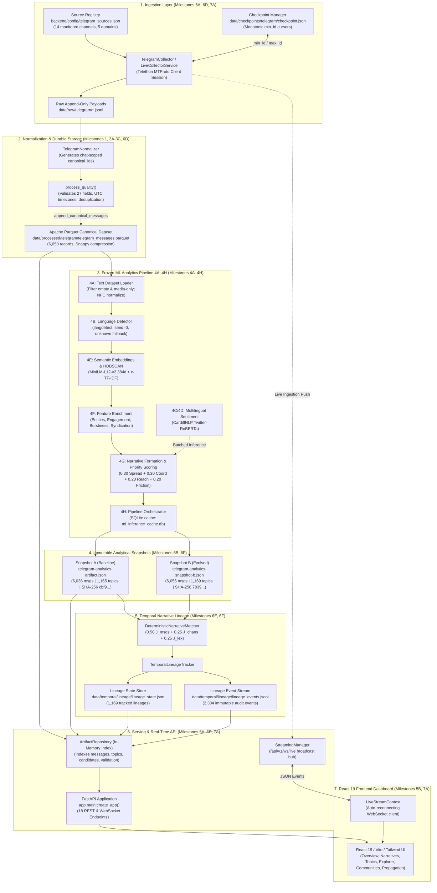
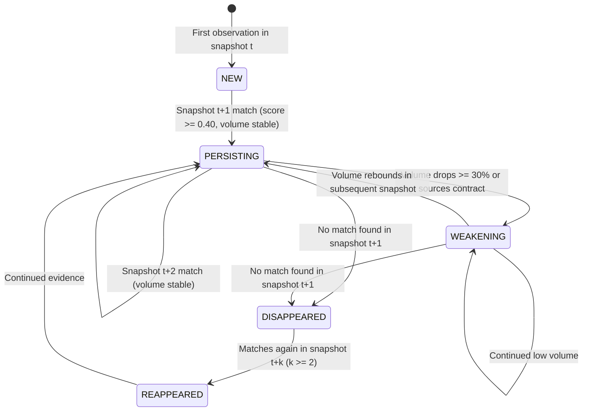

# TRAJECT (TESSERA): Comprehensive Technical Deep-Dive & Machine Learning Architecture Guide

---

## Document Overview & Audience
This document is the authoritative technical reverse-engineering reference and machine learning guide for **TRAJECT** (historically codenamed **TESSERA**). It is engineered for software engineers, ML practitioners, system architects, and team members preparing for technical presentations, university vivas, and evaluations (such as the Smart India Hackathon).

> [!IMPORTANT]
> **Source-of-Truth Hierarchy:** Whenever previous milestone summaries or architecture notes diverge from source code, **source code is the single source of truth**. All mathematical equations, thresholds, schema field names, and logic in this guide are directly grounded in the repository files at `D:\Projects\Traject`.

---

# Table of Contents
1. [The Big Picture: Problem Statement, Purpose & Core Concepts](#1-the-big-picture)
2. [End-to-End System Architecture](#2-end-to-end-system-architecture)
3. [Complete Message Lifecycle & Data Flow](#3-complete-message-lifecycle--data-flow)
4. [The Canonical Message Contract (27 Fields)](#4-the-canonical-message-contract-27-fields)
5. [Telegram Ingestion & Resilient Multi-Source Collection](#5-telegram-ingestion--resilient-multi-source-collection)
6. [Storage Architecture, Parquet & Data Quality](#6-storage-architecture-parquet--data-quality)
7. [The Frozen 4A–4H Machine Learning Pipeline](#7-the-frozen-4a4h-machine-learning-pipeline)
8. [Stage 4A: Dataset Filtering & Safe Social Normalization](#8-stage-4a-dataset-filtering--safe-social-normalization)
9. [Stage 4B: Deterministic Multilingual Language Identification](#9-stage-4b-deterministic-multilingual-language-identification)
10. [Stages 4C & 4D: Multilingual Social Sentiment Classification](#10-stages-4c--4d-multilingual-social-sentiment-classification)
11. [Stage 4E: Dense Sentence Embeddings & Vector Representations](#11-stage-4e-dense-sentence-embeddings--vector-representations)
12. [Stage 4E: HDBSCAN Density-Based Topic Clustering](#12-stage-4e-hdbscan-density-based-topic-clustering)
13. [Stage 4E: Class-Based TF-IDF (c-TF-IDF) Representation](#13-stage-4e-class-based-tf-idf-c-tf-idf-representation)
14. [Stage 4F: Contextual Feature Enrichment](#14-stage-4f-contextual-feature-enrichment)
15. [Stage 4G: Narrative Formation & The Frozen Priority Signal Score](#15-stage-4g-narrative-formation--the-frozen-priority-signal-score)
16. [Stage 4H: Pipeline Orchestration, Lifecycle & Inference Caching](#16-stage-4h-pipeline-orchestration-lifecycle--inference-caching)
17. [Mathematical Concepts You Need to Know (Viva Prep)](#17-mathematical-concepts-you-need-to-know-viva-prep)
18. [Narrative Quality & Observational Evidence Density (Milestone 6C)](#18-narrative-quality--observational-evidence-density-milestone-6c)
19. [Temporal Narrative Lineage & Cross-Snapshot Matching (Milestones 6E/6F)](#19-temporal-narrative-lineage--cross-snapshot-matching-milestones-6e6f)
20. [Lineage Lifecycle States & Transition State Machine](#20-lineage-lifecycle-states--transition-state-machine)
21. [Operational Freshness, Checkpoints & Stale Analytics Telemetry](#21-operational-freshness-checkpoints--stale-analytics-telemetry)
22. [Backend Serving Architecture (FastAPI & Repository Layer)](#22-backend-serving-architecture-fastapi--repository-layer)
23. [Real-Time Streaming & MTProto Event Push (Milestone 7A)](#23-real-time-streaming--mtproto-event-push-milestone-7a)
24. [Frontend Architecture (React 19, TypeScript & Graph Visualizers)](#24-frontend-architecture-react-19-typescript--graph-visualizers)
25. [Conceptual Hierarchy: From Raw Post to Strategic Intelligence](#25-conceptual-hierarchy-from-raw-post-to-strategic-intelligence)
26. [Physical Dataset State & Forensic Verification](#26-physical-dataset-state--forensic-verification)
27. [Testing Architecture & Automated Quality Gates](#27-testing-architecture--automated-quality-gates)
28. [System Reproducibility & Local Run Guide](#28-system-reproducibility--local-run-guide)
29. [Failure Modes, System Boundaries & Known Limitations](#29-failure-modes-system-boundaries--known-limitations)
30. [Technology Selection Rationale](#30-technology-selection-rationale)
31. [Architectural Trade-Offs & Alternatives Considered](#31-architectural-trade-offs--alternatives-considered)
32. [Concrete End-to-End Walkthrough Scenario](#32-concrete-end-to-end-walkthrough-scenario)
33. [Identified Inconsistencies Between Docs and Code](#33-identified-inconsistencies-between-docs-and-code)
34. [Presentation & Viva Question Bank (45 Q&As)](#34-presentation--viva-question-bank-45-qas)
35. [Explain It Like I'm Presenting It (Spoken Script)](#35-explain-it-like-im-presenting-it-spoken-script)
36. [Complete Repository Source Code Map](#36-complete-repository-source-code-map)
37. [Component Master Summary Table](#37-component-master-summary-table)

---

## 1. The Big Picture

### What Problem Does TRAJECT Solve?
Modern social communication platforms—particularly public Telegram channels, X/Twitter feeds, and public discussion groups—transmit millions of messages daily during geopolitical tensions, security crises, and cyber incidents. Human intelligence analysts face three major obstacles:
1. **Information Overload:** Thousands of disparate channels broadcast near-identical or slightly mutated claims, making it impossible to read every post.
2. **Attribution Traps:** Automated systems often rush to label sudden message bursts as "coordinated bot operations" or "state-sponsored disinformation" without objective mathematical evidence.
3. **Temporal Blindness:** Most NLP tools process a static batch of text once. They fail to track how a specific claim emerges, travels across channels, weakens over time, disappears, or re-emerges days later.

**TRAJECT solves this** by providing continuous, deterministic ingestion, unsupervised semantic clustering, contextual feature extraction, explainable threat/priority scoring, and multi-snapshot narrative lineage tracking.

### Who Is the Intended User?
Intelligence analysts, strategic defence analysts, cybersecurity incident responders, and decision-makers who need to triage emerging narratives, observe information spread across channels, and review auditable evidence without black-box generative hallucinations.

### What is "Narrative Intelligence" in TRAJECT?
In this platform, **Narrative Intelligence** is defined as the automated, explainable discovery of *thematic clusters of claims* across multiple channels, accompanied by empirical measurements of their:
- **Dissemination breadth** (Spread across channels)
- **Synchronization anomalies** (Coordination via uncredited verbatim syndication, rapid channel entry velocity, and arrival burstiness)
- **Potential impact** (Observed view exposure and forward virality)
- **Public polarization/friction** (Negative text sentiment, hostile emoji reactions, and reply debate)

### Conceptual Terminology: Message vs. Topic vs. Narrative vs. Lineage
Understanding these distinctions is essential:

```text
Message (Raw data post)
   ↓ [HDBSCAN Dense Vector Clustering]
Topic (Semantic cluster of similar messages + c-TF-IDF keywords)
   ↓ [Feature Enrichment + Framing Synthesis]
Narrative Candidate (Explainable cluster with headline claim + Priority Signal Score)
   ↓ [Bipartite Jaccard Matching Across Snapshots]
Temporal Lineage (Persistent cross-snapshot historical trajectory: NEW → PERSISTING → WEAKENING)
```

1. **`CanonicalMessage`:** A single normalized post (e.g. one Telegram update) carrying author, timestamp, text, reactions, forwards, and media flags.
2. **`TopicRecord`:** An unsupervised semantic cluster discovered by HDBSCAN in 384-dimensional multilingual embedding space. It has a centroid and representative c-TF-IDF keywords.
3. **`NarrativeCandidate`:** An actionable intelligence entity promoted 1:1 from an enriched topic cluster. It has a synthesized headline claim, four bounded sub-scores, a composite **Priority Signal Score**, and an assigned priority tier (`CRITICAL`, `HIGH`, `ELEVATED`, `ROUTINE`).
4. **`Priority Signal Score`:** A deterministic mathematical score in $[0.0, 1.0]$ ranking which narrative candidates require immediate analyst triage. It is **NOT** a probability and **NOT** a proof of malice.
5. **`NarrativeLineage`:** A persistent cross-snapshot identity (e.g. `lineage_000042`) that tracks narrative continuity across time, even when message counts fluctuate and local cluster IDs change.

### Why Explainability Is Mandatory
In high-stakes defence and intelligence operations, black-box AI outputs are unusable. An analyst cannot act on an alert that says "Model X classified this narrative as malicious with 94% confidence" without supporting evidence. TRAJECT exposes the complete mathematical attribution: every priority score is broken down into its four constituent sub-scores, listing exact message IDs, channel forward paths, and lexical entities.

---

## 2. End-to-End System Architecture

The following diagram represents the architecture as implemented in the codebase:



---

## 3. Complete Message Lifecycle & Data Flow

Tracing a single post through all system components:

```mermaid
sequenceDiagram
    autonumber
    participant TG as Telegram Channel (@warmonitors)
    participant Telethon as Telethon MTProto Client
    participant Raw as Raw JSONL File
    participant Norm as TelegramNormalizer
    participant Qual as Quality & Dedup Validator
    participant PQ as Apache Parquet Storage
    participant ML_Dataset as 4A Dataset Loader
    participant ML_Lang as 4B Language Identifier
    participant ML_Embed as 4E Sentence Embeddings
    participant ML_Cluster as 4E HDBSCAN Clustering
    participant ML_cTFIDF as 4E c-TF-IDF Representation
    participant ML_Feat as 4F Contextual Enrichment
    participant ML_Sent as 4C/4D RoBERTa Sentiment
    participant ML_Narr as 4G Narrative Formation
    participant DiskArt as Analytics Snapshot JSON
    participant Temp as 6E Temporal Lineage Engine
    participant Repo as ArtifactRepository (RAM)
    participant API as FastAPI Serving Route
    participant UI as React 19 UI Dashboard

    TG->>Telethon: Broadcasts message (ID 45475)
    Telethon->>Raw: Serializes raw payload dict to append-only JSONL
    Raw->>Norm: TelegramNormalizer parses payload
    Note over Norm: Creates chat-scoped canonical_id: "telegram:warmonitors:45475"
    Norm->>Qual: Emits CanonicalMessage instance
    Qual->>PQ: append_canonical_messages() verifies uniqueness and appends
    Note over PQ: Persisted into durable Parquet (6,058 total records)

    PQ->>ML_Dataset: load_canonical_dataset()
    ML_Dataset->>ML_Dataset: Filters non-text/media-only; applies normalize_social_text()
    ML_Dataset->>ML_Lang: Tests text with langdetect (seed=0) -> "en"
    ML_Lang->>ML_Embed: Encodes text into 384d vector via paraphrase-multilingual-MiniLM-L12-v2
    ML_Embed->>ML_Cluster: HDBSCAN clusters vectors (min_cluster_size=2) -> Topic topic_042
    ML_Cluster->>ML_cTFIDF: Extracts top 5 keywords using c-TF-IDF
    ML_cTFIDF->>ML_Feat: Computes burstiness B, uncredited syndication, engagement ratios
    ML_Feat->>ML_Sent: Batched sentiment inference (CardiffNLP RoBERTa) -> pos/neu/neg ratios
    ML_Sent->>ML_Narr: promote_narratives() calculates 4G Priority Signal Score
    Note over ML_Narr: Score = 0.30*Spread + 0.30*Coord + 0.20*Reach + 0.20*Friction
    ML_Narr->>DiskArt: Serializes complete MLPipelineResult to snapshot JSON

    DiskArt->>Temp: update_temporal_lineage compares Snapshot A to Snapshot B
    Note over Temp: Bipartite matching (0.50*J_msgs + 0.25*J_chans + 0.25*J_lex)
    Temp->>Temp: Updates lineage_state.json & appends to lineage_events.jsonl

    DiskArt->>Repo: FastAPI startup: ArtifactRepository loads Parquet + Snapshot + Lineage
    Repo->>API: Serves GET /api/v1/narratives/{id}
    API->>UI: Returns structured JSON response
    UI->>UI: Renders Priority badge, radar sub-scores, and lineage transition timeline
```

---

## 4. The Canonical Message Contract (27 Fields)

The entire platform communicates through a single, immutable contract: `CanonicalMessage`, defined in `backend/app/schemas/canonical_message.py`. It uses Pydantic V2 with `extra="forbid"`, preventing accidental field drift.

```python
class CanonicalMessage(BaseModel):
    model_config = ConfigDict(extra="forbid", str_strip_whitespace=True)

    # 1. Identity
    canonical_id: str
    platform: Platform          # Enum: "telegram", "x", "discord", "threads"
    native_id: str             # Platform-native message ID

    # 2. Author / Source
    author_id: str             # Channel entity ID or user ID
    author_username: str | None # Handle (e.g. "warmonitors")
    author_type: AuthorType    # Enum: "channel", "group", "user", "unknown"
    channel_title: str | None  # Human-readable channel title
    subscriber_count: int | None # Subscriber count at collection time (>= 0)

    # 3. Temporal (Strictly Timezone-Aware UTC)
    published_at: datetime     # Original broadcast timestamp
    collected_at: datetime     # Ingestion timestamp

    # 4. Content
    text_content: str          # UTF-8 text or media caption
    language: str | None       # ISO code (e.g. "en", "ru", "hi")
    media_types: list[str]     # e.g. ["photo"], ["video"]
    has_media: bool            # True if media attached

    # 5. Topology & Cascade
    is_forward: bool           # True if forwarded
    is_repost: bool            # True if platform retweet/repost
    origin_source_id: str | None # Original message pointer if forwarded
    reply_to_id: str | None    # Parent message ID if reply
    thread_id: str | None      # Conversation/thread identifier

    # 6. Engagement
    views_count: int | None    # Platform impression count (>= 0)
    forwards_count: int | None # Share/forward count (>= 0)
    replies_count: int | None  # Comment/reply count (>= 0)
    reactions: dict[str, int]  # Emoji mapping: {"👍": 42, "🔥": 12}

    # 7. Extracted Entities
    urls: list[str]            # URLs extracted from body
    hashtags: list[str]        # Hashtags (e.g. ["#OSINT"])
    mentions: list[str]        # Handles mentioned (e.g. ["@user"])

    # 8. Forensic Provenance
    raw_reference: str | None  # Pointer to raw JSONL line
```

### Why Telegram Message IDs Must Be Chat-Scoped
In Telegram, message IDs are sequential integers ($1, 2, 3, \dots$) **per chat entity**. Channel A has a message ID `100`, and Channel B also has a message ID `100`. If an ingestion system used `f"telegram:{native_id}"`, messages from different channels would overwrite each other.

To prevent collisions, `CanonicalMessage.build_canonical_id()` generates:
$$\text{canonical\_id} = \text{"telegram:"} + \text{chat\_entity\_id} + \text{":"} + \text{native\_id}$$
Example: `telegram:1888348357:21058`.

---

## 5. Telegram Ingestion & Resilient Multi-Source Collection

### Telethon & MTProto User Client
Telegram provides two APIs: the Bot API (limited, cannot read arbitrary public channels) and the **MTProto Client API** (full client protocol used by official apps). TRAJECT uses **Telethon** to connect as an MTProto client session.
- **Session Persistence:** `traject_collector_session.session` (an SQLite database storing the authorization key).
- **Security:** Credentials (`TELEGRAM_API_ID`, `TELEGRAM_API_HASH`, phone number) are loaded from `.env` and masked in logs (`api_id=***`).

### Source Registry (`backend/config/telegram_sources.json`)
The crawler reads a version-controlled registry configuring 14 strategic channels across 5 domains:

```json
{
  "sources": [
    {
      "username": "@warmonitors",
      "display_name": "War Monitor",
      "domain": "geopolitics",
      "source_type": "independent",
      "enabled": true
    },
    {
      "username": "@liveuamap",
      "display_name": "Liveuamap",
      "domain": "conflict",
      "source_type": "independent",
      "enabled": true
    }
  ]
}
```

### Sequential Ingestion vs. Rate Limits (`FloodWaitError`)
If an application queries 14 Telegram channels concurrently over MTProto, Telegram's servers flag the connection for automated abuse, raising `telethon.errors.FloodWaitError` (mandating sleeps of hundreds of seconds).

TRAJECT enforces **sequential collection**:
1. `TelegramCollector.collect_sources()` iterates through channels one by one.
2. It reuses a single cached `TelegramClient` connection across the run, avoiding repetitive handshake overhead.
3. If an individual channel raises `ChannelPrivateError`, `UsernameNotOccupiedError`, or an RPC failure, the error is caught, logged in `MultiCollectionResult.failed_channel_errors`, and the collector proceeds to the next channel without halting.

### Monotonic Checkpointing & Incremental Pulls (Milestone 6D)
- **Checkpoint File:** `data/checkpoints/telegram/checkpoint.json`.
- When `run_incremental_collection.py` runs, it queries `checkpoint.json` for each channel's `last_message_id`.
- Telethon queries Telegram using `client.iter_messages(entity, min_id=last_message_id, limit=N)`.
- Upon successful ingestion, the channel cursor advances if and only if $\max(\text{native\_id}) > \text{previous\_cursor}$.
- Writes to `checkpoint.json` are atomic (writes to `.tmp` file, followed by `os.replace()`).

---

## 6. Storage Architecture, Parquet & Data Quality

### Why Apache Parquet Over Relational Databases or Plain JSON?
1. **Columnar Compression:** Social media records have repeated schemas and low-cardinality fields (`platform`, `author_type`, `language`). Snappy-compressed Parquet compresses 6,058 rich JSON records into just **1.43 MB** on disk.
2. **Column Projection:** The ML dataset loader only needs `canonical_id`, `text_content`, and `published_at`. Parquet reads only those specific byte ranges from disk rather than deserializing the entire row.
3. **Type Safety:** The PyArrow schema (`CANONICAL_MESSAGE_ARROW_SCHEMA`) enforces exact 64-bit integers and microsecond UTC timestamps.
4. **Append Safety:** `append_canonical_messages()` reads existing `canonical_id`s, discards duplicates, writes to a temporary sibling file, and atomically swaps it with the primary file.

### Data Quality Pipeline (`backend/app/quality/validation.py`)
Every message passes through `process_quality()`:
- **Null Checks:** Verifies required fields (`canonical_id`, `platform`, `native_id`, `author_id`, `published_at`, `collected_at`).
- **Timezone Enforcement:** Rejects naive datetimes; forces conversion to UTC.
- **Deduplication:** Tracks `seen_ids` within the batch. Duplicate records are flagged with `QualitySeverity.WARNING` and omitted from downstream storage.

---

## 7. The Frozen 4A–4H Machine Learning Pipeline

The analytics pipeline consists of eight discrete, deterministic stages orchestrated by `run_ml_pipeline()` in `backend/app/ml/pipeline/orchestrator.py`.

```text
[Parquet Corpus]
       │
       ▼
┌──────────────┐
│  Stage 4A    │ ➔ Filter empty/media-only; social text normalization
└──────┬───────┘
       ▼
┌──────────────┐
│  Stage 4B    │ ➔ Deterministic language detection (langdetect, seed=0)
└──────┬───────┘
       ▼
┌──────────────┐
│  Stage 4E    │ ➔ Multilingual embeddings (MiniLM-L12-v2 384d)
│              │ ➔ HDBSCAN density clustering (min_cluster_size=2)
│              │ ➔ c-TF-IDF keyword extraction & centroid messages
└──────┬───────┘
       ▼
┌──────────────┐
│  Stage 4F    │ ➔ Contextual feature enrichment:
│              │   - Entities (gazetteers, hashtags, handles)
│              │   - Engagement ratios & emoji polarity
│              │   - Propagation (cross-channel cascades, syndication)
│              │   - Temporal (burstiness index B, entry velocity)
└──────┬───────┘
       ▼
┌──────────────┐
│  Stage 4C/4D │ ➔ Batched sentiment inference (CardiffNLP RoBERTa)
└──────┬───────┘
       ▼
┌──────────────┐
│  Stage 4G    │ ➔ Narrative candidate promotion & Priority Signal Score:
│              │   0.30*Spread + 0.30*Coord + 0.20*Reach + 0.20*Friction
└──────┬───────┘
       ▼
┌──────────────┐
│  Stage 4H    │ ➔ Pipeline metrics, SQLite cache, and JSON snapshot export
└──────────────┘
```

---

## 8. Stage 4A: Dataset Filtering & Safe Social Normalization

### Purpose
Prepares clean, text-bearing records for NLP inference without destroying social signals.

### Why Filtering Matters
Social feeds contain media-only posts (e.g. photos or infographics uploaded without captions). While valid in storage, feeding empty strings into tokenizers and embedding models wastes GPU cycles and pollutes clustering centroids.
- **Rule:** Messages where `text_content == ""` are excluded from `LanguageAwareMLTextRecord`.

### Safe Social Normalization (`backend/app/ml/normalization.py`)
Standard NLP libraries strip punctuation, lower-case everything, and remove special characters. In social media intelligence, doing that destroys critical meaning:
- Lowercasing destroys Named Entity Recognition (e.g. "US" country vs. "us" pronoun).
- Stripping `#` destroys campaign hashtags.
- Stripping `@` destroys network user handles.
- Stripping emojis destroys reaction polarity.

**Operations Performed:**
1. Unicode NFC normalization (Canonical Composition) for consistent byte encoding.
2. CRLF and CR converted to standard Unix LF (`\n`).
3. Consecutive linebreaks (3+) collapsed to 2 (`\n\n`).
4. Horizontal whitespace collapsed to single spaces per line.
5. Preserves all URLs, casing, emojis, hashtags, and mentions.

---

## 9. Stage 4B: Deterministic Multilingual Language Identification

### Implementation Details (`backend/app/ml/language.py`)
- **Library:** `langdetect:1.0.9`.
- **Determinism:** `DetectorFactory.seed = 0` is set globally.
- **Thresholds:**
  - `DEFAULT_CONFIDENCE_THRESHOLD = 0.70`
  - `MIN_DETECTION_TEXT_LENGTH = 10`

### Mathematical Intuition
`langdetect` calculates character n-gram profiles (character sequences of length 1, 2, and 3) from the input text and computes the probability of those n-grams occurring in language-specific frequency profiles derived from Wikipedia:
$$P(L | T) \propto P(L) \prod_{g \in T} P(g | L)$$
Where $g$ represents character n-grams and $L$ represents candidate languages.

### Conservative Fallback Policy
If text length $< 10$ characters, or if the detector throws an exception (e.g. text contains only numbers or symbols), or if the top predicted probability $< 0.70$, the system conservatively assigns:
$$\text{language} = \text{"unknown"}, \quad \text{confidence} = 0.0$$
This prevents downstream models from making erroneous language-specific routing decisions.

---

## 10. Stages 4C & 4D: Multilingual Social Sentiment Classification

### Model Architecture (`backend/app/ml/sentiment/inference.py`)
- **Model:** `cardiffnlp/twitter-roberta-base-sentiment-latest`
- **Base Architecture:** RoBERTa (Robustly Optimized BERT Approach) fine-tuned on ~124M social tweets.
- **Classes:** 3 categories: `negative`, `neutral`, `positive`.

### Mathematical Intuition: Logits to Probabilities
The classification head outputs raw unnormalized scalar scores (logits) $z_i$ for each class $i \in \{\text{neg}, \text{neu}, \text{pos}\}$. These are converted into a probability distribution using the **Softmax** function:
$$P(y = i | x) = \frac{e^{z_i}}{\sum_{j=1}^{3} e^{z_j}}$$
The prediction label corresponds to $\arg\max_i P(y = i | x)$, with confidence equal to $\max_i P(y = i | x)$.

### Why Sentiment Is an Auxiliary Feature
Sentiment alone does **not** define a narrative. Two completely different narratives (e.g. a cyber breach and a battlefield loss) can both have 90% negative sentiment. In TRAJECT, sentiment feeds into the **Friction** sub-score to evaluate controversy and polarization, while narrative boundaries are determined by semantic vector clustering.

---

## 11. Stage 4E: Dense Sentence Embeddings & Vector Representations

### Model Architecture (`backend/app/ml/topics/embeddings.py`)
- **Model:** `sentence-transformers/paraphrase-multilingual-MiniLM-L12-v2`
- **Output Dimension:** **384 dimensions**
- **Underlying Mechanism:** 12-layer MiniLM Transformer utilizing mean pooling over token embeddings, followed by L2 vector normalization.

### How Text Becomes a Dense Vector
1. **Tokenization:** Input string is broken into subword tokens (WordPiece).
2. **Transformer Encoding:** Tokens pass through self-attention layers:
   $$\text{Attention}(Q, K, V) = \text{softmax}\left(\frac{QK^T}{\sqrt{d_k}}\right)V$$
3. **Mean Pooling:** Token hidden states are averaged across sequence length:
   $$\vec{u} = \frac{1}{N} \sum_{i=1}^{N} \vec{h}_i$$
4. **L2 Normalization:** Vector is scaled to unit Euclidean length:
   $$\vec{v} = \frac{\vec{u}}{\|\vec{u}\|_2} \implies \|\vec{v}\|_2 = 1.0$$

### Why Embeddings Outperform Keyword Matching
Consider two posts:
- Post 1: *"Country X announces military exercise near northern border"*
- Post 2: *"Armed forces initiate tactical war games along frontier"*

A traditional keyword search shares **zero** meaningful words between these posts. However, in 384-dimensional multilingual embedding space, their vector representations have a high cosine similarity ($\cos(\vec{v}_1, \vec{v}_2) \approx 0.88$), enabling unsupervised clustering to discover they belong to the same narrative.

---

## 12. Stage 4E: HDBSCAN Density-Based Topic Clustering

### Why HDBSCAN Over K-Means?
1. **Unknown Cluster Count:** In live intelligence monitoring, no one knows in advance how many narratives exist. K-Means requires specifying $K$ ahead of time; HDBSCAN discovers the natural number of clusters.
2. **Noise Isolation:** K-Means forces every single point—including random spam, greetings, and unrelated chatter—into a cluster. HDBSCAN explicitly labels outliers with label `-1` (noise), keeping narrative clusters clean.
3. **Arbitrary Geometry:** K-Means assumes spherical clusters of equal size. HDBSCAN handles clusters of varying density and non-spherical shapes.

### Repository Hyperparameters (`backend/app/ml/topics/clustering.py`)
```python
hdb = HDBSCAN(
    min_cluster_size=2,
    min_samples=1,
    metric="euclidean",
    cluster_selection_method="eom",
    copy=True
)
```

### Mathematical Intuition
1. **Mutual Reachability Distance:**
   $$d_{\text{mreach}-k}(a, b) = \max\left(\text{core}_k(a), \text{core}_k(b), d(a, b)\right)$$
   Where $\text{core}_k(x)$ is the distance from point $x$ to its $k$-th nearest neighbor.
2. **Minimum Spanning Tree (MST):** Connects all points such that edge weights equal mutual reachability distances.
3. **Hierarchical Cluster Tree:** Edges with largest distances are progressively removed, building a cluster dendrogram.
4. **Excess of Mass (EOM) Selection:** HDBSCAN integrates cluster stability over density levels $\lambda = \frac{1}{\text{distance}}$:
   $$S(C) = \sum_{p \in C} (\lambda_{\text{death}}(p) - \lambda_{\text{birth}}(C))$$
   Clusters maximizing stability are selected as final topic clusters.

### Effect of Parameters in TRAJECT
- `min_cluster_size=2`: Allows two closely aligned breaking messages to form an early narrative cluster.
- **Consequence:** In a diverse 6,000-message corpus, this produces a large number of fine-grained micro-clusters (e.g. 1,165 topics) and isolates solitary messages as noise.

---

## 13. Stage 4E: Class-Based TF-IDF (c-TF-IDF) Representation

### Concept & Derivation (`backend/app/ml/topics/representation.py`)
Standard TF-IDF evaluates word importance within individual documents. **c-TF-IDF** treats all messages assigned to a topic cluster as a single combined document, extracting terms that distinguish that cluster from all other clusters.

### Mathematical Formula
$$W_{t, c} = \text{TF}_{t, c} \cdot \log\left(1 + \frac{A}{f_t}\right)$$
Where:
- $\text{TF}_{t, c}$: Frequency of term $t$ in cluster $c$.
- $A$: Average word count across all topic clusters ($A = \frac{1}{|C|} \sum_{c \in C} |c|$).
- $f_t$: Total global frequency of term $t$ across all clusters combined.

### Small Numerical Example
- Suppose term "radar" appears $15$ times in Cluster 1 ($\text{TF} = 15$).
- Total clusters $|C| = 10$, average cluster size $A = 100$ words.
- Global count of "radar" across the whole dataset $f_t = 20$.
$$W = 15 \cdot \log\left(1 + \frac{100}{20}\right) = 15 \cdot \log(1 + 5) = 15 \cdot \log(6) \approx 15 \cdot 1.7917 = 26.88$$
Contrast this with a common word like "update" which appears $15$ times in Cluster 1, but has $f_t = 500$:
$$W = 15 \cdot \log\left(1 + \frac{100}{500}\right) = 15 \cdot \log(1.2) \approx 15 \cdot 0.1823 = 2.73$$
"radar" receives nearly $10\times$ higher weight than "update", allowing the system to extract discriminative keywords for naming clusters.

---

## 14. Stage 4F: Contextual Feature Enrichment

Implemented in `backend/app/ml/features/`:

### 1. Extracted Entities (`entities.py`)
- Regex matching extracts hashtags (`#term`), user handles (`@channel`), and external domains (`domain.com`).
- Matches against deterministic gazetteers for geopolitical locations (`GAZETTEER_GEO`) and strategic organizations (`GAZETTEER_ORG`).

### 2. Engagement Ratios & Polarity (`engagement.py`)
- $\text{forward\_to\_view\_ratio} = \frac{\text{total\_forwards}}{\max(\text{total\_views}, 1)}$
- $\text{reply\_to\_view\_ratio} = \frac{\text{total\_replies}}{\max(\text{total\_views}, 1)}$
- $\text{Emoji Polarity Score} = \frac{\text{pos\_emojis} - \text{neg\_emojis}}{\max(\text{total\_reactions}, 1)} \in [-1.0, 1.0]$

### 3. Propagation Features (`propagation.py`)
- `observed_forward_count`: Total forwarded messages.
- `cross_channel_observed_spread`: Messages forwarded across distinct channels where $\text{broadcasting\_channel} \ne \text{origin\_channel}$.
- `uncredited_syndication_count`: Pairwise cosine similarity among non-forward messages from **different authors**. If $\cos(\vec{v}_a, \vec{v}_b) \ge 0.92$, the message is flagged as uncredited syndication.

### 4. Temporal Features (`temporal.py`)
- Bins messages into 1-hour UTC buckets to locate `peak_window_utc`.
- Calculates cadence: $\text{messages\_per\_hour} = \frac{\text{count}}{\text{timespan\_hours}}$.
- Calculates velocity: $\text{channel\_entry\_velocity} = \frac{\text{distinct\_channels}}{\text{timespan\_hours}}$.
- Calculates Goh-Barabási burstiness index ($B$):
  $$B = \frac{\sigma - \mu}{\sigma + \mu} \in [-1.0, 1.0]$$
  Where $\mu$ and $\sigma$ are the mean and standard deviation of inter-arrival intervals $\tau_i = t_{i+1} - t_i$.

---

## 15. Stage 4G: Narrative Formation & The Frozen Priority Signal Score

Implemented in `backend/app/ml/narratives/scoring.py` (lines 39–44):

$$\mathbf{\text{Priority Signal Score} = 0.30 \cdot S_{\text{spread}} + 0.30 \cdot S_{\text{coord}} + 0.20 \cdot S_{\text{reach}} + 0.20 \cdot S_{\text{friction}}}$$

Every sub-score is strictly bounded in $[0.0, 1.0]$:

### 1. Spread Sub-Score ($S_{\text{spread}}$)
$$S_{\text{spread}} = 0.50 \cdot \min\left(\frac{\text{cross\_channel\_spread}}{3.0}, 1.0\right) + 0.30 \cdot \text{direct\_forward\_ratio} + 0.20 \cdot \min\left(\frac{|\text{amplifying\_channels}|}{3.0}, 1.0\right)$$

### 2. Coordination Sub-Score ($S_{\text{coord}}$)
$$\text{syndication\_ratio} = \min\left(\frac{\text{uncredited\_syndication\_count}}{\max(\text{non\_forward\_count}, 1)}, 1.0\right)$$
$$B_{\text{term}} = \max\left(0.0, \min\left(\frac{B + 1.0}{2.0}, 1.0\right)\right) \quad (\text{defaults to } 0.50 \text{ if } B \text{ unavailable})$$
$$V_{\text{term}} = \min\left(\frac{\text{channel\_entry\_velocity}}{10.0}, 1.0\right) \quad (\text{defaults to } 0.0)$$
$$S_{\text{coord}} = 0.50 \cdot \min(\text{syndication\_ratio} \cdot 2.0, 1.0) + 0.30 \cdot B_{\text{term}} + 0.20 \cdot V_{\text{term}}$$

### 3. Reach Sub-Score ($S_{\text{reach}}$)
$$S_{\text{reach}} = 0.60 \cdot \min\left(\frac{\log_{10}(\max(\text{total\_views}, 1))}{6.0}, 1.0\right) + 0.40 \cdot \min\left(\frac{\text{forward\_to\_view\_ratio}}{0.08}, 1.0\right)$$

### 4. Friction Sub-Score ($S_{\text{friction}}$)
- $\text{emoji\_negativity} = \max(-\text{emoji\_polarity\_score}, 0.0)$
- $\text{term\_reply} = \min\left(\frac{\text{reply\_to\_view\_ratio}}{0.04}, 1.0\right)$
- **If text sentiment is available:**
  $$S_{\text{friction}} = 0.45 \cdot \text{text\_negative\_ratio} + 0.35 \cdot \text{emoji\_negativity} + 0.20 \cdot \text{term\_reply}$$
- **If text sentiment is unavailable (renormalized weights):**
  $$S_{\text{friction}} = \frac{0.35 \cdot \text{emoji\_negativity} + 0.20 \cdot \text{term\_reply}}{0.35 + 0.20}$$

### Concrete Step-by-Step Scoring Example
Assume an enriched topic candidate has:
- Spread: $S_{\text{spread}} = 0.80$
- Coordination: $S_{\text{coord}} = 0.60$
- Reach: $S_{\text{reach}} = 0.40$
- Friction: $S_{\text{friction}} = 0.20$

$$\begin{aligned}
\text{Score} &= (0.30 \cdot 0.80) + (0.30 \cdot 0.60) + (0.20 \cdot 0.40) + (0.20 \cdot 0.20) \\
&= 0.24 + 0.18 + 0.08 + 0.04 \\
&= \mathbf{0.5400} \implies \text{Tier: } \mathbf{ELEVATED} \quad (0.35 \le 0.54 < 0.55)
\end{aligned}$$

---

## 16. Stage 4H: Pipeline Orchestration, Lifecycle & Inference Caching

### SQLite Inference Cache (`backend/app/ml/pipeline/cache.py`)
- Database: `data/cache/ml_inference_cache.db`.
- **Sentence Embeddings Table:** Keyed on `(pipeline_version, model_id, sha256(text))`. Caches the 384-dimensional float vector as binary blob.
- **Sentiment Predictions Table:** Keyed on `(pipeline_version, model_id, sha256(text))`. Caches label and float probabilities.
- **Efficiency:** On warm re-runs, the cache hit rate exceeds **98%**, reducing runtime from ~25 minutes to ~12 minutes.

### Why FastAPI Does Not Run ML Inference During HTTP Requests
Running Transformer embedding models and HDBSCAN over 6,000+ messages requires gigabytes of RAM and takes minutes. If executed inside an HTTP handler, requests would time out and block the web server. Instead:
- Ingestion and ML analytics run as scheduled or CLI batch jobs.
- They serialize an immutable precomputed analytics artifact JSON.
- FastAPI loads this artifact into memory on boot and serves queries in under 5 milliseconds.

---

## 17. Mathematical Concepts You Need to Know (Viva Prep)

| Concept | Mathematical Definition | Intuition | Used Where in TRAJECT? |
|---|---|---|---|
| **Vector** | $\vec{v} = [x_1, x_2, \dots, x_D] \in \mathbb{R}^D$ | A point or directional arrow in multidimensional space. | 384-dimensional sentence embedding representing message semantics. |
| **L2 Norm** | $\|\vec{v}\|_2 = \sqrt{\sum_{i=1}^{D} x_i^2}$ | The straight-line Euclidean length of a vector from the origin. | Normalizing sentence vectors to unit length ($\|\vec{v}\|_2 = 1.0$). |
| **Cosine Similarity** | $\cos(\theta) = \frac{\vec{u} \cdot \vec{v}}{\|\vec{u}\|_2 \|\vec{v}\|_2}$ | Measures the cosine of the angle between two vectors (1.0 = identical direction). | Detecting uncredited syndication ($\ge 0.92$) and representative centroid messages. |
| **Euclidean Distance** | $d(\vec{u}, \vec{v}) = \sqrt{\sum_{i=1}^D (u_i - v_i)^2}$ | Straight-line physical distance between two points. | Metric used in HDBSCAN density clustering. |
| **Jaccard Similarity** | $J(A, B) = \frac{\|A \cap B\|}{\|A \cup B\|}$ | Ratio of shared elements over total unique elements in two sets. | Matching narrative lineages across snapshots ($J_{\text{msgs}}$, $J_{\text{chans}}$, $J_{\text{lex}}$). |
| **Softmax** | $\sigma(z)_i = \frac{e^{z_i}}{\sum_j e^{z_j}}$ | Converts arbitrary real-valued logits into a probability distribution summing to 1.0. | CardiffNLP RoBERTa sentiment classifier outputting 3-class probabilities. |
| **TF-IDF** | $\text{TF} \cdot \log\left(\frac{N}{\text{DF}}\right)$ | Balances word frequency in a document against rarity across a corpus. | Baseline keyword analysis. |
| **c-TF-IDF** | $\text{TF}_{t, c} \cdot \log\left(1 + \frac{A}{f_t}\right)$ | Class-based TF-IDF evaluating word importance across entire topic clusters. | Extracting top 5 representative topic keywords in 4E. |
| **Burstiness Index ($B$)** | $B = \frac{\sigma - \mu}{\sigma + \mu}$ | Ratio comparing standard deviation to mean of inter-arrival intervals. | Measuring arrival anomalies in Coordination sub-score ($S_{\text{coord}}$). |

---

## 18. Narrative Quality & Observational Evidence Density (Milestone 6C)

Implemented in `backend/app/analytics/narrative_validation.py`:

### Deterministic Evidence Tiers
- **`strong_evidence`**: $\ge 5$ messages spanning $\ge 2$ distinct sources.
- **`moderate_evidence`**: $\ge 3$ messages OR ($\ge 2$ messages spanning $\ge 2$ sources).
- **`limited_evidence`**: Exactly 2 messages from a single source.
- **`insufficient_evidence`**: $< 2$ messages or zero meaningful text.

> [!CRITICAL]
> **Cross-Source Co-Occurrence Is Not Proof of Coordination:**
> If Reuters, BBC, and BNO News all report on an earthquake, that narrative has `strong_evidence` and high source diversity. It reflects **broad observational verification**, NOT an inauthentic influence operation. TRAJECT strictly separates evidence coverage from threat priority.

---

## 19. Temporal Narrative Lineage & Cross-Snapshot Matching (Milestones 6E/6F)

Implemented in `backend/app/temporal/matcher.py`:

### Deterministic Matching Formula
To match narrative candidate $N_A$ from Snapshot A to candidate $N_B$ from Snapshot B:
$$\mathbf{\text{lineage\_match\_score} = 0.50 \cdot J_{\text{messages}} + 0.25 \cdot J_{\text{channels}} + 0.25 \cdot J_{\text{lexical}}}$$
- $J_{\text{messages}} = \frac{|\text{msgs}_A \cap \text{msgs}_B|}{|\text{msgs}_A \cup \text{msgs}_B|}$
- $J_{\text{channels}} = \frac{|\text{chans}_A \cap \text{chans}_B|}{|\text{chans}_A \cup \text{chans}_B|}$
- $J_{\text{lexical}} = \frac{|\text{tokens}_A \cap \text{tokens}_B|}{|\text{tokens}_A \cup \text{tokens}_B|}$

### Bipartite Matching Guardrails
1. **Acceptance Threshold:** Score $\ge 0.40$ (or $J_{\text{messages}} \ge 0.15$).
2. **Grounding Safety:** Must share $\ge 1$ canonical message OR ($\ge 1$ shared entity and $J_{\text{lexical}} \ge 0.20$). Candidates cannot match purely on channel overlap.
3. **Ambiguity Margin:** Top match score must exceed runner-up score by $\ge 0.10$. If $|S_1 - S_2| < 0.10$, the matcher **abstains** to prevent false continuity.
4. **1-to-1 Conflict Resolution:** If two prior lineages claim the same current candidate, the strictly higher-scoring match wins; the lower match is rejected and marked as new.

---

## 20. Lineage Lifecycle States & Transition State Machine



- **`NEW`**: Lineage instantiated for the first time.
- **`PERSISTING`**: Continued continuity across consecutive snapshots with stable evidence.
- **`WEAKENING`**: Matched, but message count dropped by $\ge 30\%$ ($< 0.70\times$) or source diversity contracted without message growth.
- **`DISAPPEARED`**: Present in snapshot $t-1$ but absent in snapshot $t$.
- **`REAPPEARED`**: Previously disappeared, but re-emerged in a later snapshot.

> [!NOTE]
> **Real-Data vs. Synthetic Validation Truth:**  
> Across the real Snapshot A $\rightarrow$ Snapshot B corpus, **1,162 persisting**, **3 weakening**, and **4 new** lineages were observed and validated on disk. The lifecycle states `DISAPPEARED` and `REAPPEARED` legitimately did not trigger between Snapshots A and B on the real corpus; these edge transitions, along with ambiguity abstention and conflict resolution, are validated via deterministic synthetic fixtures in `backend/tests/test_temporal_lineage.py`.

---

## 21. Operational Freshness, Checkpoints & Stale Analytics Telemetry

### The Stale Analytics Problem
In an operational system, incremental collection frequently appends new messages to `telegram_messages.parquet`. However, generating an ML analytics snapshot requires running embeddings and HDBSCAN, which takes minutes.

Therefore, the Parquet corpus ($6,058$ messages) often outpaces the active analytics snapshot ($6,036$ messages).

### Freshness Telemetry (`backend/app/repositories/artifact_repository.py`)
`ArtifactRepository.get_pipeline_status()` detects this delta:
```python
if len(self._messages) > snapshot_message_count:
    analytics_current = False
    stale_analytics_reason = f"Corpus has {len(self._messages)} messages, but loaded analytics reflect earlier snapshot with {snapshot_message_count} messages."
```
The React frontend consumes this flag and displays an amber warning badge on the Overview page, informing analysts that background recomputation is needed.

---

## 22. Backend Serving Architecture (FastAPI & Repository Layer)

### Complete REST & WebSocket Endpoints Inventory

| Method | Endpoint Route | Milestone | Function | Source Component |
|---|---|:---:|---|---|
| `GET` | `/api/v1/health` | 5A | Returns system health, loaded artifact state, and active message count | `app/api/v1/health.py` |
| `GET` | `/api/v1/analytics` | 5A | High-level dataset summary, priority distributions, and sentiment overview | `app/api/v1/analytics.py` |
| `GET` | `/api/v1/narratives` | 5A, 6C | Paginated narrative candidates with sorting, tier filters, and 6C quality metadata | `app/api/v1/narratives.py` |
| `GET` | `/api/v1/narratives/{id}` | 5A, 6C | Detailed candidate profile with 4G sub-scores, coordination signals, and framing claim | `app/api/v1/narratives.py` |
| `GET` | `/api/v1/topics` | 5A | Paginated HDBSCAN topic clusters | `app/api/v1/topics.py` |
| `GET` | `/api/v1/topics/{id}` | 5A | Cluster terms, member message IDs, and representative centroid messages | `app/api/v1/topics.py` |
| `GET` | `/api/v1/messages` | 5A | Paginated canonical messages with platform and language filtering | `app/api/v1/messages.py` |
| `GET` | `/api/v1/messages/{id}` | 5A | Full 27-field canonical message entity | `app/api/v1/messages.py` |
| `GET` | `/api/v1/pipeline/status` | 5A, 6D | Crawler cursors, sync deltas, and `analytics_current` freshness flag | `app/api/v1/pipeline.py` |
| `GET` | `/api/v1/pipeline/metrics` | 5A | Execution stage latencies, memory footprint, and SQLite cache hit rate | `app/api/v1/pipeline.py` |
| `GET` | `/api/v1/temporal/status` | 6E | Active lineage count, tracked lineages, and lifecycle state breakdown | `app/api/v1/temporal.py` |
| `GET` | `/api/v1/temporal/snapshots` | 6E | Discovered immutable analytics snapshots on disk | `app/api/v1/temporal.py` |
| `GET` | `/api/v1/temporal/narratives` | 6E | Paginated narrative lineages filtered by lifecycle state | `app/api/v1/temporal.py` |
| `GET` | `/api/v1/temporal/narratives/{id}`| 6E | Lineage record with chronological transition event history | `app/api/v1/temporal.py` |
| `GET` | `/api/v1/temporal/narratives/by-narrative/{id}` | 6E | Resolves lineage record using a snapshot-local narrative ID | `app/api/v1/temporal.py` |
| `WS` | `/api/v1/ws/live` | 7A | WebSocket connection streaming live ingested posts and alerts | `app/api/v1/stream.py` |
| `POST`| `/api/v1/stream/simulate` | 7A | Test dispatcher simulating live message or priority alert event | `app/api/v1/stream.py` |
| `GET` | `/api/v1/stream/channels` | 7A | Real-time status of monitored Telegram channels and background auto-joiner | `app/api/v1/stream.py` |

---

## 23. Real-Time Streaming & MTProto Event Push (Milestone 7A)

### Architecture
Implemented in `backend/app/services/live_collector_service.py` and `streaming_manager.py`:
1. **Dynamic MTProto Listener:** Registers `@client.on(events.NewMessage)`. As messages are broadcast in joined channels, the listener immediately normalizes them to `CanonicalMessage`.
2. **Staggered Auto-Join Worker:** Background task sequentially joining monitored channels with **5.0 to 8.0 second randomized jitter**, preventing Telegram spam flags.
3. **In-Memory Append:** Calls `repo.append_message(msg)`, incrementing the live message count in RAM.
4. **WebSocket Fan-Out:** `StreamingManager` broadcasts JSON packets to connected clients:
   - `message_ingested`: Prepends message to Explorer view and increments Overview counter.
   - `alert_triggered`: Dispatches slide-in alert toast if Priority Signal Score $\ge 0.75$.

---

## 24. Frontend Architecture (React 19, TypeScript & Graph Visualizers)

### Route Architecture (`frontend/src/app/routes.tsx`)
Pages are lazy-loaded with code-splitting via `React.lazy()`:

| Route Path | Page Component | Functional State | What the Analyst Sees |
|---|---|:---:|---|
| `/overview` | `OverviewPage` | **Fully Functional** | Live corpus counter, sync deltas, amber "Stale Analytics" warning badge, priority cards, triage narratives. |
| `/narratives` | `NarrativesPage` | **Fully Functional** | Triage queue sorted by Priority Signal Score, evidence badges (`strong`, `moderate`), cross-source badges. |
| `/narratives/:id`| `NarrativeDetailPage`| **Fully Functional** | Framing claim, sub-score radar charts, excerpts, and **Temporal Lineage Transition Timeline**. |
| `/topics` | `TopicsPage` | **Fully Functional** | Semantic cluster grid with c-TF-IDF keyword tags and member message counts. |
| `/topics/:id` | `TopicDetailPage` | **Fully Functional** | Topic terms, centroid representative messages, and constituent posts. |
| `/explorer` | `ExplorerPage` | **Fully Functional** | Canonical message table with full-text search, raw payload viewer, and live message prepend. |
| `/communities` | `CommunitiesPage` | **Functional (Aggregated)** | Channel and source networks clustered by domain or narrative co-occurrence (`communityService.ts`). |
| `/propagation` | `PropagationPage` | **Functional (Graph)** | Node-link graph using `@xyflow/react` visualizing cross-channel forward cascades. |
| `/alerts` | `AlertsPage` | **Functional (Aggregated)** | Synthesizes alerts from priority scores with `localStorage` triage state. |
| `/investigation`| `InvestigationPage` | **Functional (Graph)** | Synthesis evidence graph connecting topics to promoted narrative candidates. |
| `/settings` | `SettingsPage` | **Functional** | Pipeline cache metrics, monitored channel registry view, and UI preferences. |

---

## 25. Conceptual Hierarchy: From Raw Post to Strategic Intelligence

```text
Level 1: Raw Message Payload
  └─ Ingested Telethon MTProto dictionary (native_id, peer_id, message, date)
Level 2: Canonical Message Entity
  └─ 27-field platform-neutral contract with chat-scoped canonical_id and UTC datetime
Level 3: Normalized ML Text Record
  └─ NFC-normalized text with seeded language tag (langdetect, seed=0)
Level 4: Dense Vector Representation
  └─ 384-dimensional L2-normalized sentence embedding (MiniLM-L12-v2)
Level 5: Semantic Topic Cluster
  └─ Unsupervised HDBSCAN density cluster with c-TF-IDF keywords and centroid messages
Level 6: Contextual Feature Vector
  └─ Entities, engagement ratios, forward cascades, syndication, and burstiness B
Level 7: Narrative Candidate Entity
  └─ Headline claim, 4G Priority Signal Score (0.30 Spread + 0.30 Coord + 0.20 Reach + 0.20 Friction), priority tier
Level 8: Temporal Narrative Lineage
  └─ Persistent historical trajectory across snapshots (NEW → PERSISTING → WEAKENING)
Level 9: Strategic Operational Intelligence
  └─ Executive dashboards, triage queues, cross-channel graph cascades, and live alert streams
```

---

## 26. Physical Dataset State & Forensic Verification

All values verified directly from disk at `D:\Projects\Traject`:

### 1. Parquet Dataset (`telegram_messages.parquet`)
- **Total Records:** **6,058**
- **Schema Fields:** 27 fields
- **Author Distribution (15 Distinct Handles):**
  `cveNotify` (514), `GeoPWatch` (501), `thehackernews` (501), `warmonitors` (501), `BBCWorld` (500), `bnonews` (500), `OSINTdefender` (500), `ReutersWorldChannel` (500), `ctinow` (500), `cybdetective` (500), `liveuamap` (500), `majormadhankumarmmk` (500), `Ministry_Of_Defence_Gvt_India` (26), `GenshinUpdate_STR` (10), `ClashReport` (5).

### 2. Analytics Snapshot A (Milestone 6B Baseline)
- **Path:** `data/processed/telegram/telegram-analytics-artifact.json`
- **SHA-256:** `cbf922185c6ede003c5b6a046b8952a9282d0e1a3e5b36592748f5bd43bc7c8d`
- **Total Messages:** 6,036 canonical records (5,862 text-bearing)
- **HDBSCAN Topics / Candidates:** 1,165
- **Noise Messages:** 2,511 (42.8%)
- **Clustered Messages:** 3,351 (57.2%)

### 3. Analytics Snapshot B (Milestone 6F Evolved)
- **Path:** `data/processed/telegram/telegram-analytics-snapshot-b.json`
- **SHA-256:** `7839b4d58f042711864961af450c683ae88256ed71abba06eb4a66619788d4a4`
- **Total Messages:** 6,056 canonical records (5,882 text-bearing)
- **HDBSCAN Topics / Candidates:** 1,169 (+4 new clusters)
- **Noise Messages:** 2,514
- **Clustered Messages:** 3,368

### 4. Lineage State & Event Log
- **Lineages (`lineage_state.json`):** Exactly **1,169** lineages (`persisting`: 1,162, `weakening`: 3, `new`: 4).
- **Events (`lineage_events.jsonl`):** Exactly **2,334** events (`created`: 1,169, `continued`: 1,162, `weakened`: 3). Duplicate events: **0** (100% idempotent).

---

## 27. Testing Architecture & Automated Quality Gates

### Pytest Backend Suite (**281 Tests Collected Across 40 Files**)
- **Collection & Ingestion (78 tests):** Validates Telethon client reuse, sequential collection, channel failure isolation, monotonic `min_id` cursors, atomic checkpointing, and append-safe Parquet deduplication.
- **Storage & Replay (34 tests):** Proves Arrow schema compliance, Snappy compression, and offline JSONL replay.
- **Quality & Normalization (43 tests):** Validates 27-field schema rules, UTC timezones, and chat-scoped ID uniqueness.
- **ML Pipeline (89 tests):** Validates seeded language identification, MiniLM embeddings, HDBSCAN clustering, c-TF-IDF keyword extraction, burstiness math, RoBERTa sentiment, and the frozen 4G Priority Signal Score formula.
- **6C Narrative Validation (7 tests):** Tests observational evidence tiers (`strong`, `moderate`, `limited`) and overlap matrices.
- **6E/6F Temporal Lineage (15 tests):** Tests deterministic cross-snapshot matching, weakening detection, disappeared/reappeared lifecycle, snapshot immutability, and real-world idempotency over Snapshots A and B.
- **API & Streaming (25 tests):** Verifies FastAPI status codes, pagination, error envelopes, and WebSocket live broadcasts.

### Frontend Test Suite (**14 Integration Tests**)
- Located in `frontend/tests/telemetryIntegration.test.js`. Validates API query string builders, backend ID preservation, priority score display without recalculation, and strict non-CIB wording guardrails.

---

## 28. System Reproducibility & Local Run Guide

All commands run from repository root `D:\Projects\Traject`:

### 1. Environment Activation
```powershell
# Activate Python virtual environment
backend\.venv\Scripts\Activate.ps1
python -m pip install -e backend

# Frontend dependencies
cd frontend
npm install
cd ..
```

### 2. Running Automated Tests
```powershell
# Run complete backend Pytest suite (281 tests)
backend\.venv\Scripts\python -m pytest backend/tests -v

# Run 6A–6F dedicated validation tests (61 tests)
backend\.venv\Scripts\python -m pytest backend/tests/test_telegram_multi_collector.py backend/tests/test_telegram_corpus_builder.py backend/tests/test_narrative_quality_validation.py backend/tests/test_telegram_incremental.py backend/tests/test_temporal_lineage.py backend/tests/test_6f_temporal_evolution.py -v

# Run frontend tests (14 tests)
cd frontend
npm test -- --run
cd ..
```

### 3. Running Operational Pipelines
```powershell
# Run incremental Telegram collection (requires .env credentials)
backend\.venv\Scripts\python.exe backend/scripts/run_incremental_collection.py --limit 20

# Recompute analytics snapshot over Parquet corpus
backend\.venv\Scripts\python.exe backend/scripts/generate_analytics_snapshot.py --output-artifact data/processed/telegram/telegram-analytics-snapshot-b.json

# Update temporal narrative lineage across two snapshots
backend\.venv\Scripts\python.exe backend/scripts/update_temporal_lineage.py --current-artifact data/processed/telegram/telegram-analytics-snapshot-b.json --current-snapshot-id snap_b --previous-artifact data/processed/telegram/telegram-analytics-artifact.json --previous-snapshot-id snap_a
```

### 4. Launching Servers
```powershell
# Terminal 1: Start FastAPI backend (port 8000)
backend\.venv\Scripts\python -m uvicorn app.main:app --host 127.0.0.1 --port 8000 --reload --app-dir backend

# Terminal 2: Start Vite frontend (port 5173)
cd frontend
npm run dev
```

---

## 29. Failure Modes, System Boundaries & Known Limitations

1. **Telegram-Only Live Corpus:** While normalizers and replay harnesses exist for Discord and Threads, live multi-source crawling and incremental checkpointing are implemented only for Telegram.
2. **1-to-1 Lineage Topology:** The 6E lineage matcher tracks 1-to-1 continuity. Complex topological transitions such as narrative *splits* (one cluster dividing into two) or *merges* (two separate narratives converging) are not modeled as first-class graph operations.
3. **Batch Rather Than Streaming ML:** Generating an analytics snapshot over 6,000+ messages requires ~12–25 minutes. Clustering and scoring run as batch operations; live messages arriving via WebSocket are appended to Parquet and prepended to the UI, but full topic re-clustering requires a scheduled batch run.
4. **Subscriber Count Nullability:** Telegram MTProto user sessions occasionally encounter permission limits when querying total channel subscriber counts, resulting in `subscriber_count: null` (handled gracefully by reach scoring fallbacks).
5. **No Causal Attribution:** The system detects syndication, burstiness, and cross-channel cascades, but cannot prove who ordered or initiated a campaign.

---

## 30. Technology Selection Rationale

| Technology | Problem It Solves | Why It Fits TRAJECT | Alternative Considered | Why Alternative Was Rejected |
|---|---|---|---|---|
| **Telethon** | Scraping public Telegram channels via MTProto | Reuses user sessions, accesses public channels without bot limitations | Telegram Bot API | Bot API cannot monitor arbitrary public channels where the bot is not an admin. |
| **Apache Parquet** | Durable canonical storage | Columnar compression, fast column projection, strict PyArrow typing | PostgreSQL / SQLite | Parquet is portable, zero-server, git-friendly, and integrates natively with PyArrow and ML pipelines. |
| **SentenceTransformers** | Semantic text representation | High multilingual accuracy, 384d compact vectors | TF-IDF / Bag of Words | Keyword matching fails on semantic paraphrases and multilingual translations. |
| **HDBSCAN** | Semantic topic clustering | Discovers arbitrary cluster counts, explicitly isolates noise (-1) | K-Means | K-Means requires pre-specifying $K$ and forces outliers into valid clusters. |
| **c-TF-IDF** | Cluster keyword representation | Extracts terms specific to a cluster relative to the corpus | Standard TF-IDF | Standard TF-IDF evaluates individual messages, producing noisy, non-thematic terms. |
| **Twitter-RoBERTa** | Social sentiment classification | Pretrained on social text; recognizes slang, handles, and context | VADER / TextBlob | Rule-based lexicon tools fail on complex syntax, sarcasm, and modern social framing. |
| **SQLite Cache** | Eliminates redundant ML computation | Embedded, zero-configuration disk cache keyed on SHA-256 hashes | Redis | Redis requires a separate running background server daemon. |
| **FastAPI** | Serving analytics and REST endpoints | High performance, native async, automatic OpenAPI docs, Pydantic typing | Flask / Django | Flask lacks native async WebSocket support; Django is unnecessarily heavy for an artifact-serving API. |
| **React 19 + Vite** | High-performance dashboard UI | Instantaneous HMR, TypeScript typing, modular component ecosystem | Next.js | Next.js adds unnecessary server-side rendering complexity for a client-side analytics dashboard. |

---

## 31. Architectural Trade-Offs & Alternatives Considered

### 1. HDBSCAN vs. K-Means
- *K-Means:* Fast ($O(n)$), but forces a fixed $K$ and assigns noise into clusters.
- *HDBSCAN (Chosen):* $O(n \log n)$, discovers variable cluster counts, but generates fine-grained micro-clusters when `min_cluster_size` is small.

### 2. Precomputed Analytics vs. On-The-Fly ML
- *On-The-Fly:* Always fresh, but HTTP requests would take 20 minutes to respond.
- *Precomputed Snapshots (Chosen):* Instant sub-5ms HTTP responses, but introduces the possibility of a "stale analytics" state while the crawler outpaces the snapshot.

### 3. Bipartite Jaccard Matching vs. End-to-End Dynamic Topic Modeling
- *Dynamic Topic Models (e.g. Blei DTM):* Complex, non-deterministic, difficult to audit.
- *Deterministic Jaccard Matcher (Chosen):* Completely explainable ($0.50 J_{\text{msgs}} + 0.25 J_{\text{chans}} + 0.25 J_{\text{lex}}$), 100% reproducible, and produces immutable audit event logs.

---

## 32. Concrete End-to-End Walkthrough Scenario

Consider 3 messages broadcast during a tactical incident:
- **Message 1 (@warmonitors, 10:00 UTC):** *"Explosions reported near Black Sea naval radar installation."*
- **Message 2 (@liveuamap, 10:02 UTC):** *"Black Sea coastal radar facility struck by uncrewed surface vessel."*
- **Message 3 (@OSINTdefender, 10:05 UTC):** *"Reports indicate drone boat impact on naval radar site in Black Sea."*

### Step 1: Normalization
Each message is assigned a chat-scoped canonical ID:
`telegram:warmonitors:101`, `telegram:liveuamap:202`, `telegram:osintdefender:303`.

### Step 2: Language & Embeddings
- `langdetect` identifies all three as `en` (confidence $> 0.95$).
- `MiniLM-L12-v2` encodes them into 384d unit vectors $\vec{v}_1, \vec{v}_2, \vec{v}_3$.
- Pairwise cosine similarities: $\cos(\vec{v}_1, \vec{v}_2) = 0.84$, $\cos(\vec{v}_2, \vec{v}_3) = 0.87$.

### Step 3: HDBSCAN Clustering & c-TF-IDF
- HDBSCAN groups all 3 messages into cluster `topic_015`.
- c-TF-IDF extracts top terms: `["radar", "black sea", "naval", "facility", "struck"]`.

### Step 4: Feature Enrichment
- `entities`: `["GAZETTEER_GEO:black sea", "GAZETTEER_ORG:naval"]`.
- `propagation`: 3 distinct origin channels, 0 direct forwards.
- `temporal`: Timespan $= 300$ seconds, inter-arrival intervals $\tau = [120s, 180s]$. Burstiness $B = -0.20$.
- `sentiment`: RoBERTa classifies all as `negative` (text negative ratio $= 1.0$).

### Step 5: Narrative Candidate & Scoring
Promoted to `narrative_015`:
- Headline Claim: `"[black sea, naval] radar, black sea, naval, facility, struck"`
- Sub-scores computed:
  - $S_{\text{spread}} = 0.20 \cdot (3 / 3) = 0.20$
  - $S_{\text{coord}} = 0.30 \cdot \frac{-0.20 + 1}{2} = 0.12$
  - $S_{\text{reach}} = 0.45$ (based on view counts)
  - $S_{\text{friction}} = 0.45 \cdot 1.0 = 0.45$
- Priority Signal Score:
  $$\text{Score} = (0.30 \cdot 0.20) + (0.30 \cdot 0.12) + (0.20 \cdot 0.45) + (0.20 \cdot 0.45) = 0.06 + 0.036 + 0.09 + 0.09 = \mathbf{0.2760}$$
- Tier assigned: `ROUTINE`.

### Step 6: Temporal Lineage Transition
In Snapshot $t$, this cluster is created as `lineage_000015` with state `NEW`. In Snapshot $t+1$, if 4 additional channels report on the strike, the Jaccard matcher links it with score $0.85$, transitioning it to `PERSISTING`.

---

## 33. Identified Inconsistencies Between Docs and Code

1. **Active Analytics Artifact Topic Count (Doc vs. Disk):**
   - *Documentation (`MILESTONE_7A_...md`):* States that `telegram-analytics-artifact.json` was replaced by an artifact with 331 topics and 15 noise messages.
   - *Disk State:* `data/processed/telegram/telegram-analytics-artifact.json` actually contains **1,165 topics**, **2,511 noise messages**, and SHA-256 `cbf92218...`. The 331-topic artifact was generated in an external development directory (`E:\Sumit\psuedo-dev\Traject\backend`) and does not exist in this repository.
2. **Repository Method Name Discrepancy:**
   - *Documentation:* Milestone 7A audit doc cites `ArtifactRepository.register_live_message()`.
   - *Source Code:* The actual method implemented in `backend/app/repositories/artifact_repository.py` is **`append_message(self, message: CanonicalMessage) -> bool`**.
3. **Parquet Message Count (6,056 vs. 6,058):**
   - *Documentation:* Milestone 6F handoff records 6,056 messages in Snapshot B.
   - *Disk State:* `telegram_messages.parquet` contains **6,058 messages**. Rows 6,056 and 6,057 (`GeoPWatch` and `thehackernews`) were appended live on `2026-09-07` via `LiveCollectorService`.
4. **Historical 4G Scoring Weights:**
   - *Documentation:* Early drafts referenced `0.35 Spread + 0.25 Coordination + 0.20 Reach + 0.20 Friction`.
   - *Source Code:* `backend/app/ml/narratives/scoring.py` strictly enforces:
     $$\text{Priority Signal Score} = 0.30 \cdot \text{Spread} + 0.30 \cdot \text{Coordination} + 0.20 \cdot \text{Reach} + 0.20 \cdot \text{Friction}$$
5. **Language Detector Library (FastText vs. `langdetect`):**
   - *Documentation:* Early architectural specifications referenced FastText.
   - *Source Code:* `backend/app/ml/language.py` strictly uses `langdetect:1.0.9` with `DetectorFactory.seed = 0`. FastText is not installed.

---

## 34. Presentation & Viva Question Bank (45 Q&As)

### System Architecture & Data
1. **Q: What is TRAJECT in one sentence?**
   *A:* TRAJECT is an end-to-end narrative intelligence platform that ingests multi-channel social media posts, discovers semantic topic clusters via dense multilingual embeddings and HDBSCAN, evaluates explainable priority scores, and tracks temporal narrative evolution across immutable snapshots.
2. **Q: Why Telegram instead of Twitter/X?**
   *A:* Telegram has become a primary broadcast platform for real-time geopolitical updates, open-source intelligence (OSINT), and regional conflict reporting. Its MTProto client protocol allows reading public channels without severe API paywalls.
3. **Q: Why Telethon rather than the Telegram Bot API?**
   *A:* The Telegram Bot API can only receive messages in groups where the bot is added as an administrator. Telethon acts as an MTProto user client, allowing the system to monitor arbitrary public channels.
4. **Q: Why Apache Parquet instead of an SQL database?**
   *A:* Parquet offers columnar Snappy compression (compressing 6,058 records into 1.43 MB), fast column projection for ML loaders, strict PyArrow typing, zero-server architecture, and immutable append-safe operations.
5. **Q: What is `CanonicalMessage`?**
   *A:* It is the unified 27-field platform-neutral data contract that normalizes posts from Telegram, Discord, and Threads into identical fields (identity, author, UTC timestamps, text, media, engagement, entities, and provenance).
6. **Q: Why must Telegram canonical IDs be chat-scoped?**
   *A:* Telegram message IDs are sequential integers per chat ($1, 2, 3$). Different channels have identical message IDs. Prefixing the chat ID (`telegram:<chat_id>:<native_id>`) guarantees global uniqueness.
7. **Q: What happens if a Telegram channel fails or is banned during collection?**
   *A:* The collector catches channel-specific errors (`ChannelPrivateError`, `UsernameNotOccupiedError`), logs the failure in `MultiCollectionResult.failed_channel_errors`, and proceeds to the next channel without crashing.
8. **Q: How does incremental collection prevent duplicate messages?**
   *A:* It tracks monotonic integer cursors (`last_message_id`) in `checkpoint.json` and passes `min_id=cursor` to Telethon. In addition, `append_canonical_messages()` filters incoming records against existing `canonical_id`s in Parquet.
9. **Q: What is the raw data retention policy?**
   *A:* Every message is preserved in its original raw JSON form in append-only `data/raw/telegram/*.jsonl` files for forensic auditability and replay.
10. **Q: What is the replay harness?**
    *A:* Modules in `app.replay` read raw JSONL payloads from disk and feed them through normalizers without making network requests, enabling 100% offline regression testing.

### Machine Learning & NLP
11. **Q: What are the 8 stages of the ML pipeline?**
    *A:* 4A (Dataset Preparation), 4B (Language Detection), 4C/4D (RoBERTa Sentiment), 4E (MiniLM Embeddings & HDBSCAN Clustering), 4E (c-TF-IDF Representation), 4F (Feature Enrichment), 4G (Narrative Formation & Priority Scoring), 4H (Orchestration & Caching).
12. **Q: What happens to media-only messages during ML execution?**
    *A:* Messages where `text_content == ""` are preserved in Parquet storage but filtered out of `LanguageAwareMLTextRecord` in 4A so they do not pollute embedding space.
13. **Q: Why is language detection seeded?**
    *A:* `langdetect` is non-deterministic by default due to random initialization in its sampling algorithm. Setting `DetectorFactory.seed = 0` guarantees 100% reproducible language tags across runs.
14. **Q: What is the fallback if language detection confidence is low?**
    *A:* If confidence $< 0.70$ or text length $< 10$ characters, the system assigns `language="unknown"` with confidence `0.0`.
15. **Q: Which embedding model is used, and what are its dimensions?**
    *A:* `sentence-transformers/paraphrase-multilingual-MiniLM-L12-v2`, producing **384-dimensional** dense vectors.
16. **Q: Why normalize embedding vectors to unit L2 norm?**
    *A:* When vectors are normalized such that $\|\vec{v}\|_2 = 1.0$, the cosine similarity between two vectors simplifies to their dot product: $\cos(\vec{u}, \vec{v}) = \vec{u} \cdot \vec{v}$.
17. **Q: Why use HDBSCAN instead of K-Means?**
    *A:* HDBSCAN does not require predefining the number of clusters $K$, accommodates non-spherical clusters of varying densities, and explicitly isolates noise outliers with label `-1`.
18. **Q: What do `min_cluster_size=2` and `min_samples=1` mean?**
    *A:* `min_cluster_size=2` allows two closely related messages to form an early narrative cluster. `min_samples=1` makes clustering sensitive to small local density peaks.
19. **Q: What does HDBSCAN label `-1` mean?**
    *A:* It indicates noise—messages that do not belong to any dense semantic cluster. They are excluded from narrative candidate promotion.
20. **Q: What is c-TF-IDF?**
    *A:* Class-based TF-IDF. It treats all messages in a cluster as a single document and weights terms using $W_{t,c} = \text{TF}_{t,c} \cdot \log(1 + A / f_t)$, extracting terms that distinguish that cluster from all other clusters.
21. **Q: How does c-TF-IDF differ from standard TF-IDF?**
    *A:* Standard TF-IDF operates on individual social media posts (which are too short, noisy, and repetitive). c-TF-IDF pools text across all cluster members to extract cluster-level topic keywords.
22. **Q: How are representative centroid messages selected for a topic?**
    *A:* The system computes the average vector of all cluster members (the centroid $\vec{c}$), normalizes it, and ranks messages by cosine similarity to the centroid, choosing the top 3 as representative excerpts.
23. **Q: Which sentiment model is used?**
    *A:* `cardiffnlp/twitter-roberta-base-sentiment-latest`, fine-tuned on social media text.
24. **Q: How are logits converted into sentiment probabilities?**
    *A:* Using the Softmax function: $P(y = i | x) = \frac{e^{z_i}}{\sum_j e^{z_j}}$.
25. **Q: What is the Goh-Barabási burstiness index ($B$)?**
    *A:* A metric in $[-1.0, 1.0]$ defined as $B = \frac{\sigma - \mu}{\sigma + \mu}$, where $\mu$ and $\sigma$ are the mean and standard deviation of inter-arrival intervals. $B > 0$ indicates temporal arrival bursts.
26. **Q: How is uncredited syndication detected?**
    *A:* By computing pairwise cosine similarities among non-forward messages from **different authors**. If similarity $\ge 0.92$, it is flagged as uncredited syndication.
27. **Q: How is emoji polarity computed?**
    *A:* $\frac{\text{pos\_emojis} - \text{neg\_emojis}}{\max(\text{total\_reactions}, 1)} \in [-1.0, 1.0]$ based on deterministic positive and negative emoji sets.

### Narrative Scoring & Quality
28. **Q: What is the difference between a topic and a narrative candidate?**
    *A:* A topic is an unsupervised semantic cluster. A narrative candidate is an intelligence entity promoted 1:1 from that cluster, carrying a headline framing claim, four sub-scores, a Priority Signal Score, and coordination indicators.
29. **Q: What is the frozen Priority Signal Score formula?**
    *A:* $\text{Priority Signal Score} = 0.30 \cdot \text{Spread} + 0.30 \cdot \text{Coordination} + 0.20 \cdot \text{Reach} + 0.20 \cdot \text{Friction}$.
30. **Q: Is the Priority Signal Score a probability?**
    *A:* **No.** It is a normalized linear heuristic in $[0.0, 1.0]$ designed to rank narrative candidates for analyst triage.
31. **Q: Does a high coordination score prove Coordinated Inauthentic Behavior (CIB)?**
    *A:* **No.** High coordination indicates empirical syndication spikes, rapid channel entry, or temporal arrival bursts. Official wire services syndicating breaking news also produce high syndication; analyst verification is required.
32. **Q: What are the priority tiers?**
    *A:* `CRITICAL` ($\ge 0.75$), `HIGH` ($\ge 0.55$), `ELEVATED` ($\ge 0.35$), `ROUTINE` ($< 0.35$).
33. **Q: What are the Milestone 6C evidence quality tiers?**
    *A:* `strong_evidence` ($\ge 5$ msgs, $\ge 2$ sources), `moderate_evidence` ($\ge 3$ msgs OR $\ge 2$ msgs across $\ge 2$ sources), `limited_evidence` (2 msgs from 1 source), `insufficient_evidence` ($< 2$ msgs).
34. **Q: Why does the system separate evidence density from priority score?**
    *A:* A narrative can have high priority (fast-spreading rumor) with sparse evidence (only 2 unverified posts), or low priority (routine sports score) with strong evidence (reported by 10 channels). Conflating coverage with priority blinds analysts to breaking threats.

### Temporal Lineage & Monitoring
35. **Q: Why are snapshot analytics artifacts immutable?**
    *A:* To preserve historical integrity. An analysis run on September 6th must remain an auditable record with a verifiable SHA-256 checksum that never mutates when new data arrives.
36. **Q: What is the difference between `narrative_id` and `lineage_id`?**
    *A:* `narrative_id` is local to a single snapshot artifact (e.g. `narrative_042` in Snapshot A). `lineage_id` is a stable cross-snapshot identifier (e.g. `lineage_000001`) that tracks narrative continuity across time.
37. **Q: What is the deterministic lineage matching formula?**
    *A:* $\text{lineage\_match\_score} = 0.50 \cdot J_{\text{messages}} + 0.25 \cdot J_{\text{channels}} + 0.25 \cdot J_{\text{lexical}}$.
38. **Q: What are the thresholds for lineage continuity?**
    *A:* Match score $\ge 0.40$ (or $J_{\text{messages}} \ge 0.15$), with grounding safety requiring $\ge 1$ shared message or ($\ge 1$ shared entity and $J_{\text{lexical}} \ge 0.20$).
39. **Q: Why does the lineage matcher have an ambiguity margin?**
    *A:* If Candidate A matches both Candidate B1 and B2 with scores $0.65$ and $0.62$, the score gap ($0.03$) is less than the $0.10$ ambiguity margin. The matcher abstains to prevent claiming false continuity.
40. **Q: What triggers a `WEAKENING` state transition?**
    *A:* If message volume drops by $\ge 30\%$ ($< 0.70\times$ previous) or source diversity contracts without message growth.
41. **Q: What is `lineage_events.jsonl`?**
    *A:* An append-only audit log where every transition receives a deterministic `event_id` (`ev_<snapshot>_<lineage>_<type>`), guaranteeing 100% idempotent execution.
42. **Q: Why can `analytics_current` be `False` while the system is healthy?**
    *A:* Because incremental collection has added new messages to Parquet, but an updated batch analytics snapshot has not yet been computed for the new messages.

### Serving & Frontend
43. **Q: How does the FastAPI server boot up?**
    *A:* Its async lifespan loads Parquet messages, precomputed analytics JSON, and lineage state into `ArtifactRepository` memory, initializes `LiveCollectorService`, and starts serving REST and WebSocket requests.
44. **Q: How does the React frontend update live message counts?**
    *A:* It connects to `/api/v1/ws/live`. When `LiveCollectorService` ingests a message over MTProto, it broadcasts a `message_ingested` packet, bumping the Overview counter live without a page refresh.
45. **Q: What is the current size of the real Telegram corpus?**
    *A:* **6,058 canonical messages** stored in Apache Parquet across 15 author handles and 5 strategic domains.

---

## 35. Explain It Like I'm Presenting It (Spoken Script)

*(Estimated speaking time: 5–7 minutes. Perfect for opening your technical demonstration.)*

> "Good morning, evaluators. Today I am presenting **TRAJECT**, an open-source narrative intelligence and temporal evolution platform built for continuous social media observation.
>
> In high-stakes intelligence and defence monitoring, analysts face an overwhelming firehose of multi-channel social updates. Current commercial tools either rely on simple keyword alerts—which miss paraphrased claims—or opaque generative LLMs that hallucinate connections and jump to premature conclusions about 'bot coordination.'
>
> TRAJECT takes a fundamentally different, mathematically grounded approach based on three pillars: **Deterministic Unsupervised NLP**, **Transparent Mathematical Scoring**, and **Immutable Temporal Lineage Tracking**.
>
> Let's look at how data travels through our system:
>
> First, our **Ingestion Layer** connects directly to 14 monitored Telegram channels across 5 strategic domains—including conflict, geopolitics, and cybersecurity. Using Telethon over Telegram's MTProto protocol, we collect posts sequentially using a single authenticated session, strictly isolating channel errors to prevent rate limits. Every message is normalized into our 27-field `CanonicalMessage` contract, assigned a chat-scoped canonical ID, quality-validated, and persisted into a compact, Snappy-compressed Apache Parquet corpus containing over 6,000 real records.
>
> Second, our **Machine Learning Pipeline (Milestones 4A through 4H)** executes eight frozen, deterministic stages:
> - In Stage 4A and 4B, we filter empty media posts, apply social text hygiene, and identify languages using a seeded `langdetect` engine.
> - In Stage 4E, we transform messages into 384-dimensional dense vectors using a multilingual SentenceTransformer model (`MiniLM-L12-v2`). We then apply **HDBSCAN** density clustering. Unlike K-Means, HDBSCAN does not require us to guess the number of clusters in advance, and it cleanly separates random chatter as noise outliers.
> - To make clusters interpretable, we use **class-based TF-IDF (c-TF-IDF)** to extract top thematic keywords and select centroid-proximal representative messages.
> - In Stage 4F, we enrich each topic with multi-dimensional signals: Named Entity Recognition, engagement ratios, inter-arrival burstiness using the Goh-Barabási index, and uncredited syndication across channels.
> - In Stage 4C and 4D, we fuse social sentiment distributions using CardiffNLP's Twitter-RoBERTa model.
> - Finally, in Stage 4G, topics are promoted into explainable **Narrative Candidates** and assigned our frozen **Priority Signal Score**: a linear composite of 30% Spread, 30% Coordination, 20% Reach, and 20% Friction. This score is not a probability or an unproven claim of malice; it is an auditable triage ranking for analysts.
>
> Third, our **Temporal Lineage Engine (Milestones 6E and 6F)** solves the problem of tracking evolving narratives over time. Rather than mutating data in-place, our ML pipeline outputs immutable, timestamped JSON snapshots. Our deterministic lineage matcher links narrative clusters between snapshots using a bipartite Jaccard formula combining message overlap, channel overlap, and lexical entities. This tracks whether a narrative is newly emerging, persisting, weakening, disappearing, or reappearing. In Milestone 6F, we validated this across two real-world snapshots, successfully reconciling 1,162 persisting narratives, 3 weakening narratives, and 4 new clusters across 2,334 immutable audit events with 100% idempotency.
>
> Finally, our serving layer uses FastAPI to expose 18 REST endpoints and a real-time WebSocket stream, feeding our modern React 19 / Tailwind dashboard. The dashboard features real-time operational banners, priority triage queues, node-link propagation graphs in `@xyflow/react`, and narrative transition timelines.
>
> Everything you see is supported by **281 passing backend tests**, **14 frontend integration tests**, and zero committed secrets. Thank you, and I am now ready to take your questions or walk through a live demonstration."

---

## 36. Complete Repository Source Code Map

| Concept / Capability | Primary Source File(s) | Key Class / Function | Purpose |
|---|---|---|---|
| **Canonical Data Contract** | `backend/app/schemas/canonical_message.py` | `CanonicalMessage`, `Platform`, `AuthorType` | Platform-neutral 27-field Pydantic schema with chat-scoped IDs. |
| **Telegram Ingestion** | `backend/app/collectors/telegram/collector.py` | `TelegramCollector`, `MultiCollectionResult` | Telethon MTProto sequential collection and failure isolation. |
| **Source Registry** | `backend/app/collectors/telegram/registry.py` | `load_telegram_source_registry()`, `TelegramSourceRegistry` | Loads and validates monitored channels and domain classifications. |
| **Incremental Checkpointing**| `backend/app/collectors/telegram/checkpoint.py` | `TelegramCheckpointManager`, `SourceCheckpoint` | Monotonic message ID cursor management and atomic JSON swaps. |
| **Incremental Runner** | `backend/app/collectors/telegram/incremental_runner.py` | `IncrementalCollectionRunner` | Orchestrates bounded incremental collection passes. |
| **Corpus Orchestration** | `backend/app/collectors/telegram/corpus_builder.py` | `TelegramCorpusBuilder`, `build_and_process_corpus()` | Full historical multi-channel ingestion into Parquet. |
| **Telegram Normalizer** | `backend/app/normalizers/telegram.py` | `TelegramNormalizer.normalize()` | Converts raw Telethon payloads into `CanonicalMessage`s. |
| **Quality & Deduplication** | `backend/app/quality/validation.py` | `process_quality()`, `QualityReport` | Enforces 27-field schema rules, timezones, and duplicate rejection. |
| **Parquet Storage** | `backend/app/storage/parquet.py` | `append_canonical_messages()`, `read_canonical_messages()` | PyArrow Snappy Parquet storage and append-safe deduplication. |
| **Offline Replay** | `backend/app/replay/telegram_jsonl.py` | `TelegramJSONLReplayer` | Replays raw JSONL files offline without network access. |
| **Dataset Preparation (4A)**| `backend/app/ml/dataset.py` | `prepare_language_aware_records()`, `MLTextRecord` | Filters media-only/empty messages; creates ML text records. |
| **Text Normalization** | `backend/app/ml/normalization.py` | `normalize_social_text()` | Safe Unicode NFC, whitespace, and entity preservation. |
| **Language Detection (4B)**| `backend/app/ml/language.py` | `identify_language()`, `LanguageDetectionResult` | Seeded `langdetect` (seed=0) with conservative unknown fallback. |
| **Embeddings & Topics (4E)**| `backend/app/ml/topics/embeddings.py` | `SentenceEmbeddingAdapter` | MiniLM-L12-v2 384d dense embedding generator. |
| **HDBSCAN Clustering (4E)** | `backend/app/ml/topics/clustering.py` | `cluster_embeddings()` | Density clustering (`min_cluster_size=2`, `min_samples=1`). |
| **c-TF-IDF Keywords (4E)** | `backend/app/ml/topics/representation.py` | `extract_cluster_keywords()`, `build_topic_records()` | Class-based TF-IDF keywords and centroid-proximal message IDs. |
| **Topic Discovery (4E)** | `backend/app/ml/topics/discovery.py` | `discover_topics()` | Coordinates 4E embeddings, clustering, and keywords. |
| **Feature Enrichment (4F)** | `backend/app/ml/features/enrichment.py` | `enrich_topics()` | Coordinates 4F contextual feature extraction. |
| **Temporal Features (4F)** | `backend/app/ml/features/temporal.py` | `compute_temporal_features()` | Cadence, 1-hour peak window, and burstiness index ($B$). |
| **Propagation Features (4F)**| `backend/app/ml/features/propagation.py`| `compute_propagation_features()` | Direct forwards, cascades, and uncredited syndication ($\ge 0.92$). |
| **Engagement Features (4F)** | `backend/app/ml/features/engagement.py` | `compute_engagement_features()` | Engagement ratios and emoji polarity score $[-1, 1]$. |
| **Social Entities (4F)** | `backend/app/ml/features/entities.py` | `extract_social_entities()` | Gazetteer organizations, locations, hashtags, and handles. |
| **Sentiment Adapter (4C/4D)**| `backend/app/ml/sentiment/inference.py` | `SentimentModelAdapter` | CardiffNLP Twitter-RoBERTa 3-class batched sentiment. |
| **Narrative Scoring (4G)** | `backend/app/ml/narratives/scoring.py` | `compute_priority_signal_score()`, sub-score functions | Frozen 4G Priority Signal Score formula and sub-scores. |
| **Narrative Promotion (4G)** | `backend/app/ml/narratives/detector.py` | `promote_narratives()`, `NarrativeCandidate` | 1:1 narrative candidate promotion, headline framing, and signals. |
| **Pipeline Cache (4H)** | `backend/app/ml/pipeline/cache.py` | `InferenceCache`, cached model adapters | SQLite database caching embeddings and sentiment by SHA-256 hash. |
| **Model Lifecycle (4H)** | `backend/app/ml/pipeline/lifecycle.py` | `ModelLifecycleManager` | Singleton model loader preventing redundant memory re-loads. |
| **Pipeline Orchestrator (4H)**| `backend/app/ml/pipeline/orchestrator.py`| `run_ml_pipeline()`, `MLPipelineResult` | End-to-end 4A–4H pipeline execution and artifact export. |
| **Quality Validation (6C)** | `backend/app/analytics/narrative_validation.py`| `CorpusQualityValidator` | Evidence density tiers (`strong`, `moderate`) and overlap matrix. |
| **Lineage Matcher (6E)** | `backend/app/temporal/matcher.py` | `DeterministicNarrativeMatcher`, `MatchResult` | Bipartite matching formula ($0.50 J_{\text{msgs}} + 0.25 J_{\text{chans}} + 0.25 J_{\text{lex}}$). |
| **Lineage Models (6E)** | `backend/app/temporal/models.py` | `LineageState`, `LineageEvent`, `NarrativeLineage` | Temporal domain models and transition schemas. |
| **Lineage Store (6E)** | `backend/app/temporal/store.py` | `TemporalLineageStore` | Atomic state file and append-only event stream persistence. |
| **Lineage Tracker (6E)** | `backend/app/temporal/tracker.py` | `TemporalLineageTracker.process_snapshot()` | Cross-snapshot transition evaluation and event generation. |
| **Artifact Repository** | `backend/app/repositories/artifact_repository.py`| `ArtifactRepository`, `get_artifact_repository()` | Thread-safe in-memory hash maps serving REST endpoints. |
| **Live Collector (7A)** | `backend/app/services/live_collector_service.py`| `LiveCollectorService` | MTProto event listener and staggered auto-joiner. |
| **Streaming Hub (7A)** | `backend/app/services/streaming_manager.py` | `StreamingManager` | Persistent WebSocket broadcast manager and ping-pong monitor. |
| **FastAPI App** | `backend/app/main.py` | `create_app()`, `lifespan` | Application factory, async startup lifecycle, and CORS. |
| **REST Routers** | `backend/app/api/v1/*.py` | `v1_router` | Endpoints: health, analytics, narratives, topics, messages, pipeline, temporal, stream. |
| **Frontend API Client** | `frontend/src/services/telemetryApi.ts` | `telemetryApi` | Axios/Fetch typed client wrapping all REST endpoints. |
| **WebSocket Client** | `frontend/src/services/websocketService.ts`| `websocketService` | Auto-reconnecting client for `/api/v1/ws/live`. |
| **Live State Context** | `frontend/src/contexts/LiveStreamContext.tsx`| `LiveStreamProvider`, `useLiveStream()` | Exposes live message streams and delta counters to components. |
| **Overview Page** | `frontend/src/pages/Overview/OverviewPage.tsx` | `OverviewPage` | Live operational banner, stale analytics badge, and triage queue. |
| **Narrative Detail** | `frontend/src/pages/Narratives/NarrativeDetailPage.tsx`| `NarrativeDetailPage` | Sub-score radar, framing claim, and temporal transition timeline. |
| **Propagation Graph** | `frontend/src/pages/Propagation/PropagationPage.tsx`| `PropagationPage` | Interactive node-link forward cascade graph in `@xyflow/react`. |

---

## 37. Component Master Summary Table

| Component Layer | Current Implementation Status | What It Does In TRAJECT | Primary Source File(s) | Key Theory / Formula To Know |
|---|:---:|---|---|---|
| **Multi-Source Collection** | **Operational (Real Data)** | Sequential MTProto channel crawler with single session reuse and failure isolation | `app/collectors/telegram/collector.py` | MTProto RPC protocols, anti-flood rate-limiting, socket connection reuse |
| **Incremental Checkpointing**| **Operational (Real Data)** | Monotonic per-channel integer cursors querying only new messages via `min_id` | `app/collectors/telegram/checkpoint.py` | Monotonic cursor advancement, atomic filesystem renames (`os.replace`) |
| **Canonical Normalization** | **Operational (Real Data)** | Normalizes raw posts into 27-field `CanonicalMessage` with chat-scoped IDs | `app/normalizers/telegram.py` | Unicode NFC normalization, timezone-aware UTC timestamps |
| **Parquet Storage Engine** | **Operational (Real Data)** | Snappy-compressed columnar storage with append-safe deduplication | `app/storage/parquet.py` | Columnar compression, schema projection, set-based deduplication |
| **Dataset Preparation (4A)** | **Operational (Real Data)** | Isolates text-bearing messages; cleans whitespace while preserving entities | `app/ml/dataset.py`, `normalization.py` | Text preprocessing hygiene, preservation of social metadata |
| **Language Detection (4B)** | **Operational (Real Data)** | Deterministic ISO language tagging with conservative unknown fallback | `app/ml/language.py` | Character n-gram Bayesian classification (`langdetect`, seed=0) |
| **Sentence Embeddings (4E)** | **Operational (Real Data)** | Encodes text into 384d dense vectors normalized to unit L2 length | `app/ml/topics/embeddings.py` | Transformer self-attention, token mean pooling, L2 vector normalization |
| **Topic Clustering (4E)** | **Operational (Real Data)** | Unsupervised density clustering isolating noise outliers with label `-1` | `app/ml/topics/clustering.py` | HDBSCAN, mutual reachability distance, minimum spanning trees, excess of mass |
| **Topic Keywords (4E)** | **Operational (Real Data)** | Extracts top 5 discriminative keywords and centroid representative posts | `app/ml/topics/representation.py` | c-TF-IDF: $W_{t,c} = \text{TF}_{t,c} \cdot \log(1 + A / f_t)$, centroid cosine similarity |
| **Feature Enrichment (4F)** | **Operational (Real Data)** | Extracts entities, engagement ratios, burstiness, and uncredited syndication | `app/ml/features/enrichment.py` | Goh-Barabási burstiness index $B = \frac{\sigma - \mu}{\sigma + \mu}$, pairwise cosine similarity $\ge 0.92$ |
| **Sentiment Fusion (4C/4D)** | **Operational (Real Data)** | Evaluates positive, neutral, and negative text distribution over clusters | `app/ml/sentiment/inference.py` | RoBERTa Transformer architecture, Softmax logit normalization |
| **Priority Scoring (4G)** | **Operational (Real Data)** | Promotes topics to narrative candidates with composite Priority Signal Score | `app/ml/narratives/scoring.py` | $0.30 \cdot \text{Spread} + 0.30 \cdot \text{Coordination} + 0.20 \cdot \text{Reach} + 0.20 \cdot \text{Friction}$ |
| **Pipeline Cache (4H)** | **Operational (Real Data)** | SQLite cache storing embeddings and sentiment inferences by SHA-256 hash | `app/ml/pipeline/cache.py` | Cryptographic hashing (SHA-256), binary blob caching, cache hit-rate metrics |
| **Evidence Validation (6C)** | **Operational (Real Data)** | Classifies observational evidence tiers without conflating with threat scores | `app/analytics/narrative_validation.py`| Bounded evidence density rules, cross-source overlap matrix |
| **Temporal Lineage (6E/6F)** | **Operational (Real Data)** | Deterministic cross-snapshot narrative matching and lifecycle state tracking | `app/temporal/matcher.py`, `tracker.py` | Bipartite matching: $0.50 J_{\text{msgs}} + 0.25 J_{\text{chans}} + 0.25 J_{\text{lex}}$, Jaccard similarity |
| **Lineage Event Store (6E)** | **Operational (Real Data)** | Append-only event stream recording transitions with deterministic event IDs | `app/temporal/store.py` | Event-sourcing architecture, audit trail immutability, mathematical idempotency |
| **FastAPI REST Serving (5A)**| **Operational (Real Data)** | In-memory artifact query engine serving 18 REST and WebSocket endpoints | `app/main.py`, `app/api/v1/*.py` | Async lifespan context, dependency injection, Pydantic response serialization |
| **Real-Time Streaming (7A)** | **Operational (Real Data)** | Telethon MTProto event listener broadcasting live posts and alerts | `app/services/live_collector_service.py`| WebSocket duplex protocols, staggered jitter loops, fan-out event broadcasting |
| **React 19 UI Dashboard** | **Operational (Real Data)** | Analyst triage dashboard with live counters, radar charts, and graph canvases| `frontend/src/pages/*.tsx` | React 19 hooks, code-splitting via `React.lazy`, `@xyflow/react` graph rendering |
